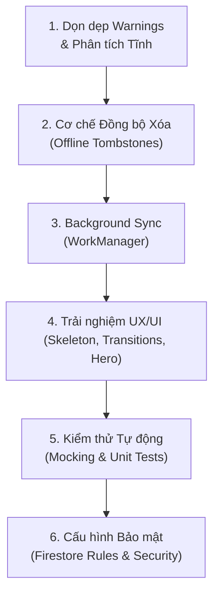

# Lộ trình Hoàn thiện Toàn diện Dự án TaskFlow 🏆

Để nâng tầm dự án **TaskFlow** từ một ứng dụng mẫu chất lượng cao trở thành một sản phẩm **Premium thương mại 100% chuẩn production**, dưới đây là tổng hợp các hạng mục cải tiến và tối ưu hóa chuyên sâu. Các phần này bổ sung và hoàn thiện mảnh ghép cuối cùng cho hệ thống của bạn.

---

## 🗺️ Bản đồ các Hạng mục Cải tiến



---

## 💎 Chi tiết từng Hạng mục & Hướng dẫn Thực hiện

### 1. Dọn dẹp Mã nguồn & Khắc phục Cảnh báo Tĩnh (Clean up warnings)
Hiện tại `flutter analyze` đang báo 18 cảnh báo nhỏ (Infos) liên quan đến các hàm bị lỗi thời (deprecated) hoặc in nhật ký (print) không chuẩn.

*   **THAY VÌ**: Sử dụng hàm `withOpacity` bị cảnh báo mất độ chính xác màu trên Flutter mới.
    *   **HÃY DÙNG**: Phương thức mới `.withValues(alpha: ...)` từ Flutter 3.3x trở lên.
    ```dart
    // Thay thế:
    Colors.black.withOpacity(0.04)
    // Thành:
    Colors.black.withValues(alpha: 0.04)
    ```
*   **THAY VÌ**: Sử dụng `print()` để ghi log gỡ lỗi trong môi trường production (bị rule `avoid_print` cảnh báo).
    *   **HÃY DÙNG**: Thư viện `logger` hoặc sử dụng hàm hệ thống `debugPrint()` giúp tối ưu hóa hiệu năng khi build ở chế độ Release.
    ```dart
    import 'package:flutter/foundation.dart';
    
    // Thay thế:
    print("Error: $e");
    // Thành:
    debugPrint("Error: $e");
    ```

---

### 2. Quản lý Xóa Ngoại tuyến (Offline Deletion Tracking via Tombstones)
*Hiện trạng*: Khi người dùng xóa một Task hoặc một Project ở chế độ offline, bản ghi chỉ bị xóa vật lý ở SQLite local. Khi có mạng trở lại, Firestore Server không có thông tin nào để biết bản ghi đó đã bị xóa để xóa đồng bộ theo.

*   **Giải pháp**: Sử dụng mô hình **Tombstones** (Bia mộ dữ liệu). Tạo một bảng SQLite phụ để lưu trữ các ID đã bị xóa ngoại tuyến.
*   **Các bước triển khai**:
    1.  Tạo bảng `deleted_records_local(id TEXT PRIMARY KEY, type TEXT, deletedAt INTEGER)` trong SQLite DB v4.
    2.  Khi gọi hàm `deleteTask` hay `deleteProject` khi **Offline**, thay vì chỉ xóa ở SQLite, hãy ghi ID của bản ghi đó vào bảng `deleted_records_local`.
    3.  Khi có kết nối mạng (hoặc khi chạy tiến trình Sync ngầm), lấy toàn bộ danh sách trong bảng này, đẩy yêu cầu xóa lên Firestore, sau đó dọn sạch bảng `deleted_records_local`.

*Mã nguồn SQLite hỗ trợ lưu vết xóa:*
```dart
Future<void> markRecordDeletedOffline(String id, String type) async {
  final database = await db;
  await database.insert(
    'deleted_records_local',
    {
      'id': id,
      'type': type,
      'deletedAt': DateTime.now().millisecondsSinceEpoch,
    },
    conflictAlgorithm: ConflictAlgorithm.replace,
  );
}
```

---

### 3. Đồng bộ hóa Ngầm Tự động (Background Synchronization via WorkManager)
*Hiện trạng*: Việc đồng bộ hóa dữ liệu ngoại tuyến hiện đang phụ thuộc vào việc người dùng mở app hoặc kéo vuốt làm mới (Pull-to-refresh). Nếu người dùng tắt ứng dụng, các task sửa đổi lúc offline sẽ không được đồng bộ.

*   **Giải pháp**: Tích hợp package `workmanager` để hệ điều hành (Android/iOS) tự động cấp tài nguyên chạy một tác vụ nền định kỳ quét SQLite và đồng bộ lên Firebase Firestore.
*   **Các bước triển khai**:
    1.  Thêm package `workmanager` vào `pubspec.yaml`.
    2.  Định nghĩa một tác vụ nền tên là `syncTask` trong hàm `callbackDispatcher` ở `main.dart`.
    3.  Tác vụ này sẽ gọi hàm `syncPendingTasks()` của `TaskRepository` và xử lý dọn dẹp các ID đã xóa trong bảng `deleted_records_local`.
    4.  Cấu hình tần suất chạy (ví dụ: mỗi 15 phút hoặc khi thiết bị cắm sạc + có Wi-Fi).

```dart
void callbackDispatcher() {
  Workmanager().executeTask((task, inputData) async {
    // Khởi tạo Firebase & Database local ngầm
    await Firebase.initializeApp();
    final taskRepo = TaskRepositoryImpl();
    await taskRepo.syncPendingTasks(); // Tự động đẩy task chưa sync
    return Future.value(true);
  });
}
```

---

### 4. Nâng tầm Trải nghiệm Người dùng (Premium UI/UX Polish)

#### ❖ Hiệu ứng Tải khung (Shimmer / Skeleton Loading)
Thay vì sử dụng biểu tượng quay tròn `CircularProgressIndicator` gây cảm giác ứng dụng bị đơ hoặc lỗi thời, hãy triển khai Shimmer hiệu ứng chuyển động mượt màu xám-trắng.

*   Sử dụng thư viện `shimmer`.
*   Tạo Widget `TaskCardSkeleton` có kích thước và hình dáng bo góc `24px` y hệt thẻ thật để hiển thị trong lúc chờ dữ liệu từ Firestore stream về.

#### ❖ Hiển thị Hoạt ảnh Kết nối (Animated Network Status Banner)
Hiển thị một thanh thông báo nhỏ màu xanh dịu ở đầu hoặc cuối màn hình với hiệu ứng trượt nhẹ (Slide) khi mạng được phục hồi: *"Mạng đã kết nối. Đang đồng bộ hóa dữ liệu..."*, và tự động ẩn đi sau 3 giây để người dùng hoàn toàn yên tâm về dữ liệu của họ.

#### ❖ Vuốt để Hành động (Swipe to Action)
Cho phép Member vuốt nhanh để nộp bài hoặc nhận việc, Manager vuốt nhanh để phê duyệt hoặc hủy bỏ công việc:
*   Bao bọc thẻ `TaskCard` bằng widget `Dismissible`.
*   Thiết kế background ẩn phía sau khi vuốt có icon hành động rõ ràng (ví dụ: Vuốt sang phải là icon check lá mạ để duyệt `Done`, Vuốt sang trái là icon thùng rác màu hồng đào để `Cancel`).
*   Áp dụng phản hồi rung nhẹ (Haptic Feedback) bằng `HapticFeedback.lightImpact()` để tăng trải nghiệm xúc giác.

#### ❖ Chuyển cảnh mượt mà (Hero & Page Transitions)
*   Sử dụng `Hero` widget bọc quanh tiêu đề dự án hoặc biểu tượng tiến độ để khi người dùng nhấn từ danh sách dự án mở chi tiết, các thành phần này sẽ phóng to mượt mà không bị giật lag.
*   Thiết lập hiệu ứng chuyển trang dạng **Shared Axis** (Trục chia sẻ) hoặc slide mềm mại thời lượng `200ms` thay cho chuyển cảnh mặc định cứng nhắc của nền tảng Android.

---

### 5. Kiểm thử Tự động Chuyên sâu (Advanced Unit & Integration Tests)
Hiện tại file `test/widget_test.dart` đang bị bỏ trống hoặc lỗi thời. Đối với một dự án lớn có cấu trúc đa tầng (UI -> Provider -> Repository -> Service) và lưu trữ hai chiều, việc có bộ kiểm thử tự động là bắt buộc.

*   **Kiểm thử Đơn vị (Unit Test)**:
    *   Viết test case kiểm tra tính hợp lệ của Ma trận Chuyển đổi Trạng thái trong `Task` (Ví dụ: Đảm bảo trạng thái `todo` không bao giờ chuyển được thẳng sang `done` mà không qua `reviewing`).
    *   Viết test kiểm thử thuật toán LWW (Last-Write-Wins) bằng cách tạo mock dữ liệu có ngày cập nhật khác nhau để kiểm tra hàm merge có hoạt động đúng logic đã định không.
*   **Kiểm thử Giao diện (Widget Test)**:
    *   Sử dụng mock package (như `mockito` hoặc `mocktail`) để giả lập `TaskRepository` và `AuthProvider` giúp test độc lập các Widget UI mà không cần cài đặt kết nối Firebase hoặc SQLite thật.

---

### 6. Thắt chặt Quy tắc Bảo mật Firestore (Firestore Security Rules)
Mặc dù bạn đã có các cơ chế phân quyền ở Client (Manager/Member), nhưng bất kỳ ai có API key của Firebase đều có thể bypass client để sửa đổi dữ liệu nếu không cấu hình Security Rules trên Firebase Console.

Cần cấu hình file [firestore.rules](file:///d:/Workspace/TBDD/TaskFlow_Huong_Thuong_Cuong_N03_1_2026/firestore.rules) để thắt chặt bảo mật:
*   **Tasks**: Chỉ cho phép tạo mới hoặc xóa nếu User có vai trò là `manager`. Cho phép Member cập nhật trạng thái nếu họ là người được gán công việc đó (`assignedTo == request.auth.uid`).
*   **Projects**: Chỉ cho phép `manager` sửa đổi thông tin dự án hoặc thêm thành viên.

---

## 📈 Kế hoạch Hành động Khuyên dùng (Action Plan)

1.  **Giai đoạn 1: Dọn dẹp & Tối ưu (Dễ - Thực hiện ngay)**
    *   Quét toàn bộ dự án thay thế các thuộc tính bị cảnh báo lỗi thời.
    *   Viết các bộ test case cơ bản cho `Task model`.
2.  **Giai đoạn 2: Trải nghiệm người dùng (Visual - Tạo ấn tượng)**
    *   Cài đặt Shimmer Loading, Hero Animation và Tap Spring Effect lên toàn bộ các card.
3.  **Giai đoạn 3: Tính năng nâng cao (Logic đồng bộ & Bảo mật)**
    *   Cập nhật quy tắc Firestore Security Rules.
    *   Triển khai bảng ghi vết xóa Tombstones và tích hợp WorkManager.
