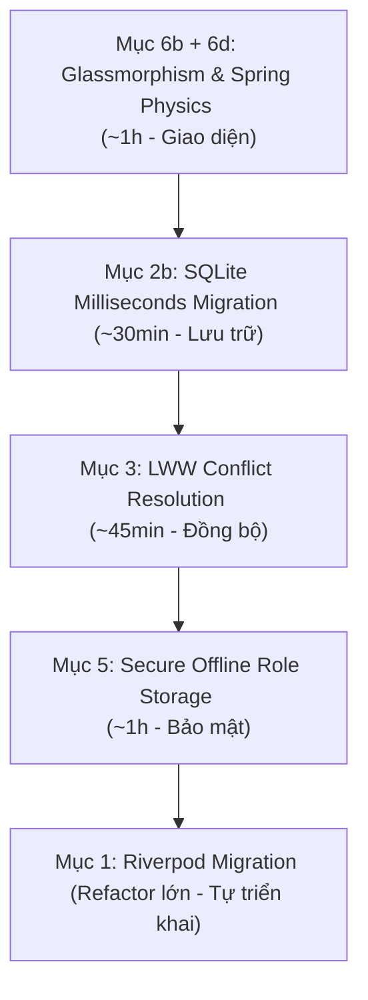

# Hướng dẫn chi tiết: Kế hoạch Nâng cấp Hệ thống TaskFlow 🚀

Tài liệu này tổng hợp toàn bộ các hạng mục cần làm để đưa ứng dụng **TaskFlow** lên chuẩn Premium thương mại, được sắp xếp theo trình tự tối ưu nhất từ dễ đến khó, từ các thay đổi tác động trực quan (High Impact UI) cho đến cấu trúc lưu trữ và quản lý trạng thái.

---

## 🗺️ Lộ trình thực hiện & Ước lượng thời gian



| Thứ tự | Hạng mục công việc | Mô tả ngắn gọn | Độ khó | Thời gian ước lượng |
| :---: | :--- | :--- | :---: | :---: |
| **1** | **Mục 6b + 6d** — Glassmorphism Cards + Tap Spring | Hiệu ứng kính mờ cho thẻ nhiệm vụ & nhấn đàn hồi | Dễ | ~1 giờ |
| **2** | **Mục 2b** — SQLite lưu ms Epoch & Migration DB v4 | Chuẩn hóa kiểu dữ liệu thời gian dưới dạng số nguyên | Trung bình | ~30 phút |
| **3** | **Mục 3** — LWW Conflict Resolution trong Repository | Thuật toán giải quyết xung đột đồng bộ Last-Write-Wins | Trung bình | ~45 phút |
| **4** | **Mục 5** — `flutter_secure_storage` Offline Role | Mã hóa & lưu trữ vai trò người dùng khi mất mạng | Dễ | ~1 giờ |
| **5** | **Mục 1** — Riverpod Migration (Tự triển khai) | Chuyển đổi kiến trúc State Management bền vững | Khó | Linh hoạt |

---

## 💎 Chi tiết từng Hạng mục & Hướng dẫn Cài đặt

### 1. Mục 6b + 6d — Glassmorphism Cards + Tap Spring (Impact UI lập tức)

Tạo cảm giác hiện đại bằng hiệu ứng kính mờ (Glassmorphism) kết hợp phản hồi xúc giác giả lập qua hiệu ứng đàn hồi lò xo (Spring Physics) khi chạm vào thẻ nhiệm vụ.

#### ❖ Bước 1: Tạo Widget hiệu ứng Spring khi Tap
Tạo file mới tại [lib/widgets/tap_spring_effect.dart](file:///d:/Workspace/TBDD/TaskFlow_Huong_Thuong_Cuong_N03_1_2026/lib/widgets/tap_spring_effect.dart):

```dart
import 'package:flutter/material.dart';

class TapSpringEffect extends StatefulWidget {
  final Widget child;
  final VoidCallback onTap;

  const TapSpringEffect({super.key, required this.child, required this.onTap});

  @override
  State<TapSpringEffect> createState() => _TapSpringEffectState();
}

class _TapSpringEffectState extends State<TapSpringEffect> with SingleTickerProviderStateMixin {
  late AnimationController _controller;
  late Animation<double> _scale;

  @override
  void initState() {
    super.initState();
    _controller = AnimationController(
      vsync: this,
      duration: const Duration(milliseconds: 100),
    );
    _scale = Tween<double>(begin: 1.0, end: 0.95).animate(
      CurvedAnimation(parent: _controller, curve: Curves.easeOut),
    );
  }

  @override
  void dispose() {
    _controller.dispose();
    super.dispose();
  }

  @override
  Widget build(BuildContext context) {
    return GestureDetector(
      onTapDown: (_) => _controller.forward(),
      onTapUp: (_) {
        _controller.reverse();
        widget.onTap();
      },
      onTapCancel: () => _controller.reverse(),
      child: ScaleTransition(
        scale: _scale,
        child: widget.child,
      ),
    );
  }
}
```

#### ❖ Bước 2: Tạo thẻ Glassmorphism cho Task
Nâng cấp Widget Card hiển thị công việc trong [lib/screens/home_screen.dart](file:///d:/Workspace/TBDD/TaskFlow_Huong_Thuong_Cuong_N03_1_2026/lib/screens/home_screen.dart):

```dart
import 'dart:ui';
import 'package:flutter/material.dart';

class GlassTaskCard extends StatelessWidget {
  final Widget child;
  final VoidCallback onTap;

  const GlassTaskCard({super.key, required this.child, required this.onTap});

  @override
  Widget build(BuildContext context) {
    return TapSpringEffect(
      onTap: onTap,
      child: ClipRRect(
        borderRadius: BorderRadius.circular(16),
        child: BackdropFilter(
          filter: ImageFilter.blur(sigmaX: 12, sigmaY: 12),
          child: Container(
            decoration: BoxDecoration(
              color: Colors.white.withOpacity(0.08), // Phông kính mờ sáng
              borderRadius: BorderRadius.circular(16),
              border: Border.all(
                color: Colors.white.withOpacity(0.15), // Viền phản chiếu mỏng
                width: 1.0,
              ),
              boxShadow: [
                BoxShadow(
                  color: Colors.black.withOpacity(0.05),
                  blurRadius: 10,
                  offset: const Offset(0, 4),
                )
              ]
            ),
            child: child,
          ),
        ),
      ),
    );
  }
}
```

---

### 2. Mục 2b — SQLite lưu ms Epoch & Migration DB v4

Chuyển đổi kiểu lưu trữ của cột `deadline` và `updatedAt` trong SQLite từ định dạng String ISO-8601 sang dạng số nguyên Integer (Milliseconds từ Epoch) để tối ưu hiệu năng sắp xếp, so sánh ngày tháng và tránh lỗi múi giờ.

#### ❖ Bước 1: Điều chỉnh Task Model để hỗ trợ cả Epoch và String
Cập nhật [lib/models/task_model.dart](file:///d:/Workspace/TBDD/TaskFlow_Huong_Thuong_Cuong_N03_1_2026/lib/models/task_model.dart) tại các phương thức đồng bộ hóa để thích ứng linh hoạt:

```dart
// Trong Task.fromMap:
deadline: data['deadline'] is int 
    ? DateTime.fromMillisecondsSinceEpoch(data['deadline'] as int)
    : DateTime.tryParse(data['deadline']?.toString() ?? '') ?? DateTime.now(),

updatedAt: data['updatedAt'] is int
    ? DateTime.fromMillisecondsSinceEpoch(data['updatedAt'] as int)
    : DateTime.tryParse(data['updatedAt']?.toString() ?? '') ?? DateTime.now(),

// Trong Task.toMap():
// (Lưu ý: Firebase Firestore/SQLite Service sẽ tự phân tách tùy mục đích)
Map<String, dynamic> toMap() {
  return {
    'title': title,
    'description': description,
    'projectId': projectId,
    'assignedTo': assignedTo,
    'status': status,
    'deadline': deadline.toIso8601String(), // Dành cho Firestore
    'assigneeName': assigneeName,
    'assigneeAvatar': assigneeAvatar,
    'isUrgent': isUrgent,
    'updatedAt': updatedAt.toIso8601String(),
  };
}

// Thêm hàm toSQLiteMap() để phục vụ riêng cho SQLite Service:
Map<String, dynamic> toSQLiteMap() {
  return {
    'title': title,
    'description': description,
    'projectId': projectId,
    'assignedTo': assignedTo,
    'status': status,
    'deadline': deadline.millisecondsSinceEpoch, // Lưu số nguyên
    'assigneeName': assigneeName,
    'assigneeAvatar': assigneeAvatar,
    'isUrgent': isUrgent ? 1 : 0,
    'updatedAt': updatedAt.millisecondsSinceEpoch, // Lưu số nguyên
  };
}
```

#### ❖ Bước 2: Viết mã nguồn nâng cấp cơ sở dữ liệu lên v4
Cập nhật [lib/services/sqlite_service.dart](file:///d:/Workspace/TBDD/TaskFlow_Huong_Thuong_Cuong_N03_1_2026/lib/services/sqlite_service.dart):

```dart
// 1. Tăng phiên bản cơ sở dữ liệu:
version: 4,

// 2. Cập nhật hàm cacheTask dùng toSQLiteMap():
await database.insert(
  'tasks_local',
  {
    ...task.toSQLiteMap(),
    'id': task.id,
    'syncedAt': DateTime.now().millisecondsSinceEpoch, // Lưu Epoch
    'isSynced': isSynced ? 1 : 0,
  },
  conflictAlgorithm: ConflictAlgorithm.replace,
);

// 3. Thực hiện Migration trong callback onUpgrade:
if (oldVersion < 4) {
  // SQLite không cho phép trực tiếp thay đổi kiểu dữ liệu cột hiện tại.
  // Ta sẽ viết migration bằng cách tạo bảng tạm, chuyển dữ liệu rồi đổi tên bảng.
  await db.transaction((txn) async {
    // Tạo bảng tạm mới có kiểu cột là INTEGER
    await txn.execute(
      'CREATE TABLE tasks_local_temp('
      'id TEXT PRIMARY KEY, '
      'title TEXT, '
      'description TEXT, '
      'projectId TEXT REFERENCES projects_local(id) ON DELETE CASCADE, '
      'assignedTo TEXT, '
      'status TEXT, '
      'deadline INTEGER, ' // Kiểu số nguyên mới
      'syncedAt INTEGER, ' // Kiểu số nguyên mới
      'assigneeName TEXT, '
      'assigneeAvatar TEXT, '
      'isUrgent INTEGER DEFAULT 0, '
      'updatedAt INTEGER, ' // Kiểu số nguyên mới
      'isSynced INTEGER DEFAULT 1'
      ')',
    );

    // Đọc tất cả bản ghi hiện tại
    final List<Map<String, dynamic>> oldTasks = await txn.query('tasks_local');
    for (var taskMap in oldTasks) {
      // Parse dữ liệu thời gian chuỗi cũ thành số nguyên
      final deadlineText = taskMap['deadline'] as String?;
      final updatedAtText = taskMap['updatedAt'] as String?;
      final syncedAtText = taskMap['syncedAt'] as String?;

      final deadlineEpoch = deadlineText != null ? (DateTime.tryParse(deadlineText)?.millisecondsSinceEpoch ?? DateTime.now().millisecondsSinceEpoch) : DateTime.now().millisecondsSinceEpoch;
      final updatedAtEpoch = updatedAtText != null ? (DateTime.tryParse(updatedAtText)?.millisecondsSinceEpoch ?? DateTime.now().millisecondsSinceEpoch) : DateTime.now().millisecondsSinceEpoch;
      final syncedAtEpoch = syncedAtText != null ? (DateTime.tryParse(syncedAtText)?.millisecondsSinceEpoch ?? DateTime.now().millisecondsSinceEpoch) : DateTime.now().millisecondsSinceEpoch;

      await txn.insert('tasks_local_temp', {
        ...taskMap,
        'deadline': deadlineEpoch,
        'updatedAt': updatedAtEpoch,
        'syncedAt': syncedAtEpoch,
      });
    }

    // Xóa bảng cũ và đổi tên bảng tạm
    await txn.execute('DROP TABLE tasks_local');
    await txn.execute('ALTER TABLE tasks_local_temp RENAME TO tasks_local');
  });
}
```

---

### 3. Mục 3 — LWW Conflict Resolution trong TaskRepository

Áp dụng chiến lược giải quyết xung đột **Last-Write-Wins** trong [lib/repositories/impl/task_repository_impl.dart](file:///d:/Workspace/TBDD/TaskFlow_Huong_Thuong_Cuong_N03_1_2026/lib/repositories/impl/task_repository_impl.dart) để tự động hóa việc hợp nhất dữ liệu đa nguồn dựa trên mốc thời gian sửa đổi gần nhất.

```dart
Future<void> _mergeAndResolveConflicts(List<Task> serverTasks, List<Task> localTasks) async {
  final Map<String, Task> localMap = {for (var t in localTasks) t.id: t};
  final Map<String, Task> serverMap = {for (var t in serverTasks) t.id: t};

  // 1. Đồng bộ hóa hai chiều theo mốc thời gian cập nhật (updatedAt)
  for (var serverTask in serverTasks) {
    final localTask = localMap[serverTask.id];
    if (localTask == null) {
      // Trình hợp 1: Chỉ tồn tại trên Server -> Tải về máy
      await _sqliteService.cacheTask(serverTask, isSynced: true);
    } else {
      // Trường hợp 2: Tồn tại ở cả 2 đầu -> Áp dụng Last-Write-Wins
      if (serverTask.updatedAt.isAfter(localTask.updatedAt)) {
        // Server sửa sau -> Ghi đè vào máy
        await _sqliteService.cacheTask(serverTask, isSynced: true);
      } else if (localTask.updatedAt.isAfter(serverTask.updatedAt)) {
        // Local sửa sau khi offline -> Đẩy lên Server
        try {
          await _firebaseService.saveTask(localTask);
          await _sqliteService.markTaskSynced(localTask.id);
        } catch (_) {
          // Gặp lỗi đẩy mạng -> Giữ isSynced = 0 ở local để Background Sync giải quyết sau
        }
      } else {
        // Hai mốc thời gian bằng nhau -> Đồng bộ hoàn tất
        await _sqliteService.markTaskSynced(localTask.id);
      }
    }
  }

  // 2. Quản lý bản ghi tạo mới ngoại tuyến
  for (var localTask in localTasks) {
    if (!serverMap.containsKey(localTask.id)) {
      // Chỉ tồn tại ở máy local -> Cố gắng đẩy lên Server
      try {
        await _firebaseService.saveTask(localTask);
        await _sqliteService.markTaskSynced(localTask.id);
      } catch (_) {
        // Đánh dấu isSynced = 0 để Background Sync thử lại sau
      }
    }
  }
}
```

---

### 4. Mục 5 — flutter_secure_storage offline role (Mã hóa vai trò)

Đảm bảo an toàn bảo mật tuyệt đối cho thông tin nhạy cảm của người dùng (như vai trò, token đăng nhập) ở chế độ ngoại tuyến bằng mã hóa phần cứng thay vì lưu clear-text tại `SharedPreferences`.

#### ❖ Bước 1: Khai báo thư viện bảo mật
Thêm thư viện này vào [pubspec.yaml](file:///d:/Workspace/TBDD/TaskFlow_Huong_Thuong_Cuong_N03_1_2026/pubspec.yaml):
```yaml
dependencies:
  flutter_secure_storage: ^9.1.2
```
*Chạy lệnh: `flutter pub get` để cập nhật.*

#### ❖ Bước 2: Tạo Lớp Dịch vụ Lưu trữ Bảo mật
Tạo file [lib/services/secure_storage_service.dart](file:///d:/Workspace/TBDD/TaskFlow_Huong_Thuong_Cuong_N03_1_2026/lib/services/secure_storage_service.dart):

```dart
import 'package:flutter_secure_storage/flutter_secure_storage.dart';

class SecureStorageService {
  static const _storage = FlutterSecureStorage();
  
  static const _keyUserRole = 'cached_user_role';
  static const _keyUserEmail = 'cached_user_email';
  static const _keyUserName = 'cached_user_name';
  static const _keyUserId = 'cached_user_id';

  // Lưu trữ dữ liệu người dùng được mã hóa
  static Future<void> saveUserOffline(String id, String name, String email, String role) async {
    await _storage.write(key: _keyUserId, value: id);
    await _storage.write(key: _keyUserName, value: name);
    await _storage.write(key: _keyUserEmail, value: email);
    await _storage.write(key: _keyUserRole, value: role);
  }

  // Đọc vai trò người dùng ngoại tuyến
  static Future<String?> getOfflineRole() async {
    return await _storage.read(key: _keyUserRole);
  }

  // Đọc đầy đủ thông tin người dùng được mã hóa
  static Future<Map<String, String>?> getOfflineUser() async {
    final id = await _storage.read(key: _keyUserId);
    final name = await _storage.read(key: _keyUserName);
    final email = await _storage.read(key: _keyUserEmail);
    final role = await _storage.read(key: _keyUserRole);

    if (id == null || role == null) return null;
    return {
      'id': id,
      'name': name ?? '',
      'email': email ?? '',
      'role': role,
    };
  }

  // Xóa toàn bộ dữ liệu bảo mật khi đăng xuất
  static Future<void> clearAll() async {
    await _storage.deleteAll();
  }
}
```

#### ❖ Bước 3: Wrap AuthProvider khôi phục trạng thái an toàn
Chỉnh sửa logic khôi phục session và phân quyền trong [lib/providers/auth_provider.dart](file:///d:/Workspace/TBDD/TaskFlow_Huong_Thuong_Cuong_N03_1_2026/lib/providers/auth_provider.dart):

```dart
import '../services/secure_storage_service.dart';

// Thay đổi thuộc tính kiểm tra Manager an toàn hơn:
bool get isManager {
  // Khi offline, chúng ta sẽ tin tưởng quyền được lưu mã hóa an toàn trong Secure Storage
  return _currentUser?.role == 'manager';
}

// 1. Trong hàm login thành công:
if (_currentUser != null) {
  await SecureStorageService.saveUserOffline(
    _currentUser!.id,
    _currentUser!.name,
    _currentUser!.email,
    _currentUser!.role,
  );
}

// 2. Trong hàm logout:
await SecureStorageService.clearAll();

// 3. Thêm hàm khôi phục Session khi khởi động app:
Future<void> tryAutoLoginOffline() async {
  _isLoading = true;
  notifyListeners();

  final offlineUser = await SecureStorageService.getOfflineUser();
  if (offlineUser != null) {
    _currentUser = UserModel(
      id: offlineUser['id']!,
      name: offlineUser['name']!,
      email: offlineUser['email']!,
      role: offlineUser['role']!,
      password: '',
    );
    _isOfflineMode = true; // Thiết lập chế độ Offline
  }

  _isLoading = false;
  notifyListeners();
}
```

---

### 5. Mục 1 — Riverpod Migration (Kiến trúc tương lai - Tự triển khai)

> [!TIP]
> Việc di chuyển kiến trúc từ **Provider** sang **Riverpod** là đợt cấu trúc mã nguồn (refactor) quy mô nhất. Hãy thực hiện phần này cuối cùng và tuần tự để đảm bảo tính ổn định và không làm mất token vô ích.

#### 🎯 Lộ trình Từng Bước Tự Di Chuyển

1. **Bước 1**: Khai báo thư viện `flutter_riverpod` trong `pubspec.yaml` (sau khi hoàn thành có thể xóa bỏ hoàn toàn gói `provider`).
2. **Bước 2**: Bọc widget gốc của ứng dụng `ProviderScope` tại [lib/main.dart](file:///d:/Workspace/TBDD/TaskFlow_Huong_Thuong_Cuong_N03_1_2026/lib/main.dart):
   ```dart
   void main() {
     runApp(
       const ProviderScope(
         child: TaskFlowApp(),
       ),
     );
   }
   ```
3. **Bước 3**: Chuyển đổi các lớp Provider kế thừa `ChangeNotifier` sang `StateNotifier` hoặc dùng Riverpod Generator (`@riverpod`).
   *Ví dụ cấu trúc `authProvider` theo cú pháp Riverpod hiện đại:*
   ```dart
   import 'package:flutter_riverpod/flutter_riverpod.dart';
   
   class AuthState {
     final UserModel? currentUser;
     final bool isLoading;
     final String? errorMessage;
     final bool isOfflineMode;
   
     AuthState({this.currentUser, this.isLoading = false, this.errorMessage, this.isOfflineMode = false});
   
     AuthState copyWith({UserModel? currentUser, bool? isLoading, String? errorMessage, bool? isOfflineMode}) {
       return AuthState(
         currentUser: currentUser ?? this.currentUser,
         isLoading: isLoading ?? this.isLoading,
         errorMessage: errorMessage ?? this.errorMessage,
         isOfflineMode: isOfflineMode ?? this.isOfflineMode,
       );
     }
   }
   
   class AuthNotifier extends StateNotifier<AuthState> {
     AuthNotifier() : super(AuthState());
     
     // Các hàm xử lý login, register, logout...
   }
   
   final authProvider = StateNotifierProvider<AuthNotifier, AuthState>((ref) {
     return AuthNotifier();
   });
   ```
4. **Bước 4**: Refactor các Widget giao diện:
   * Chuyển các màn hình kế thừa `StatelessWidget` thành `ConsumerWidget`.
   * Chuyển các màn hình kế thừa `StatefulWidget` thành `ConsumerStatefulWidget`.
   * Sử dụng đối tượng `WidgetRef ref` để theo dõi và cập nhật trạng thái thay thế cho `Provider.of`:
     ```dart
     // Trước kia:
     final auth = Provider.of<AuthProvider>(context);
     
     // Bây giờ:
     final authState = ref.watch(authProvider);
     final authController = ref.read(authProvider.notifier);
     ```

---

## 🛠️ Hướng dẫn Kiểm thử & Xác thực

Sau khi hoàn tất mỗi mục, hãy sử dụng các lệnh kiểm tra lỗi cú pháp và phân tích code tĩnh để đảm bảo dự án sạch lỗi:

```bash
# Cập nhật thư viện mới
flutter pub get

# Kiểm tra code tĩnh
flutter analyze
```

*Chúc bạn hoàn thiện ứng dụng TaskFlow Premium thật mượt mà! Nếu gặp bất kỳ điểm nghẽn hay lỗi phát sinh trong quá trình code, hãy gửi yêu cầu hỗ trợ ngay.*
