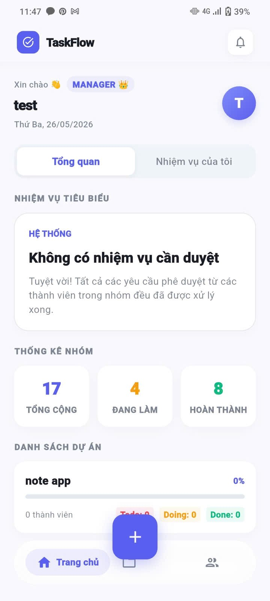
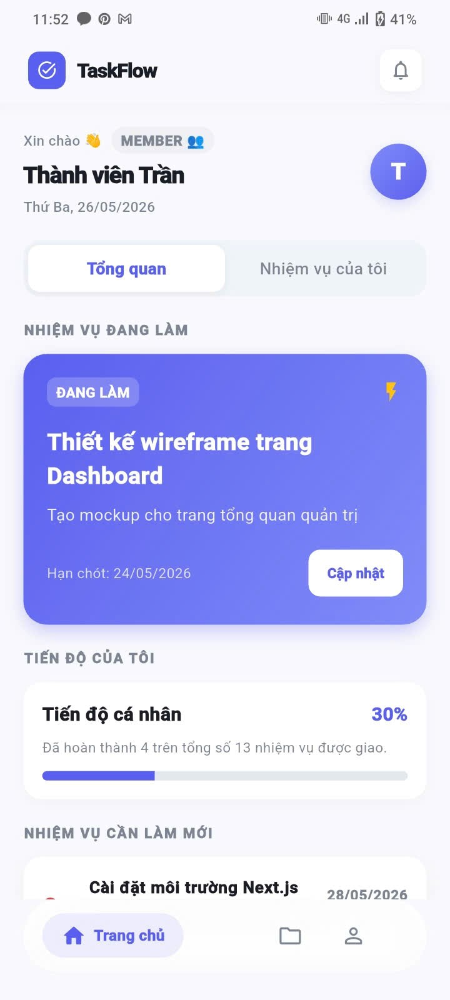
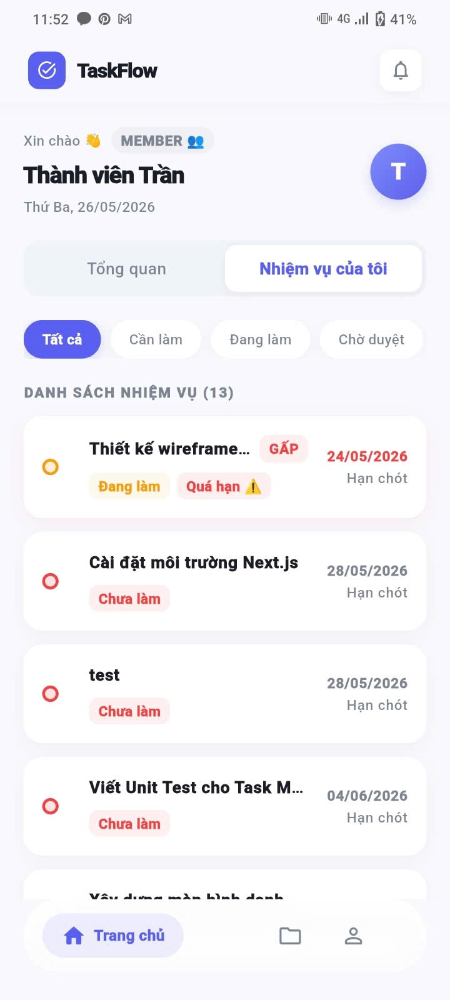
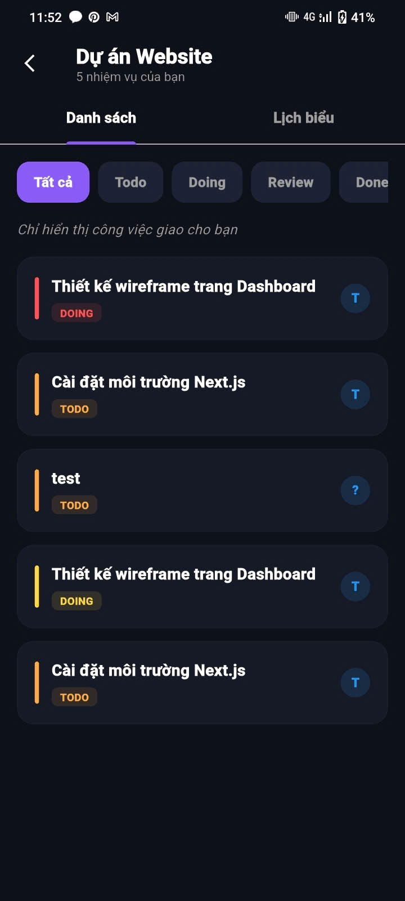
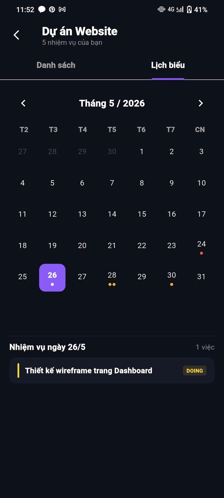
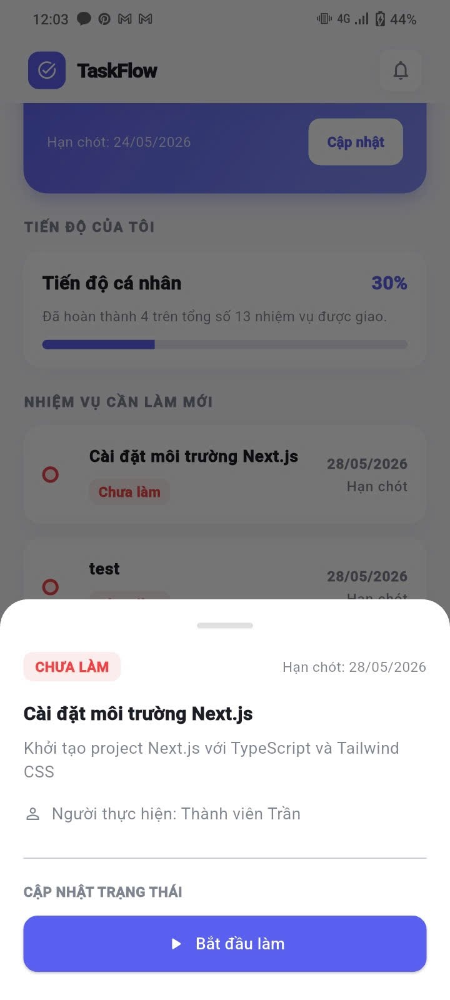

# Buoi Thuc Hanh 01 - Flutter

## Thong tin du an
- Ten ung dung: Ung dung sinh ton trong Rung
- Nen tang: Flutter
- Muc tieu buoi 01: Khoi tao du an va tuy chinh man hinh chinh theo yeu cau nhom

## Noi dung da thuc hien
1. Khoi tao cau truc du an Flutter.
2. Cap nhat tieu de ung dung thanh ten ung dung nhom.
3. Hien thi danh sach thanh vien nhom tren man hinh chinh.
4. Giu nguyen giao dien va mau sac theo mau ban dau.

## Thanh vien nhom
- Tran Thi Thu Huong - 23010344
- Nguyen Thi Thuong - 23010308

## Cach chay du an
1. Cai dat Flutter SDK.
2. Tai thu vien:

	flutter pub get

3. Chay ung dung:

	flutter run

## Ghi chu
- File giao dien chinh: lib/main.dart
- README nay duoc cap nhat cho nhiem vu Buoi thuc hanh 01.

# Buoi Thuc Hanh 02 - Phat trien chuc nang quan ly du an

### Noi dung da thuc hien
- Hien thi danh sach nhan su voi cac thong tin: ID, ten, vai tro
- Hien thi danh sach cong viec voi cac thong tin: ID, ten, trang thai, nguoi duoc giao

### Danh sach nhan su
- Nguyen Van A (Manager)
- Tran Thi B (Member)
- Le Van C (Member)

### Danh sach cong viec
- Thiet ke UI (Trạng thái: Doing) - Người được giao: Tran Thi B
- Ket noi Firebase (Trạng thái: Todo) - Người được giao: Le Van C
- Test app (Trạng thái: Done) - Người được giao: Tran Thi B

## Ghi chu
- File giao dien chinh: lib/main.dart
- README nay duoc cap nhat cho nhiem vu Buoi thuc hanh 02.

# 🚀 Dự án TaskFlow - Nhóm 03

## 👥 Thành viên nhóm & Phân công công việc
1. **Trần Thị Thu Hường** (Trưởng nhóm)
   - **Phụ trách**: Xây dựng **Trang Home** (Dashboard tổng quan công việc).
   - **Nhiệm vụ**: Thiết kế giao diện theo mẫu Figma Content, quản lý điều hướng và tích hợp Header/Footer.
   
2. **Nguyễn Việt Cường**
   - **Phụ trách**: Xây dựng **Trang Content** (Danh sách dự án).
   - **Nhiệm vụ**: Thiết kế giao diện thẻ dự án, thanh tìm kiếm và phân loại công việc.

3. **Nguyễn Thị Thương**
   - **Phụ trách**: Xây dựng **Trang About** (Hồ sơ cá nhân).
   - **Nhiệm vụ**: Thiết kế trang Profile, hiển thị thông tin cá nhân và thống kê.

---

## 🔗 Thông tin nộp bài (Câu 1)
- **Link GitHub Repository**: [https://github.com/ttt-huong/TaskFlow_Huong_Thuong_Cuong_N03_1_2026](https://github.com/ttt-huong/TaskFlow_Huong_Thuong_Cuong_N03_1_2026)
- **Link README.md**: [https://github.com/ttt-huong/TaskFlow_Huong_Thuong_Cuong_N03_1_2026/blob/main/README.md](https://github.com/ttt-huong/TaskFlow_Huong_Thuong_Cuong_N03_1_2026/blob/main/README.md)

---

## 🛠 Kiến trúc ứng dụng
Dự án được xây dựng trên nền tảng **Flutter** với cấu trúc thư mục chuyên nghiệp:
- `lib/core/`: Chứa các hằng số màu sắc, font chữ và dữ liệu mẫu (SeedData).
- `lib/models/`: Định nghĩa cấu trúc dữ liệu (User, Project, Task).
- `lib/repositories/`: Xử lý logic dữ liệu và mock API.
- `lib/screens/`: Chứa giao diện các màn hình chính.
- `lib/widgets/common/`: Chứa `MainLayout` (Khung Header-Body-Footer dùng chung).

---

# Bài tập thực hành số 6
## Tổng quát hóa kết hợp Chuyên biệt hóa

## Link Repository
- [TaskFlow_Huong_Thuong_Cuong_N03_1_2026](https://github.com/ttt-huong/TaskFlow_Huong_Thuong_Cuong_N03_1_2026)

## Thành viên nhóm

### Thành viên 1: Trần Thị Thu Hường

#### Phần công việc phụ trách
- `lib/screens/main_screen.dart`
- `lib/screens/home_screen.dart`
- `lib/screens/login_screen.dart`
- `lib/screens/register_screen.dart`
- `lib/screens/project_task_screen.dart`
- `lib/screens/task_detail_screen.dart`
- Calendar Tab trong `project_task_screen.dart`
- Role-based UI: Manager / Member
- Task workflow: `todo → doing → reviewing → done`
- `TaskProvider` integration

#### Phân tích Tổng quát hóa

##### `StatefulWidget` / `State`
- Quan hệ: `extends`
- Lớp cha hoặc lớp tổng quát: `StatefulWidget`, `State<T>`
- Lớp con hoặc lớp triển khai: `MainScreen`, `HomeScreen`, `LoginScreen`, `RegisterScreen`, `ProjectTaskScreen`, `TaskDetailScreen`
- Ý nghĩa tổng quát hóa: Tái sử dụng cơ chế vòng đời và render của Flutter, đồng thời tách phần giao diện và trạng thái.
- File liên quan: `lib/screens/main_screen.dart`, `lib/screens/home_screen.dart`, `lib/screens/login_screen.dart`, `lib/screens/register_screen.dart`, `lib/screens/project_task_screen.dart`, `lib/screens/task_detail_screen.dart`
- Code minh họa:
```dart
class MainScreen extends StatefulWidget {
   const MainScreen({super.key});

   @override
   State<MainScreen> createState() => _MainScreenState();
}
```

##### `ChangeNotifier` → Provider
- Quan hệ: `extends`
- Lớp cha hoặc lớp tổng quát: `ChangeNotifier`
- Lớp con hoặc lớp triển khai: `TaskProvider`, `AuthProvider`, `ProjectProvider`
- Ý nghĩa tổng quát hóa: Tách state và logic ra khỏi UI, cho phép UI lắng nghe thay đổi dữ liệu qua Provider.
- File liên quan: `lib/providers/task_provider.dart`, `lib/providers/auth_provider.dart`, `lib/providers/project_provider.dart`
- Code minh họa:
```dart
class TaskProvider extends ChangeNotifier {
   final TaskRepositoryImpl _taskRepository = TaskRepositoryImpl();
```

##### Repository Pattern
- Quan hệ: `abstract class` / `implements`
- Lớp cha hoặc lớp tổng quát: `TaskRepository`
- Lớp con hoặc lớp triển khai: `TaskRepositoryImpl`
- Ý nghĩa tổng quát hóa: Tách giao diện truy cập dữ liệu khỏi phần cài đặt cụ thể, giúp dễ thay thế và kiểm thử.
- File liên quan: `lib/repositories/task_repository.dart`, `lib/repositories/impl/task_repository_impl.dart`
- Code minh họa:
```dart
abstract class TaskRepository {
   Future<List<Task>> getTasks();
   Future<void> addTask(Task task);
}
```

##### Generic Class
- Quan hệ: generic `<T>`
- Lớp tổng quát: `DataPrinter<T>`, `DataListPrinter<T>`
- Ý nghĩa tổng quát hóa: Một lớp dùng được cho nhiều kiểu dữ liệu mà không cần viết lại code.
- File liên quan: `lib/core/utils/data_printer.dart`
- Code minh họa:
```dart
class DataPrinter<T> {
   T data;
   DataPrinter(this.data);
}
```

#### Phân tích Chuyên biệt hóa

##### Role-based navigation trong `MainScreen`
- Vì sao chuyên biệt hóa: Người dùng Manager và Member có số tab và quyền truy cập khác nhau.
- Logic đặc thù: Manager có thêm tab Nhóm và nút FAB tạo task.
- File liên quan: `lib/screens/main_screen.dart`
- Code minh họa:
```dart
final List<Widget> _managerPages = [
   const HomeScreen(),
   const ProjectListScreen(),
   const UserListScreen(),
   const ProfileScreen(),
];

floatingActionButton: role == 'manager'
      ? FloatingActionButton(
            onPressed: () => _showCreateTaskSheet(context),
         )
      : null,
```

##### HomeScreen theo role Manager / Member
- Vì sao chuyên biệt hóa: Dữ liệu hiển thị trên Home khác nhau theo vai trò người dùng.
- Logic đặc thù: Manager tải tất cả task, Member chỉ tải task của mình.
- File liên quan: `lib/screens/home_screen.dart`
- Code minh họa:
```dart
if (user.isManager) {
   taskProvider.loadAllTasks();
} else {
   taskProvider.loadMyTasks(user.id);
}
```

##### Calendar Tab trong `project_task_screen.dart`
- Vì sao chuyên biệt hóa: Calendar tab lọc task theo ngày deadline, đây là logic nghiệp vụ riêng của màn hình project task.
- Logic đặc thù: chọn ngày, đếm số task trong ngày, lọc theo deadline.
- File liên quan: `lib/screens/project_task_screen.dart`
- Code minh họa:
```dart
final isSelected = _selectedCalendarDay != null && _isSameDay(day, _selectedCalendarDay!);
```

##### Task workflow `todo → doing → reviewing → done`
- Vì sao chuyên biệt hóa: Đây là quy tắc trạng thái của Task, không thể tổng quát hóa chung cho mọi đối tượng.
- Logic đặc thù: `allowedTransitions` và `validateTransition` giới hạn đường đi hợp lệ của trạng thái.
- File liên quan: `lib/models/task_model.dart`
- Code minh họa:
```dart
static final Map<String, Set<String>> allowedTransitions = {
   'todo': {'doing', 'cancelled'},
   'doing': {'reviewing', 'todo', 'cancelled'},
   'reviewing': {'done', 'doing', 'cancelled'},
   'done': {'archived'},
};
```

##### Task detail screen
- Vì sao chuyên biệt hóa: Màn hình chi tiết hiển thị deadline, trạng thái quá hạn và thông tin task theo nghiệp vụ.
- Logic đặc thù: dùng `task.isOverdue()` để đổi màu cảnh báo.
- File liên quan: `lib/screens/task_detail_screen.dart`
- Code minh họa:
```dart
_buildInfoRow(
   Icons.calendar_today,
   'Hạn chót',
   DateFormat('HH:mm - dd/MM/yyyy').format(task.deadline),
   task.isOverdue() ? Colors.redAccent : Colors.white,
)
```

#### Trích lược code chính
1. `MainScreen` phân tách nav theo role.
2. `HomeScreen` load dữ liệu theo Manager/Member.
3. `TaskProvider` kiểm tra hợp lệ trước khi đổi trạng thái.
4. `Task` model định nghĩa state-machine cho workflow.
5. `project_task_screen.dart` xử lý Calendar Tab theo deadline.
6. `task_detail_screen.dart` hiển thị trạng thái quá hạn.

#### Ảnh màn hình cần chụp
- `lib/screens/main_screen.dart`: phần khai báo danh sách tab Manager/Member và FAB của Manager.
- `lib/screens/home_screen.dart`: đoạn load task theo role trong `initState`.
- `lib/models/task_model.dart`: đoạn `allowedTransitions` và `validateTransition`.
- `lib/providers/task_provider.dart`: đoạn `updateTaskStatus` để chứng minh tích hợp provider.
- `lib/screens/project_task_screen.dart`: phần Calendar Tab và lọc task theo ngày.
- `lib/screens/task_detail_screen.dart`: phần hiển thị deadline và cảnh báo quá hạn.

#### Ảnh minh họa bài nộp
- Ảnh 1: MainScreen - Manager view
   - 
- Ảnh 2: MainScreen - Member view
   - 
- Ảnh 3: HomeScreen - role-based load
   - 
- Ảnh 4: ProjectTaskScreen - danh sách task
   - 
- Ảnh 5: ProjectTaskScreen - Calendar Tab
   - 
- Ảnh 6: TaskDetailScreen
   - 

---

### Thành viên 2:
Nguyễn Việt Cường

---

### Thành viên 3: Nguyễn Thị Thương

#### Phần công việc phụ trách
- `lib/screens/profile/profile_screen.dart`
- `lib/screens/edit_profile_screen.dart`
- `lib/screens/profile/statistics_profile_screen.dart`
- `lib/screens/profile/manager_notification_screen.dart`
- `lib/screens/profile/member_management_screen.dart`
- `lib/screens/profile/member_notification_screen.dart`
- `lib/screens/profile/member_task_screen.dart`
- Tích hợp màn hình Profile vào `lib/screens/main_screen.dart`
- Chuẩn hóa kiểm tra quyền Manager / Member qua `UserModel.isManager`

#### Mô tả công việc
Xây dựng cụm giao diện Profile cho ứng dụng TaskFlow, hiển thị thông tin cá nhân của người dùng, thống kê nhanh, các tùy chọn thao tác và điều hướng sang các màn hình phụ theo từng vai trò.

Các chức năng chính đã thực hiện:
- Thiết kế giao diện trang Profile với avatar, tên, email và badge vai trò.
- Hiển thị các chỉ số tổng quan: số dự án, số task và số task hoàn thành.
- Xây dựng màn hình chỉnh sửa thông tin cá nhân.
- Xây dựng màn hình thống kê dành cho Manager.
- Xây dựng màn hình thông báo riêng cho Manager và Member.
- Xây dựng màn hình quản lý thành viên dành cho Manager.
- Xây dựng màn hình Task của tôi dành cho Member.
- Phân quyền hiển thị tùy chọn theo vai trò Manager / Member.

#### Phân tích Tổng quát hóa

##### `StatefulWidget` / `StatelessWidget`
- Quan hệ: `extends`
- Lớp cha hoặc lớp tổng quát: `StatefulWidget`, `StatelessWidget`
- Lớp con hoặc lớp triển khai: `ProfileScreen`, `EditProfileScreen`, `StatisticsProfileScreen`, `ManagerNotificationScreen`, `MemberManagementScreen`, `MemberNotificationScreen`, `MemberTaskScreen`
- Ý nghĩa tổng quát hóa: Tái sử dụng cơ chế xây dựng giao diện của Flutter, tách phần giao diện thành từng màn hình độc lập để dễ bảo trì và mở rộng.
- File liên quan: `lib/screens/profile/profile_screen.dart`, `lib/screens/edit_profile_screen.dart`, `lib/screens/profile/*.dart`

Code minh họa:
```dart
class ProfileScreen extends StatefulWidget {
  const ProfileScreen({super.key});

  @override
  State<ProfileScreen> createState() => _ProfileScreenState();
}
```

##### Tái sử dụng layout chung `MainLayout`
- Quan hệ: composition
- Thành phần tổng quát: `MainLayout`
- Thành phần sử dụng: các màn hình Profile, Edit Profile, Statistics, Notification, Member Task
- Ý nghĩa tổng quát hóa: Dùng chung khung tiêu đề, body và cấu trúc hiển thị để giao diện đồng nhất trong toàn ứng dụng.
- File liên quan: `lib/widgets/common/main_layout.dart`

Code minh họa:
```dart
return MainLayout(
  title: 'HỒ SƠ',
  showImage: false,
  body: SingleChildScrollView(
    child: Column(
      children: [
        // Nội dung màn hình Profile
      ],
    ),
  ),
);
```

##### Provider và Model người dùng
- Quan hệ: sử dụng đối tượng `AuthProvider` và `UserModel`
- Thành phần tổng quát: `AuthProvider.currentUser`, `UserModel`
- Ý nghĩa tổng quát hóa: Thông tin người dùng được lấy từ provider dùng chung thay vì khai báo riêng trong từng màn hình.
- File liên quan: `lib/providers/auth_provider.dart`, `lib/models/user_model.dart`

Code minh họa:
```dart
final authProvider = context.watch<AuthProvider>();
final currentUser = authProvider.currentUser;
final name = currentUser?.name ?? 'Tran Thi B';
final email = currentUser?.email ?? 'b@gmail.com';
```

#### Phân tích Chuyên biệt hóa

##### Phân quyền Manager / Member trong Profile
- Vì sao chuyên biệt hóa: Manager và Member có các chức năng khác nhau trong màn hình Profile.
- Logic đặc thù: Manager xem thống kê, thông báo quản lý và quản lý thành viên; Member xem thông báo cá nhân và task của tôi.
- File liên quan: `lib/screens/profile/profile_screen.dart`

Code minh họa:
```dart
if (isManager) ...[
  _buildOptionRow(Icons.bar_chart, 'Thống kê', () {
    Navigator.push(
      context,
      MaterialPageRoute(
        builder: (_) => StatisticsProfileScreen(isManager: isManager),
      ),
    );
  }),
  _buildOptionRow(Icons.group, 'Quản lý thành viên', () {
    Navigator.push(
      context,
      MaterialPageRoute(
        builder: (_) => const MemberManagementScreen(),
      ),
    );
  }),
] else ...[
  _buildOptionRow(Icons.notifications, 'Thông báo cá nhân', () {
    Navigator.push(
      context,
      MaterialPageRoute(
        builder: (_) => const MemberNotificationScreen(),
      ),
    );
  }),
]
```

##### Chuẩn hóa vai trò người dùng
- Vì sao chuyên biệt hóa: Vai trò người dùng là nghiệp vụ riêng của TaskFlow, quyết định quyền truy cập giao diện.
- Logic đặc thù: Chuẩn hóa `role` về chữ thường và kiểm tra quyền thông qua getter `isManager`.
- File liên quan: `lib/models/user_model.dart`, `lib/providers/auth_provider.dart`

Code minh họa:
```dart
UserModel({
  required this.id,
  required this.name,
  required this.email,
  required this.password,
  required String role,
  this.avatarChar = '',
}) : role = role.trim().toLowerCase();

bool get isManager => role.trim().toLowerCase() == 'manager';
```

##### Màn hình thống kê dành cho Manager
- Vì sao chuyên biệt hóa: Thống kê dự án và hiệu suất thành viên chỉ phù hợp với vai trò Manager.
- Logic đặc thù: Nếu là Manager thì hiển thị dashboard; nếu không có quyền thì hiển thị thông báo giới hạn truy cập.
- File liên quan: `lib/screens/profile/statistics_profile_screen.dart`

Code minh họa:
```dart
@override
Widget build(BuildContext context) {
  return MainLayout(
    title: 'THỐNG KÊ',
    showImage: false,
    body: SingleChildScrollView(
      child: isManager ? _managerView() : _memberView(),
    ),
  );
}
```

##### Điều hướng Profile trong `MainScreen`
- Vì sao chuyên biệt hóa: Profile là tab dùng chung, nhưng nội dung bên trong thay đổi theo vai trò.
- Logic đặc thù: `MainScreen` dùng `ProfileScreen` mới trong thư mục `profile/` và xác định trang theo `currentUser.isManager`.
- File liên quan: `lib/screens/main_screen.dart`

Code minh họa:
```dart
final bool isManager = authProvider.currentUser?.isManager ?? false;
final pages = isManager ? _managerPages : _memberPages;
final navItems = _getNavItems(isManager);
```

#### Trích lược code chính
1. `ProfileScreen` hiển thị thông tin người dùng, thống kê nhanh và danh sách tùy chọn.
2. `EditProfileScreen` xây dựng form chỉnh sửa thông tin cá nhân.
3. `StatisticsProfileScreen` tách giao diện thống kê Manager và màn hình không có quyền.
4. `ManagerNotificationScreen` hiển thị thông báo dành cho Manager.
5. `MemberNotificationScreen` hiển thị thông báo dành cho Member.
6. `MemberTaskScreen` hiển thị danh sách task và tiến độ của Member.
7. `MemberManagementScreen` hiển thị danh sách thành viên cho Manager.
8. `UserModel.isManager` chuẩn hóa logic kiểm tra quyền người dùng.

#### Ảnh màn hình cần chụp
- `lib/screens/profile/profile_screen.dart`: màn hình Profile của Manager.
- `lib/screens/profile/profile_screen.dart`: màn hình Profile của Member.
- `lib/screens/edit_profile_screen.dart`: màn hình chỉnh sửa thông tin.
- `lib/screens/profile/statistics_profile_screen.dart`: màn hình thống kê Manager.
- `lib/screens/profile/manager_notification_screen.dart`: màn hình thông báo Manager.
- `lib/screens/profile/member_task_screen.dart`: màn hình Task của tôi.

#### Ảnh minh họa bài nộp
- Ảnh 1: ProfileScreen - Manager view
  - 
- Ảnh 2: ProfileScreen - Member view
  - 
- Ảnh 3: EditProfileScreen
  - 
- Ảnh 4: StatisticsProfileScreen
  - 
- Ảnh 5: MemberTaskScreen
  - 
