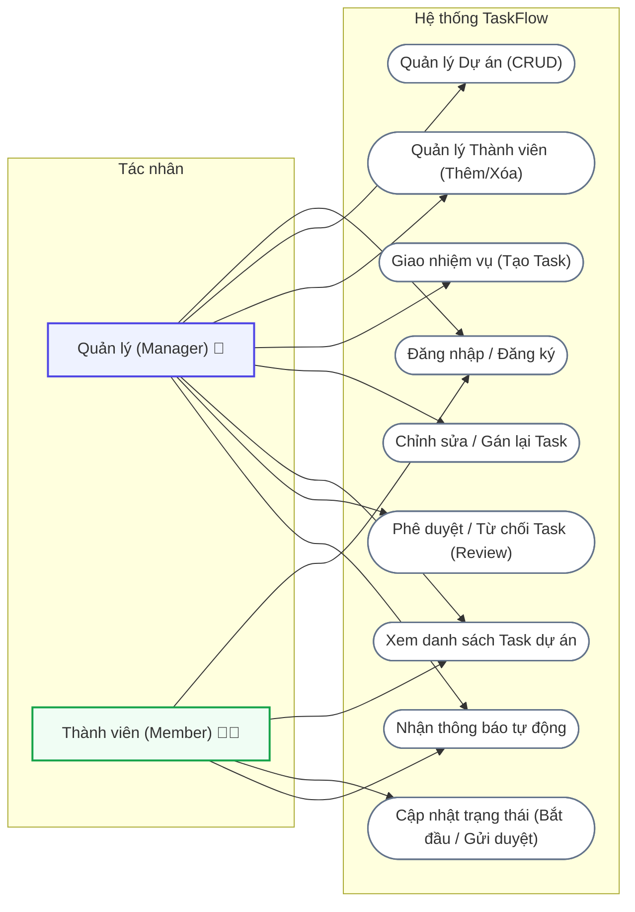
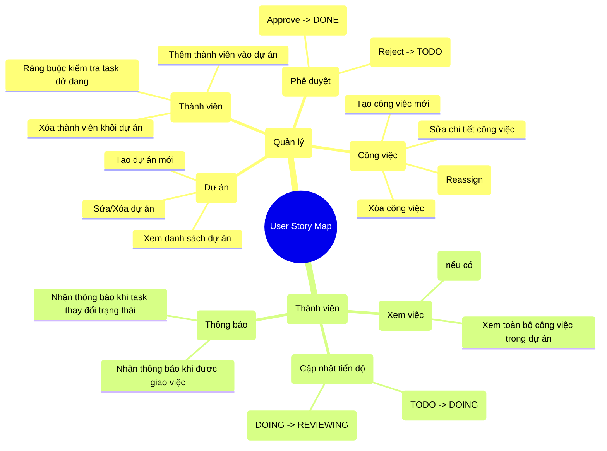

# Phân Tích Nghiệp Vụ & Sơ Đồ Quy Trình (TaskFlow Diagrams)

Tài liệu này trình bày chi tiết về phân tích nghiệp vụ của dự án TaskFlow, bao gồm sơ đồ Use Case toàn hệ thống, sơ đồ phân rã User Story Map và luồng hoạt động nghiệp vụ chi tiết giữa các vai trò (Manager và Member).

---

## I. PHÂN TÍCH NGHIỆP VỤ

### 1. Use Case Diagram (Sơ đồ ca sử dụng toàn hệ thống)

Sơ đồ Use Case mô tả trực quan các tác nhân (Actors) tương tác với các chức năng chính của hệ thống TaskFlow:

---

### 2. User Story Map (Bản đồ câu chuyện người dùng)

User Story Map phân rã các tính năng nghiệp vụ theo vai trò người dùng nhằm xác định các câu chuyện cụ thể cần giải quyết:

---

### 3. Business Workflow (Luồng nghiệp vụ hoạt động)

Sơ đồ thể hiện tiến trình làm việc phối hợp giữa Manager và Member từ khâu tạo dự án, phân công cho đến khi hoàn thành công việc:

