# Phân Tích Nghiệp Vụ & Sơ Đồ Quy Trình (TaskFlow Diagrams)

Tài liệu này trình bày chi tiết về phân tích nghiệp vụ của dự án TaskFlow, bao gồm sơ đồ Use Case toàn hệ thống, sơ đồ phân rã User Story Map và luồng hoạt động nghiệp vụ chi tiết giữa các vai trò (Manager và Member).

---

## I. PHÂN TÍCH NGHIỆP VỤ

### 1. Use Case Diagram (Sơ đồ ca sử dụng toàn hệ thống)

Sơ đồ Use Case mô tả trực quan các tác nhân (Actors) tương tác với các chức năng chính của hệ thống TaskFlow:

---

### 2. User Story Map (Bản đồ câu chuyện người dùng)

User Story Map phân rã các tính năng nghiệp vụ theo vai trò người dùng nhằm xác định các câu chuyện cụ thể cần giải quyết:

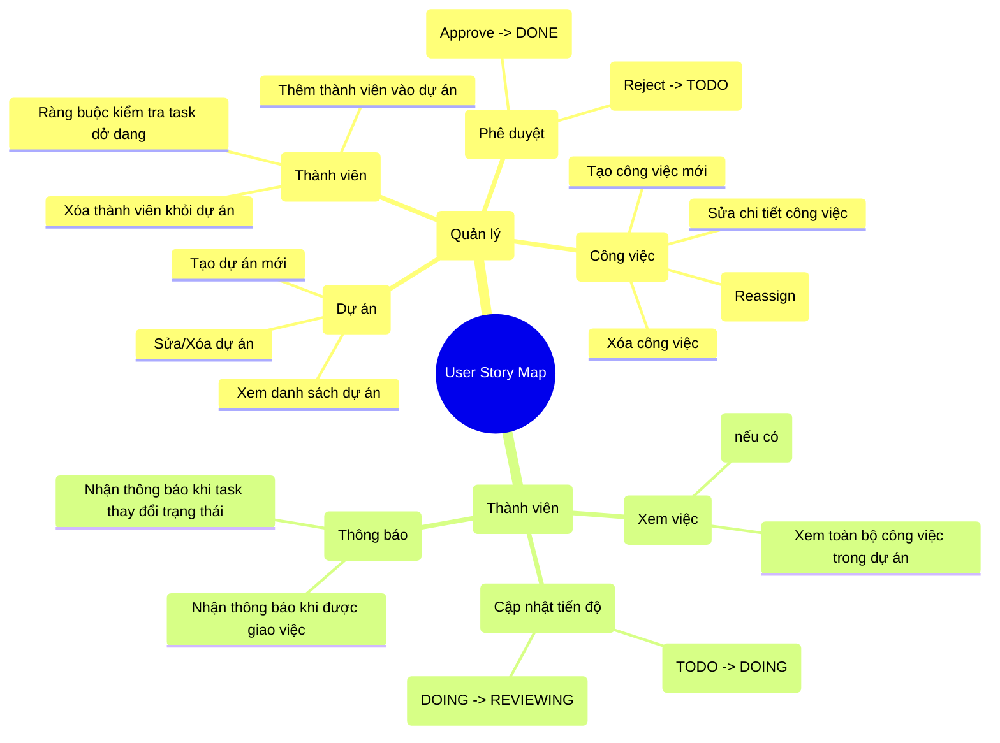

---

### 3. Business Workflow (Luồng nghiệp vụ hoạt động)

Sơ đồ thể hiện tiến trình làm việc phối hợp giữa Manager và Member từ khâu tạo dự án, phân công cho đến khi hoàn thành công việc:

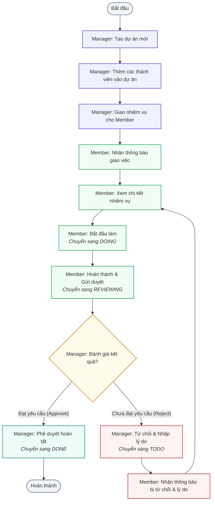

---

## II. KIẾN TRÚC HỆ THỐNG

### 4. Architecture Diagram (Sơ đồ kiến trúc phân tầng)

Sơ đồ thể hiện luồng dữ liệu và trách nhiệm của từng tầng trong kiến trúc ứng dụng (UI $\rightarrow$ Provider $\rightarrow$ Repository $\rightarrow$ Service $\rightarrow$ Databases).

> [!NOTE]
> **Ngoại lệ về luồng xử lý:** `NotificationProvider` là một ngoại lệ đặc biệt. Nó không đi qua lớp Repository mà trực tiếp lắng nghe các thay đổi trạng thái nhiệm vụ thông qua Firestore snapshots stream, sau đó ghi các bản ghi thông báo mới trực tiếp vào SQLite local thông qua `SQLiteService`.

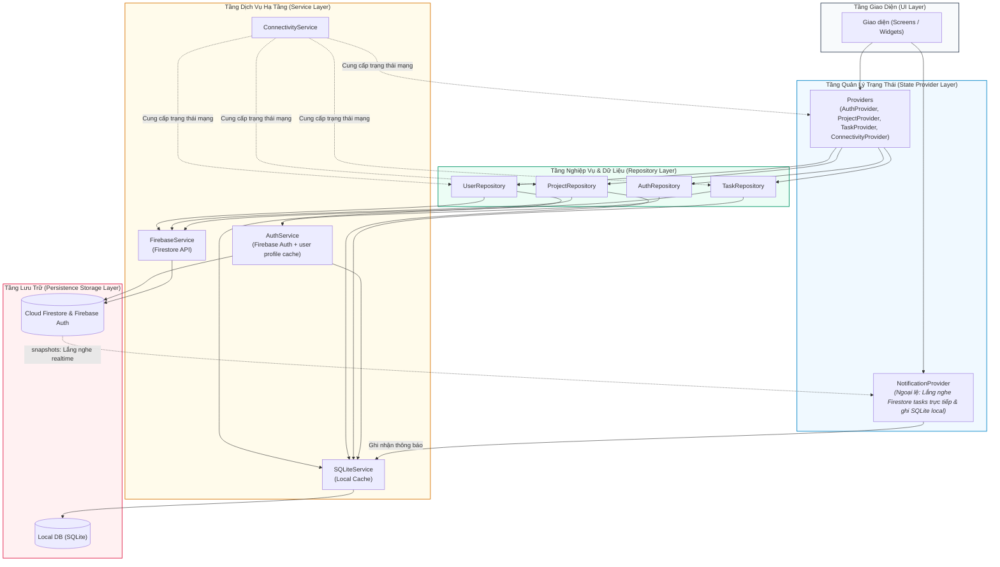

---

### 5. Package Diagram (Sơ đồ Gói)

Sơ đồ gói biểu diễn mối quan hệ phụ thuộc giữa các thư mục/gói cấu trúc mã nguồn trong ứng dụng:

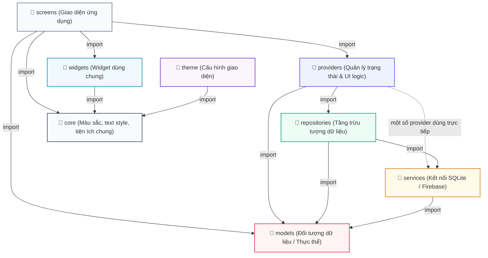

---

### 6. Component Diagram (Sơ đồ thành phần)

Sơ đồ biểu diễn các thành phần nghiệp vụ và kỹ thuật cốt lõi tương tác với nhau trong hệ thống:

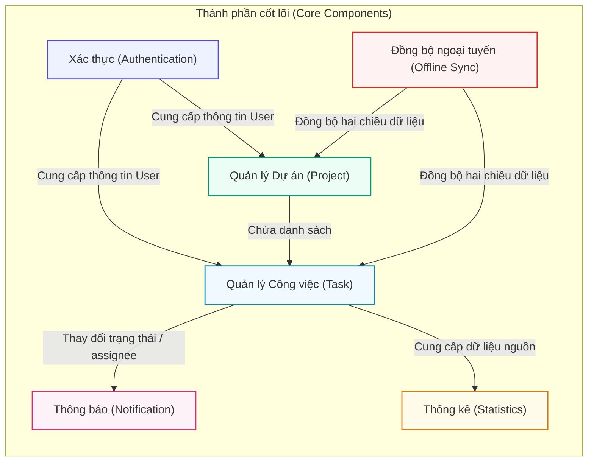

---

### 6b. Notification Flow Diagram (Sơ đồ luồng xử lý thông báo thực tế)

Sơ đồ chi tiết cơ chế lắng nghe thay đổi nhiệm vụ trực tiếp và lưu trữ thông báo cục bộ của `NotificationProvider`:

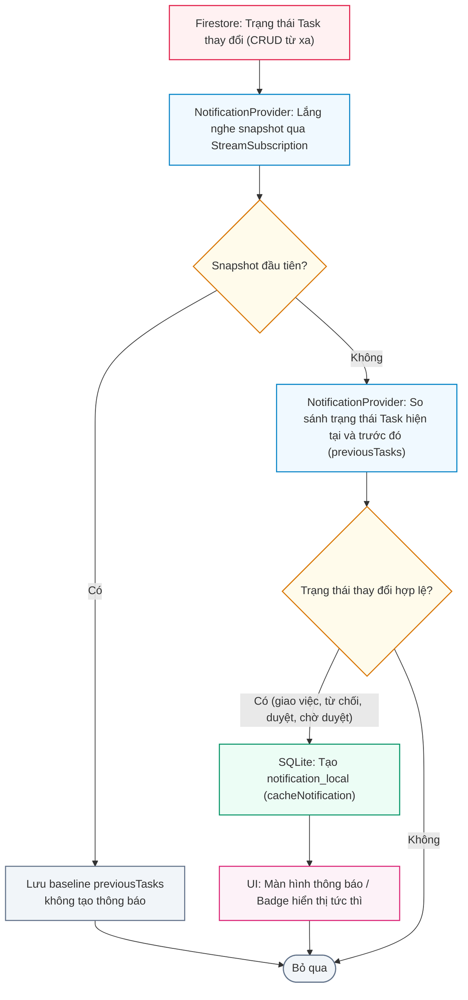

---

### 7. Deployment Diagram (Sơ đồ triển khai vật lý)

Sơ đồ mô tả cách các thành phần của TaskFlow được triển khai trên thiết bị người dùng và dịch vụ đám mây:

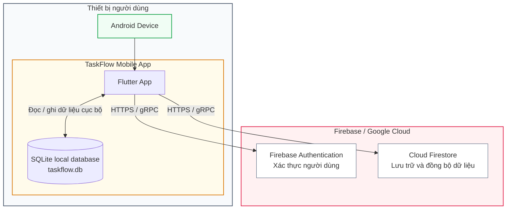

---

## III. CƠ SỞ DỮ LIỆU

### 8. ERD SQLite (Sơ đồ quan hệ cơ sở dữ liệu cục bộ SQLite)

Sơ đồ biểu diễn cấu trúc bảng vật lý và các khóa ngoại liên kết cục bộ trong tệp cơ sở dữ liệu di động của dự án:

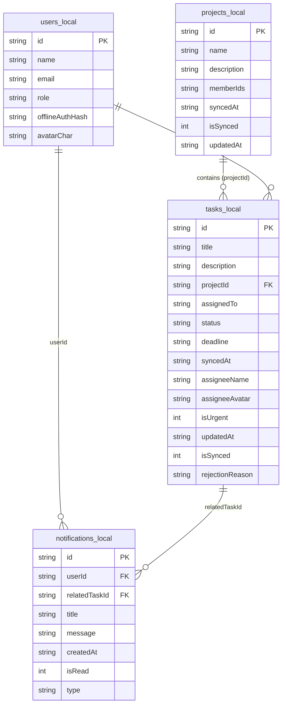

---

### 9. ERD Firestore (Sơ đồ NoSQL Firestore - Quan hệ logic)

Sơ đồ mô tả cấu trúc các tài liệu (Documents) thuộc các tập hợp (Collections) trong NoSQL Cloud Firestore và liên kết logic giữa chúng:

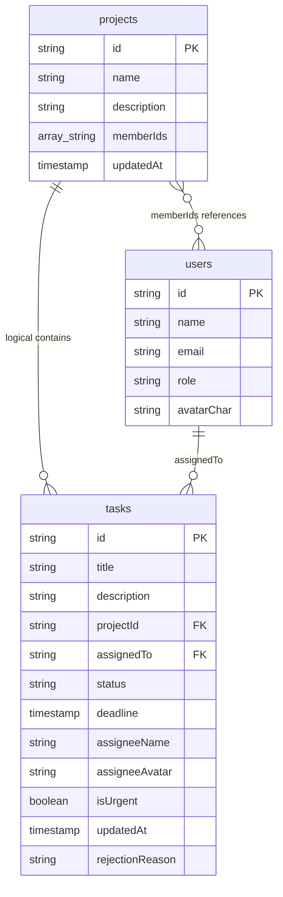

---

### 10. Data Dictionary Diagram (Sơ đồ phân rã từ điển dữ liệu)

Sơ đồ phân rã trực quan mô tả chi tiết kiểu dữ liệu và ý nghĩa của từng trường thông tin trong các thực thể:

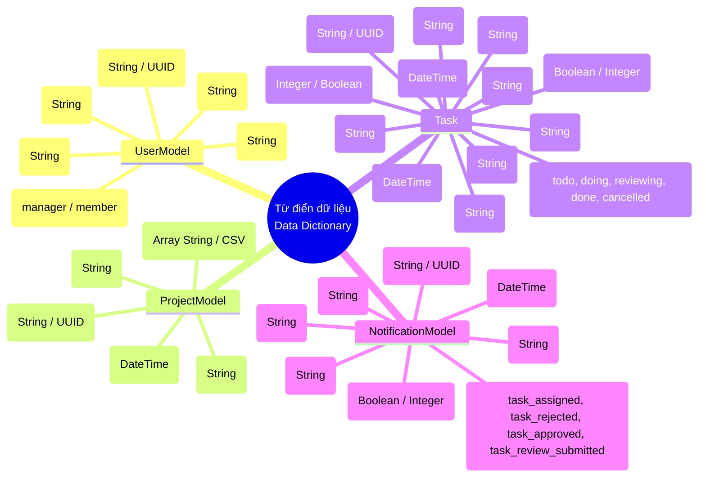

---

### 11. Offline Sync Database Diagram (Sơ đồ đồng bộ dữ liệu ngoại tuyến)

Sơ đồ biểu diễn luồng đồng bộ hai chiều giữa Firestore và SQLite dựa trên cờ trạng thái đồng bộ (`isSynced`) và nhãn thời gian cập nhật (`updatedAt`):

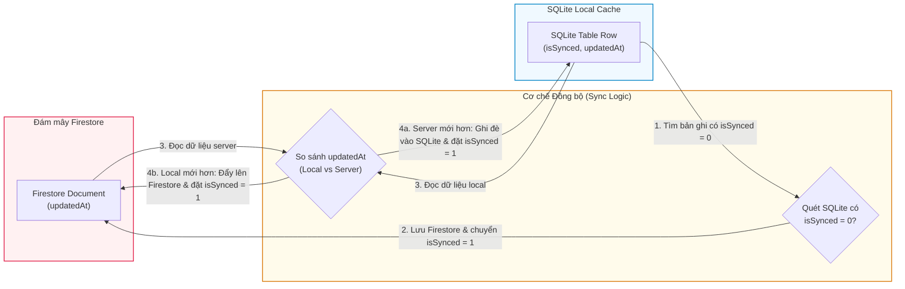

---

## IV. UML BỔ SUNG & SƠ ĐỒ HOẠT ĐỘNG

### 12. Class Diagram (Sơ đồ lớp bổ sung - Quản lý trạng thái & Data Models)

Sơ đồ mô tả mối liên kết giữa các lớp quản lý trạng thái (State Providers) và các mô hình dữ liệu chính trong ứng dụng:

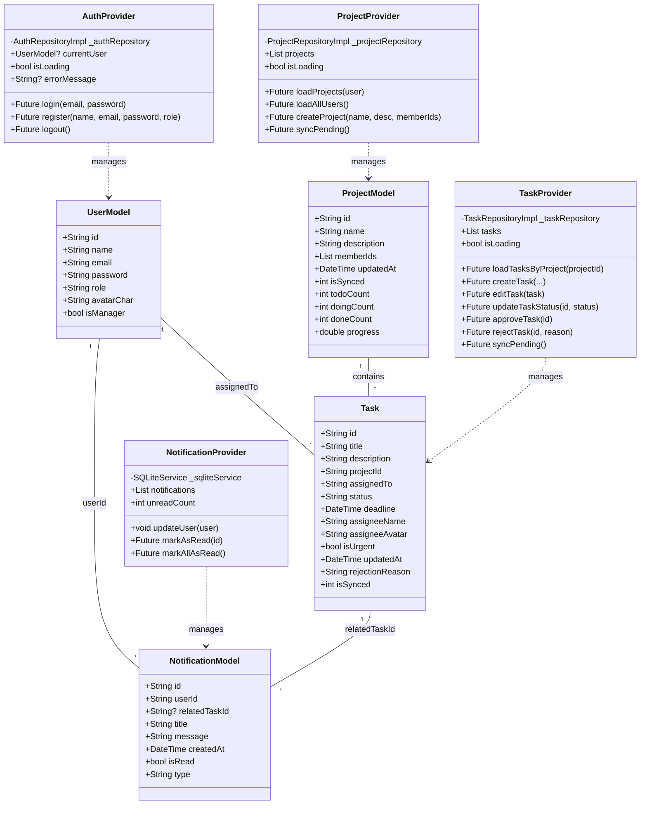

---

### 13. Activity Diagram - Login/Register (Sơ đồ hoạt động Đăng nhập & Đăng ký)

Sơ đồ quy trình thực hiện các bước xác thực người dùng trực tuyến thông qua Firebase Auth hoặc ngoại tuyến thông qua SQLite local:

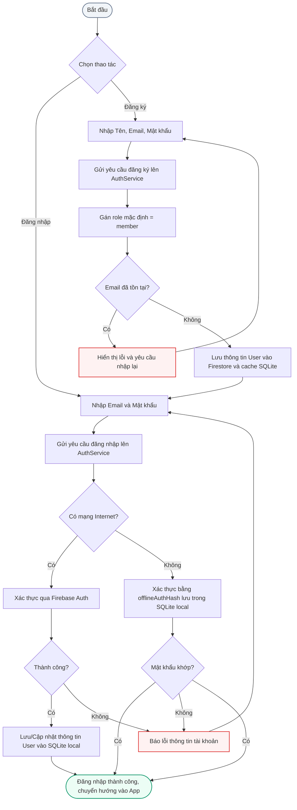

---

### 14. Activity Diagram - Create Project + Add Member (Sơ đồ hoạt động Tạo dự án & Thêm thành viên)

Sơ đồ thể hiện quy trình của Manager khi khởi tạo dự án và đính kèm các thành viên tham gia:

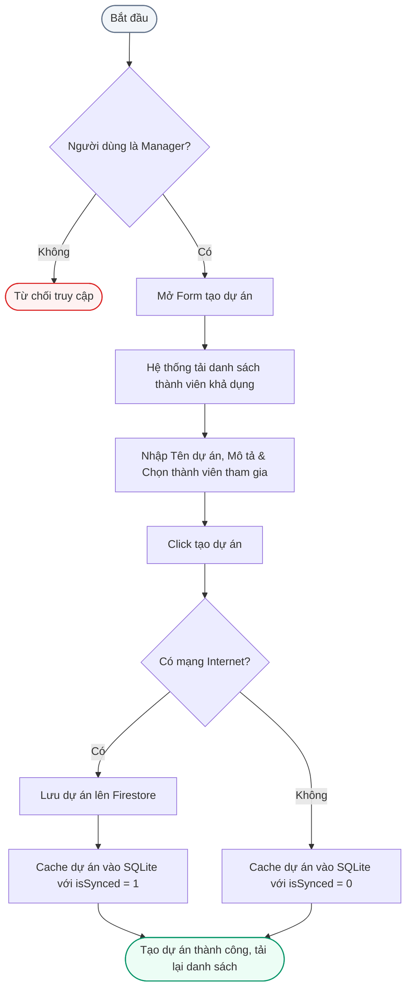

---

### 15. Activity Diagram - Assign Task (Sơ đồ hoạt động Giao nhiệm vụ công việc)

Sơ đồ quy trình Manager phân công công việc cụ thể cho thành viên của dự án:

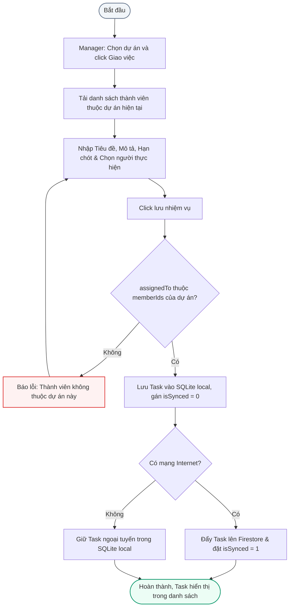

---

### 16. Activity Diagram - Member Update Task Status (Sơ đồ hoạt động Thành viên cập nhật trạng thái)

Sơ đồ hoạt động diễn tả luồng chuyển đổi trạng thái công việc của Member được phân công:

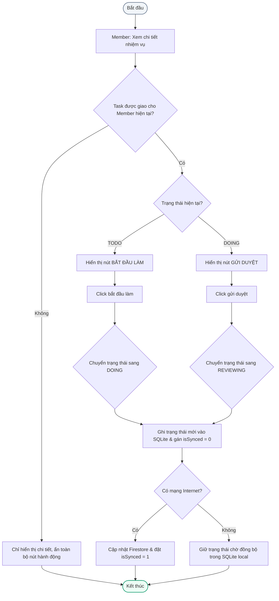

---

### 17. Activity Diagram - Manager Approve/Reject Task (Sơ đồ hoạt động phê duyệt/từ chối của quản lý)

Sơ đồ hoạt động miêu tả quy trình Manager kiểm định và đưa ra quyết định phê duyệt hay trả lại nhiệm vụ:

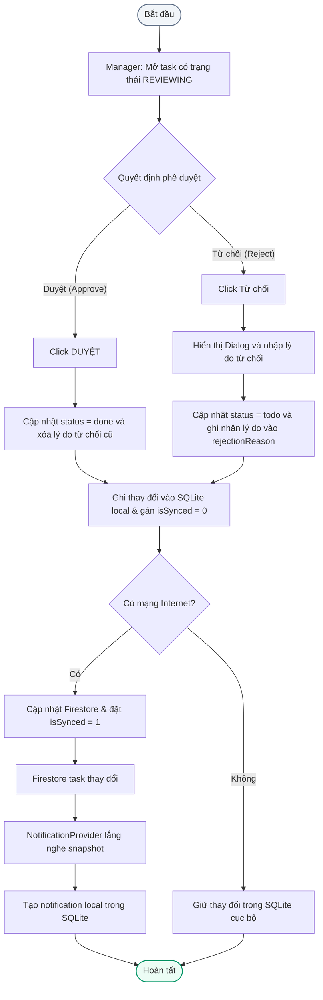

---

### 18. Sequence Diagram - Offline Sync (Sơ đồ tuần tự - Cơ chế đồng bộ dữ liệu ngoại tuyến)

Sơ đồ mô tả trình tự tương tác giữa giao diện ứng dụng, các providers, SQLite local, và Cloud Firestore khi thực hiện ghi dữ liệu ngoại tuyến và tự động đẩy đồng bộ khi thiết bị khôi phục kết nối mạng:

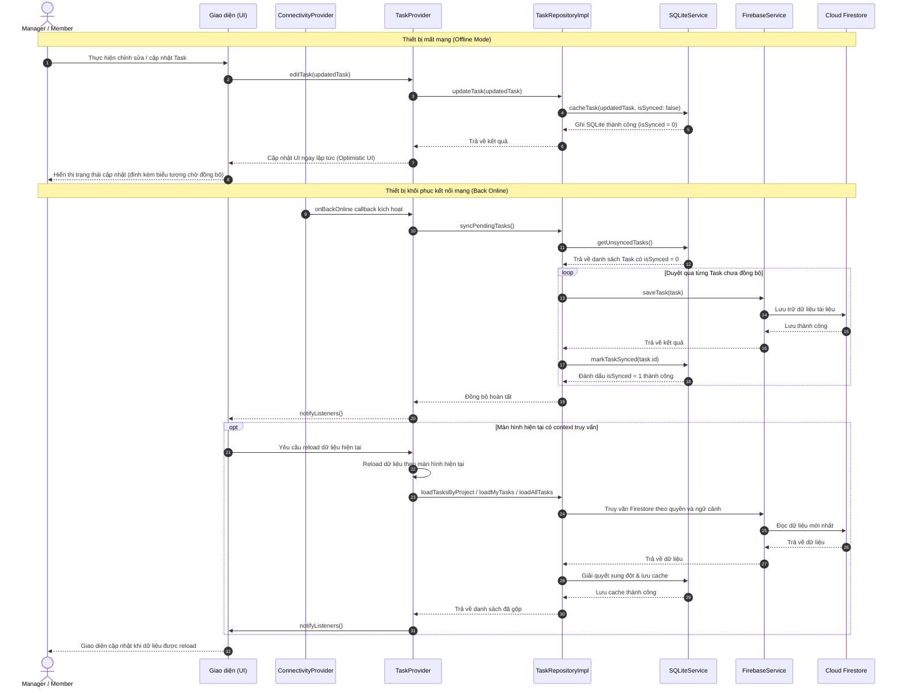
