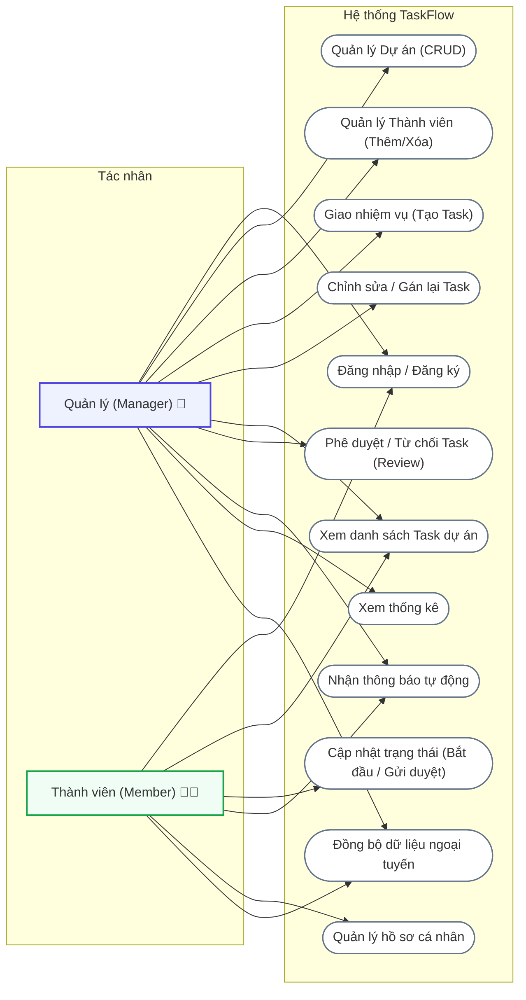
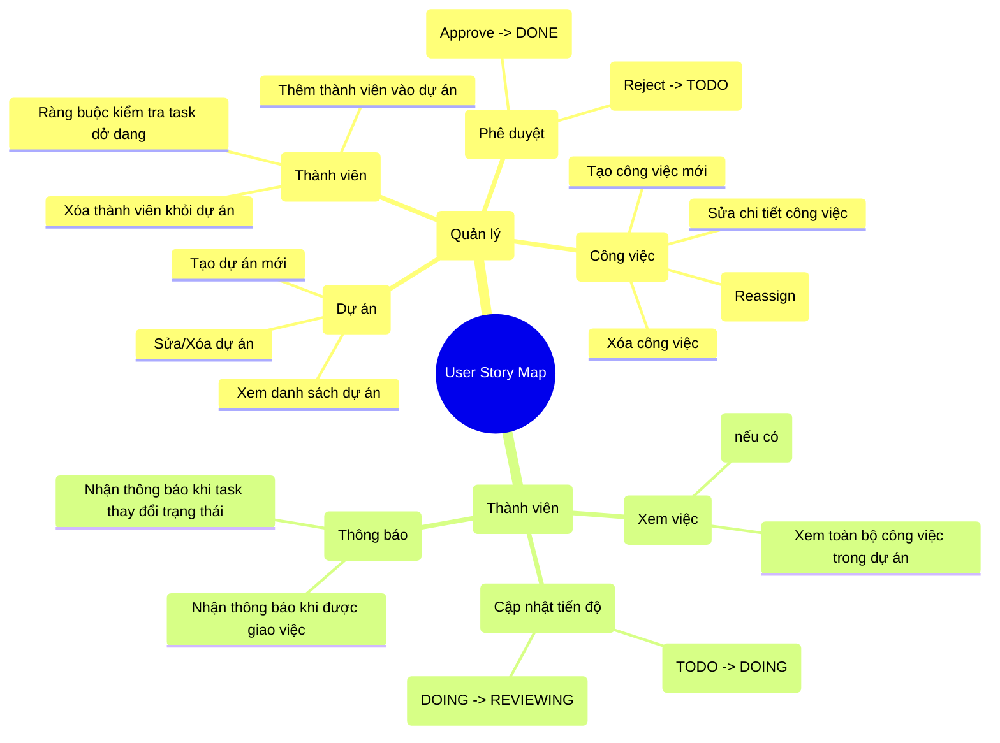
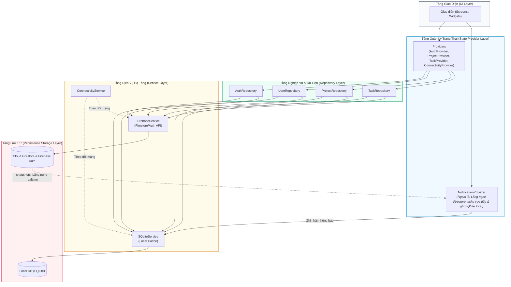
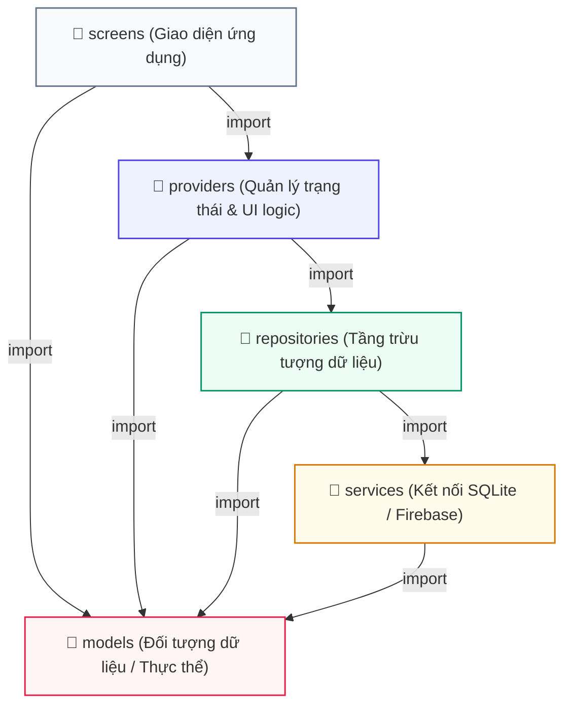
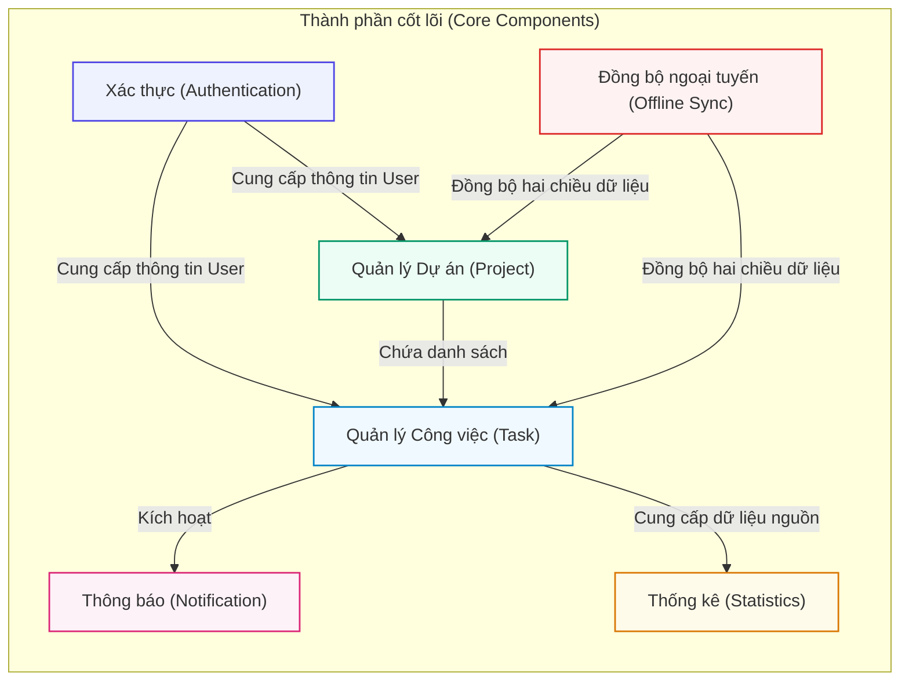
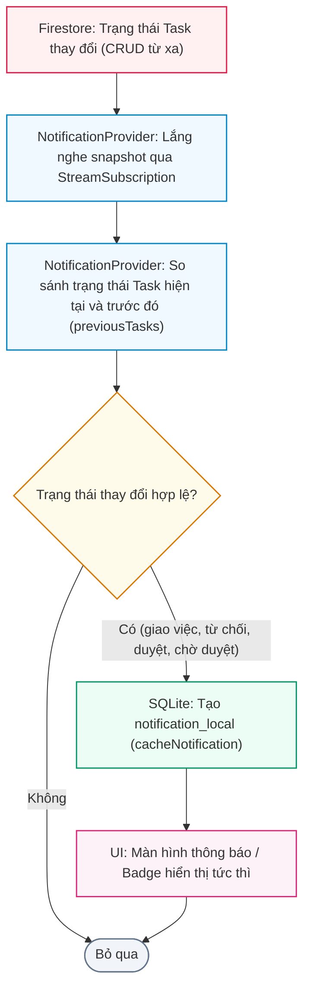

# Phân Tích Nghiệp Vụ & Sơ Đồ Quy Trình (TaskFlow Diagrams)

Tài liệu này trình bày chi tiết về phân tích nghiệp vụ của dự án TaskFlow, bao gồm sơ đồ Use Case toàn hệ thống, sơ đồ phân rã User Story Map và luồng hoạt động nghiệp vụ chi tiết giữa các vai trò (Manager và Member).

---

## I. PHÂN TÍCH NGHIỆP VỤ

### 1. Use Case Diagram (Sơ đồ ca sử dụng toàn hệ thống)

Sơ đồ Use Case mô tả trực quan các tác nhân (Actors) tương tác với các chức năng chính của hệ thống TaskFlow:



---

### 2. User Story Map (Bản đồ câu chuyện người dùng)

User Story Map phân rã các tính năng nghiệp vụ theo vai trò người dùng nhằm xác định các câu chuyện cụ thể cần giải quyết:



---

### 3. Business Workflow (Luồng nghiệp vụ hoạt động)

Sơ đồ thể hiện tiến trình làm việc phối hợp giữa Manager và Member từ khâu tạo dự án, phân công cho đến khi hoàn thành công việc:


---

## II. KIẾN TRÚC HỆ THỐNG

### 4. Architecture Diagram (Sơ đồ kiến trúc phân tầng)

Sơ đồ thể hiện luồng dữ liệu và trách nhiệm của từng tầng trong kiến trúc ứng dụng (UI $\rightarrow$ Provider $\rightarrow$ Repository $\rightarrow$ Service $\rightarrow$ Databases).

> [!NOTE]
> **Ngoại lệ về luồng xử lý:** `NotificationProvider` là một ngoại lệ đặc biệt. Nó không đi qua lớp Repository mà trực tiếp lắng nghe các thay đổi trạng thái nhiệm vụ thông qua Firestore snapshots stream, sau đó ghi các bản ghi thông báo mới trực tiếp vào SQLite local thông qua `SQLiteService`.



---

### 5. Package Diagram (Sơ đồ Gói)

Sơ đồ gói biểu diễn mối quan hệ phụ thuộc giữa các thư mục/gói cấu trúc mã nguồn trong ứng dụng:



---

### 6. Component Diagram (Sơ đồ thành phần)

Sơ đồ biểu diễn các thành phần nghiệp vụ và kỹ thuật cốt lõi tương tác với nhau trong hệ thống:



---

### 6b. Notification Flow Diagram (Sơ đồ luồng xử lý thông báo thực tế)

Sơ đồ chi tiết cơ chế lắng nghe thay đổi nhiệm vụ trực tiếp và lưu trữ thông báo cục bộ của `NotificationProvider`:



---

### 7. Deployment Diagram (Sơ đồ triển khai vật lý)

Sơ đồ phân bố vật lý của các môi trường ứng dụng chạy ở client và lưu trữ đám mây phía server:

```mermaid
flowchart TD
    subgraph ClientNode ["Thiết bị khách hàng (Client Node)"]
        AndroidDevice["Thiết bị di động Android<br>(Hỗ trợ Flutter runtime / minSdk của dự án)"]
        subgraph AppRuntime ["Môi trường chạy App (TaskFlow App)"]
            FlutterApp["Ứng dụng Flutter / Dart VM"]
            SQLiteDB[("SQLite Database file<br>(taskflow.db)")]
            FlutterApp <--> |Đọc/Ghi cục bộ| SQLiteDB
        end
    end

    subgraph CloudServer ["Đám mây Google Cloud Platform / Firebase"]
        FirebaseAuthNode["Firebase Authentication<br>(Xác thực người dùng)"]
        FirestoreNode["Cloud Firestore NoSQL Database<br>(Lưu trữ tài liệu và đồng bộ)"]
    end

    FlutterApp --> |HTTPS / WSS (gRPC)| FirebaseAuthNode
    FlutterApp --> |HTTPS / WSS (gRPC)| FirestoreNode

    %% CSS Styling
    style ClientNode fill:#f8fafc,stroke:#475569,stroke-width:1.5px
    style AndroidDevice fill:#f0fdf4,stroke:#16a34a,stroke-width:1.5px
    style AppRuntime fill:#fffbeb,stroke:#d97706,stroke-width:1.5px
    style CloudServer fill:#fff1f2,stroke:#e11d48,stroke-width:1.5px
    style FirebaseAuthNode fill:#fff,stroke:#64748b,stroke-width:1px
    style FirestoreNode fill:#fff,stroke:#64748b,stroke-width:1px
```

