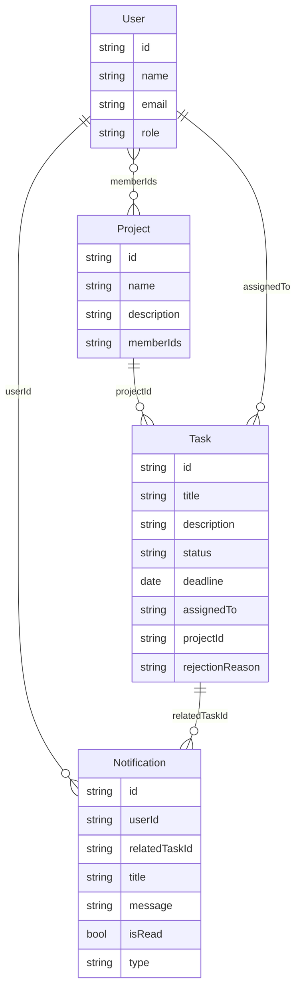
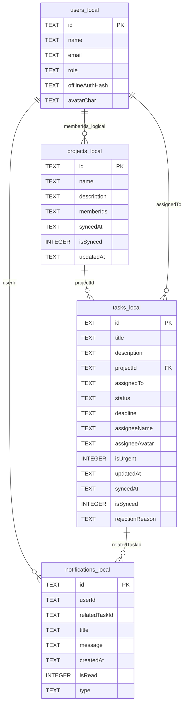

# TaskFlow ERD Diagrams

Tài liệu này tách riêng hai sơ đồ ERD của hệ thống TaskFlow: một sơ đồ nghiệp vụ đơn giản dùng cho báo cáo chính và một sơ đồ kỹ thuật phản ánh cấu trúc SQLite local database hiện tại.

## 1. ERD nghiệp vụ đơn giản

Sơ đồ này mô tả các thực thể chính trong nghiệp vụ quản lý dự án và công việc. Phần này ưu tiên sự dễ hiểu, không đưa các trường kỹ thuật phục vụ đồng bộ như `isSynced`, `syncedAt`, `updatedAt` hoặc `offlineAuthHash`.

Ghi chú:

- `Project.memberIds` là quan hệ logic nhiều-nhiều giữa User và Project.
- `Task.assignedTo` là UID của User được giao việc.
- `Notification` chỉ lưu local trong ứng dụng, không đồng bộ lên Firestore.

## 2. ERD kỹ thuật SQLite Local Database

Sơ đồ này phản ánh cấu trúc SQLite local database hiện tại trong ứng dụng. Các trường kỹ thuật như `isSynced`, `syncedAt`, `updatedAt` và `offlineAuthHash` được giữ lại vì phục vụ cơ chế Offline-First và đồng bộ dữ liệu.

Ghi chú:

- `memberIds` được lưu dạng chuỗi UID phân tách bằng dấu phẩy để đơn giản hóa đồng bộ offline.
- `isSynced = 0` nghĩa là bản ghi đang chờ đồng bộ lên Firestore.
- `updatedAt` dùng để giải quyết xung đột dữ liệu giữa local và server.
- `offlineAuthHash` chỉ dùng cho xác thực ngoại tuyến, không được lưu lên Firestore.
