# BÁO CÁO BÀI TẬP LỚN CUỐI KỲ
## MÔN: PHÁT TRIỂN ỨNG DỤNG TRÊN THIẾT BỊ DI ĐỘNG (LỚP N03)
## ĐỀ TÀI: HỆ THỐNG QUẢN LÝ CÔNG VIỆC DỰ ÁN - TASKFLOW

**Thành viên thực hiện (Nhóm N03):** 
1. Trần Thị Thu Hường
2. Nguyễn Thị Thương
3. Nguyễn Việt Cường

---

## CÂU 1: TRÌNH BÀY USER STORIES (CÂU CHUYỆN NGƯỜI DÙNG)

Hệ thống **TaskFlow** được thiết kế phân quyền rõ ràng thành hai vai trò cốt lõi: **Manager (Quản lý)** và **Member (Thành viên nhóm)**. Các câu chuyện người dùng được xây dựng để đảm bảo tính cộng tác và quản lý tối ưu:

### 1. Vai trò Manager (Quản lý dự án)
* **US-M1: Đăng nhập phân quyền**
  * *Là một* Manager, *tôi muốn* đăng nhập hệ thống bằng email và mật khẩu, *để* tôi có thể truy cập các tính năng quản lý cao cấp như tạo dự án, phân công công việc và phê duyệt.
* **US-M2: Tạo dự án mới và chọn thành viên**
  * *Là một* Manager, *tôi muốn* tạo một dự án mới (nhập tên, mô tả) và tích chọn danh sách các thành viên sẽ tham gia dự án, *để* tôi có thể nhóm các thành viên và công việc có liên quan lại với nhau.
* **US-M3: Tạo nhiệm vụ và phân công công việc**
  * *Là một* Manager, *tôi muốn* tạo một nhiệm vụ mới trong dự án và gán cho một thành viên cụ thể trong danh sách thành viên dự án, *để* đảm bảo phân công đúng người đúng việc.
* **US-M4: Chỉnh sửa và Tái phân công nhiệm vụ**
  * *Là một* Manager, *tôi muốn* chỉnh sửa tiêu đề, mô tả, hạn chót hoặc thay đổi người nhận việc của một nhiệm vụ hiện có, *để* tôi có thể linh hoạt điều phối nhân sự khi kế hoạch thay đổi.
* **US-M5: Phê duyệt/Từ chối kết quả công việc**
  * *Là một* Manager, *tôi muốn* nhận thông báo khi thành viên nộp bài, xem chi tiết và lựa chọn duyệt (hoàn thành task) hoặc từ chối (yêu cầu sửa lại kèm lý do), *để* tôi có thể kiểm soát chất lượng đầu ra.
* **US-M6: Theo dõi tiến độ và hiệu suất**
  * *Là một* Manager, *tôi muốn* xem biểu đồ tiến độ phần trăm dự án và các chỉ số thống kê hiệu suất của từng thành viên, *để* nắm rõ tình hình dự án tổng thể.

### 2. Vai trò Member (Thành viên thực hiện)
* **US-ME1: Xem dự án và công việc chung**
  * *Là một* Member, *tôi muốn* xem tất cả các dự án mà mình tham gia và toàn bộ các nhiệm vụ trong dự án đó, *để* tôi nắm rõ bối cảnh và có thể hỗ trợ đồng đội khi cần.
* **US-ME2: Quản lý công việc cá nhân**
  * *Là một* Member, *tôi muốn* lọc danh sách các công việc được giao cho riêng mình và xem chúng hiển thị trực quan trên Lịch biểu (Calendar View), *để* sắp xếp mức độ ưu tiên thực hiện.
* **US-ME3: Nhận việc (Start Task)**
  * *Là một* Member, *tôi muốn* chuyển trạng thái công việc của mình từ Cần làm (`todo`) sang Đang làm (`doing`), *để* Manager và đồng đội biết tôi đã bắt đầu thực hiện nhiệm vụ.
* **US-ME4: Nộp bài (Submit Task)**
  * *Là một* Member, *tôi muốn* chuyển trạng thái công việc từ Đang làm (`doing`) sang Chờ duyệt (`reviewing`), *để* gửi thông báo cho Manager kiểm tra và phê duyệt.
* **US-ME5: Làm việc ngoại tuyến (Offline Mode)**
  * *Là một* Member, *tôi muốn* tiếp tục đổi trạng thái công việc và ghi chép nội dung ngay cả khi thiết bị mất mạng, *để* công việc của tôi không bị gián đoạn và tự động đồng bộ lại khi có kết nối Internet.

---

## CÂU 2: PHÂN TÍCH YÊU CẦU, ĐỐI TƯỢNG, MỐI QUAN HỆ VÀ PHƯƠNG THỨC HOẠT ĐỘNG

### 1. Phân tích yêu cầu hệ thống
* **Yêu cầu chức năng:** Xác thực người dùng; quản lý dự án (CRUD); quản lý nhiệm vụ (CRUD); chuyển đổi trạng thái nhiệm vụ theo ma trận máy trạng thái (State Machine); trung tâm thông báo đẩy; thống kê trực quan.
* **Yêu cầu phi chức năng:** Kiến trúc ngoại tuyến trước (Offline-First); đồng bộ hóa dữ liệu thời gian thực; bảo mật phân quyền cơ sở dữ liệu (Firestore Security Rules); giao diện người dùng cao cấp (Premium Glassmorphism).

### 2. Các đối tượng chính trong hệ thống (Entities)
* **`UserModel`:** Đại diện cho tài khoản. Gồm có: ID (UID từ Auth), Họ tên, Email, Vai trò (`manager`/`member`), và chữ cái đại diện Avatar.
* **`ProjectModel`:** Đại diện cho dự án. Gồm có: ID, Tên dự án, Mô tả dự án, Danh sách ID thành viên (`memberIds`), thời điểm cập nhật, và các thông số thống kê phục vụ UI (số task todo/doing/done, phần trăm tiến độ).
* **`Task`:** Đại diện cho một đầu việc. Gồm có: ID, Tiêu đề, Mô tả, ID dự án liên kết, ID người thực hiện (`assignedTo`), Trạng thái (`status`), Hạn chót (`deadline`), Dữ liệu snapshot của người được gán (tên/avatar), cờ khẩn cấp, lý do từ chối, cờ trạng thái đồng bộ (`isSynced`), và thời điểm cập nhật gần nhất.
* **`NotificationModel`:** Đại diện cho thông báo. Gồm có: ID, ID người nhận, ID task liên quan, Tiêu đề, Nội dung, Thời gian tạo, Cờ đã đọc (`isRead`), và phân loại thông báo.

### 3. Mối quan hệ giữa các đối tượng (Relationships)
* **Dự án - Nhiệm vụ (Project - Task):** Quan hệ **Một - Nhiều** (`1-N`). Một dự án chứa nhiều nhiệm vụ. Mối liên kết khóa ngoại vật lý trong SQLite hỗ trợ `ON DELETE CASCADE` (xóa dự án tự động xóa sạch các task bên trong).
* **Người dùng - Nhiệm vụ (User - Task):** Quan hệ **Một - Nhiều** (`1-N`). Một người dùng có thể được giao thực hiện nhiều nhiệm vụ khác nhau qua trường `assignedTo`.
* **Người dùng - Dự án (User - Project):** Quan hệ **Nhiều - Nhiều** (`N-N`). Một thành viên tham gia nhiều dự án, và một dự án có nhiều thành viên. Mối quan hệ này được chuẩn hóa logic thông qua mảng `memberIds` lưu trữ ngay trong tài liệu dự án để tối ưu hóa truy vấn offline.
* **Nhiệm vụ - Thông báo (Task - Notification):** Quan hệ **Một - Nhiều** (`1-N`). Một sự thay đổi trạng thái của nhiệm vụ sẽ sinh ra các thông báo tương ứng cho người dùng liên quan.

### 4. Kiến trúc Tổng quan & Phương thức hoạt động (Offline-First)

Ứng dụng TaskFlow hoạt động theo mô hình **Offline-First**. Giao diện người dùng tương tác trực tiếp với các State Provider, dữ liệu được ghi đè và lưu trữ cục bộ vào SQLite trước. Khi có kết nối mạng, dữ liệu sẽ được đồng bộ hai chiều (Bi-directional Synchronization) với Cloud Firestore thông qua Repository Pattern.

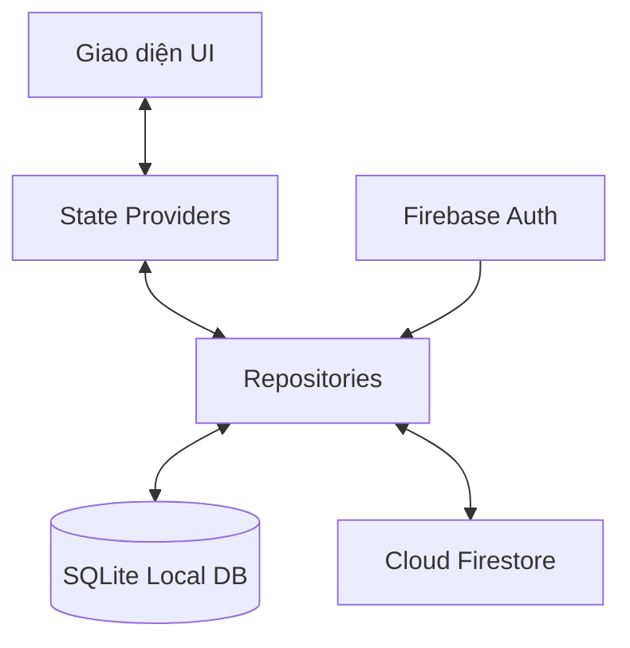
> **Lưu ý về dòng chảy dữ liệu (Data Flow):** Firebase Auth không trực tiếp đồng bộ dữ liệu với Firestore. Thay vào đó, Repository lấy định danh tài khoản (`currentUser.uid`) từ Firebase Auth, sau đó dùng UID này làm chìa khóa để thực hiện các truy vấn đọc/ghi trên Firestore và SQLite.

#### 4.1. Sơ đồ thực thể quan hệ cục bộ (ERD - SQLite Local)

Dưới đây là sơ đồ thực thể quan hệ (ERD) thể hiện cấu trúc các bảng và mối liên kết khóa ngoại/logic trong SQLite nội bộ:

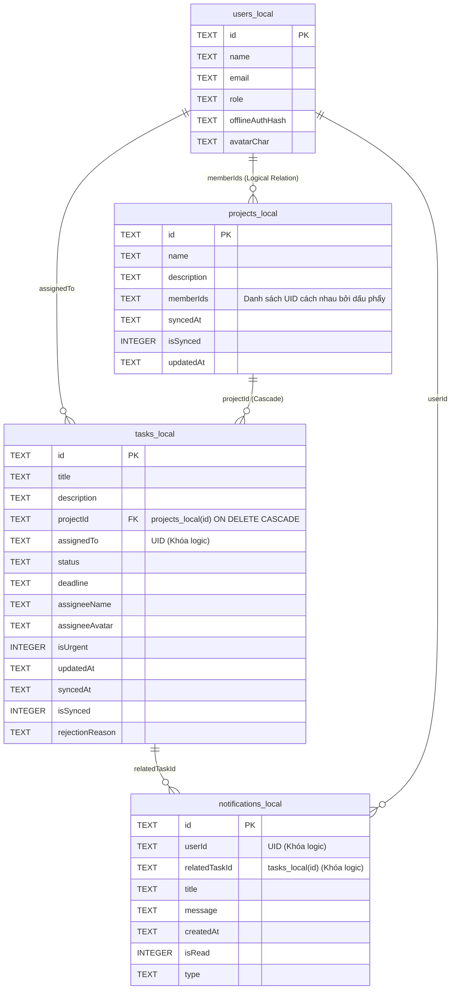

#### 4.2. Luồng Vận Động Dữ Liệu & Đồng Bộ Offline-First

##### 4.2.1. Đồng bộ xuôi (Downstream - Firestore to SQLite)
1. Khi người dùng mở các màn hình liên quan, Repository tải dữ liệu `tasks` và `projects` từ Firestore theo quyền truy cập hiện tại rồi lưu về SQLite. Riêng `NotificationProvider` lắng nghe realtime stream của collection `tasks` để phát hiện sự kiện tạo thông báo.
2. Khi nhận dữ liệu từ Firestore, Repository kiểm tra thời điểm cập nhật `updatedAt` và cờ trạng thái `isSynced` của bản ghi local trước khi ghi đè để bảo vệ các thay đổi ngoại tuyến chưa kịp đồng bộ:
   - **Quy tắc bảo vệ**: Nếu bản ghi local đang có `isSynced = 0` (chờ đồng bộ) và có thời gian `updatedAt` mới hơn dữ liệu nhận từ máy chủ, Repository sẽ **giữ lại bản ghi local** và bỏ qua việc ghi đè từ server.
   - Ngược lại, dữ liệu từ server sẽ được lưu đè vào SQLite và cập nhật `isSynced = 1`.
3. Đối với thông báo, snapshot đầu tiên chỉ được dùng để tạo baseline `previousTasks`, không tạo thông báo cho dữ liệu cũ. Từ các snapshot tiếp theo, hệ thống kiểm tra thay đổi trạng thái/gán việc hợp lệ và chống trùng dựa trên bộ ba `(userId, relatedTaskId, type)` trước khi ghi thông báo mới vào `notifications_local`.

##### 4.2.2. Đồng bộ ngược (Upstream - SQLite to Firestore)
1. Khi không có mạng (Offline), người dùng có thể tạo/cập nhật dự án hoặc tạo/cập nhật trạng thái nhiệm vụ trong phạm vi chức năng được ứng dụng hỗ trợ.
2. Hệ thống ghi dữ liệu vào SQLite, gán thời gian `updatedAt = DateTime.now()` và đánh dấu cờ trạng thái đồng bộ `isSynced = 0`.
3. Khi thiết bị khôi phục kết nối Internet:
   - `ConnectivityProvider` kích hoạt hàm `syncPending()`.
   - Tìm kiếm các bản ghi chưa đồng bộ (`isSynced = 0`) trong `projects_local` và `tasks_local`.
   - Đẩy dữ liệu lên Firestore. Sau khi lưu thành công, cập nhật `isSynced = 1` ở local và gán thời gian `syncedAt`.

##### 4.2.3. Giải quyết xung đột (Conflict Resolution)
Nếu dữ liệu được sửa đổi ở cả local và server trong thời gian offline, hệ thống giải quyết bằng cơ chế **Timestamp Comparison**:
- So sánh thuộc tính thời gian cập nhật gần nhất `updatedAt` giữa Server Task/Project và Local Task/Project.
- Nếu `server.updatedAt` lớn hơn `local.updatedAt` $\to$ Cập nhật dữ liệu từ Server ghi đè vào Local.
- Ngược lại, nếu `local.updatedAt` lớn hơn $\to$ Thực hiện đẩy dữ liệu Local ghi đè lên Server.

---

## CÂU 3: SƠ ĐỒ CẤU TRÚC LỚP VÀ SƠ ĐỒ THUẬT TOÁN (DIAGRAMS)

### 1. Class Diagram (Sơ đồ cấu trúc lớp)

#### 1.1 Data Models (Mô hình dữ liệu)
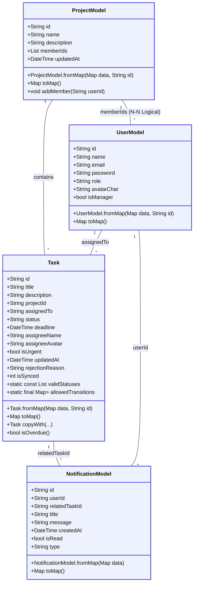

#### 1.2 Services & Repositories Layers (Tầng dịch vụ và Kho lưu trữ)
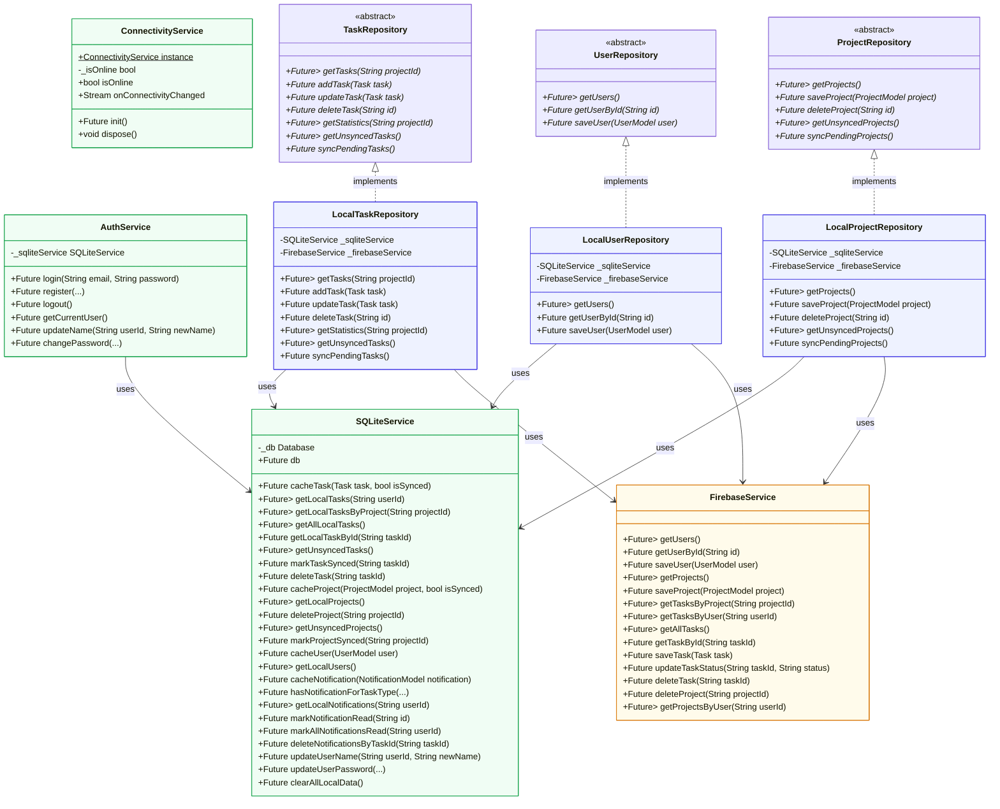

---

### 2. Sơ đồ thuật toán và Luồng hoạt động (10 Sơ đồ)

#### Sơ đồ 2.1: Luồng Đăng nhập & Phân quyền ứng dụng (Activity Diagram)

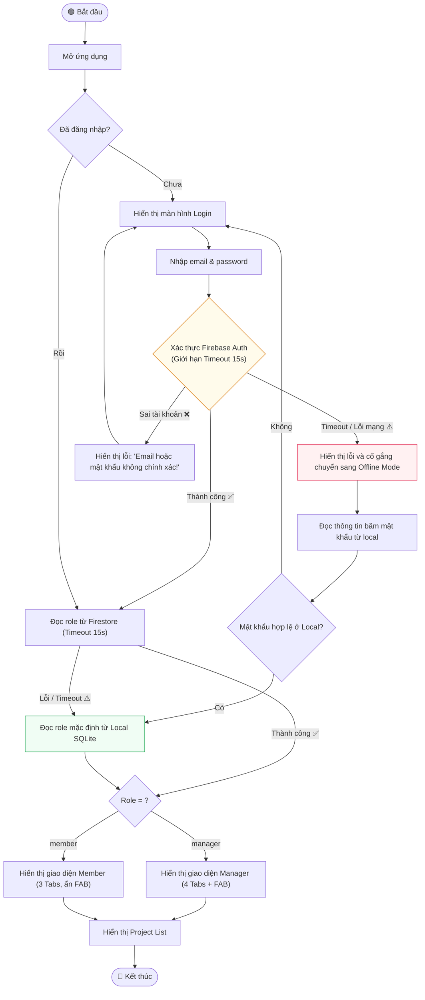

#### Sơ đồ 2.2: Luồng Tạo Task và gán việc trong dự án (Activity Diagram)

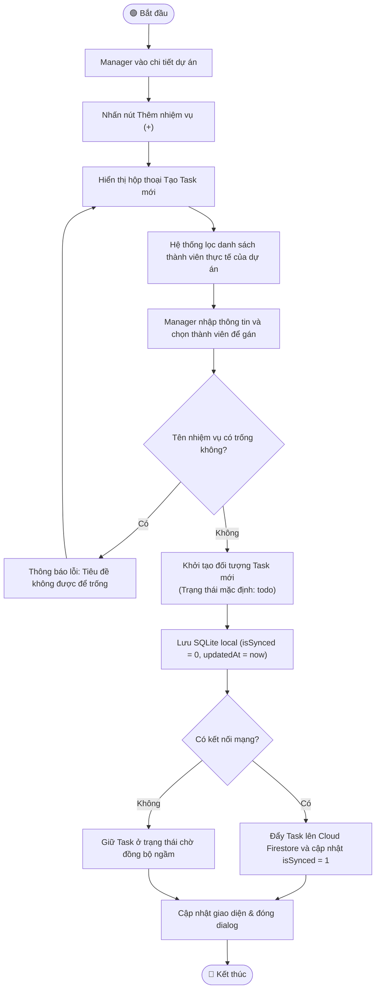

#### Sơ đồ 2.3: Luồng Cập nhật Tiến độ & Đồng bộ (Activity Diagram)

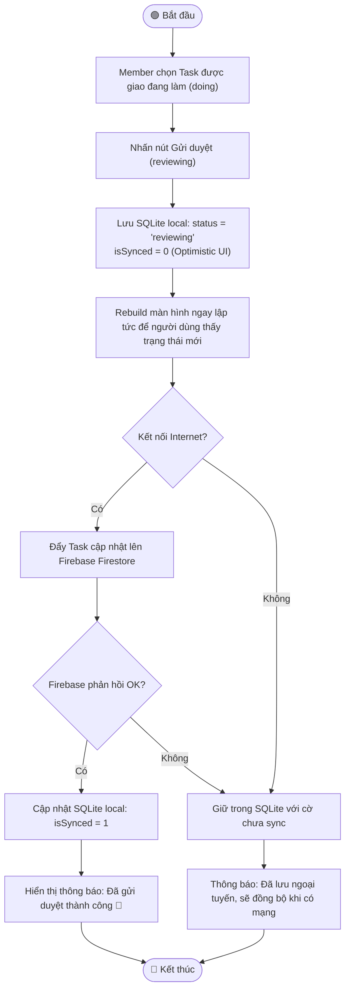

#### Sơ đồ 2.4: Luồng Chỉnh sửa Task của Manager (Activity Diagram)

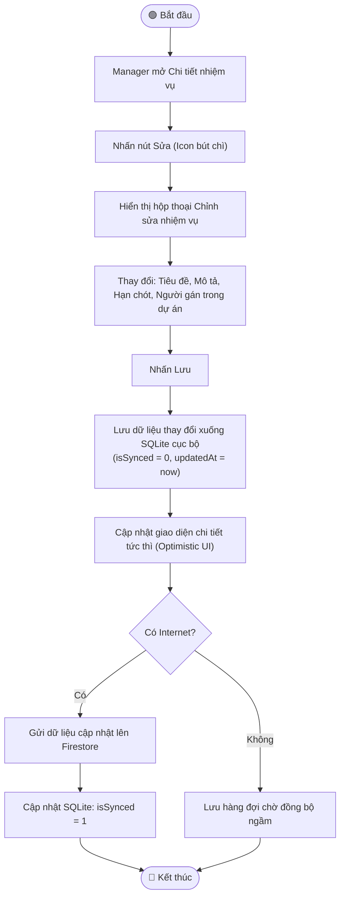

#### Sơ đồ 2.5: Luồng Quản lý thành viên & Chống Task mồ côi (Activity Diagram)

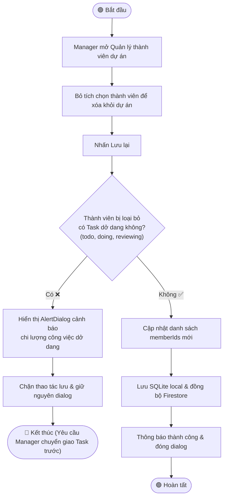

#### Sơ đồ 2.6: Luồng Tương tác cập nhật trạng thái của Task (Sequence Diagram)

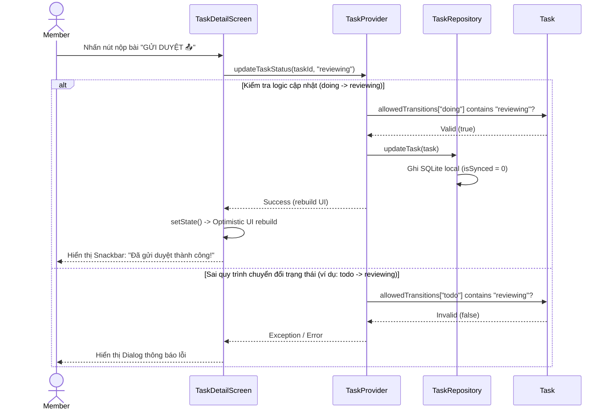

#### Sơ đồ 2.7: Luồng Repository Pattern - Offline Fallback & Error Handling (Sequence Diagram)

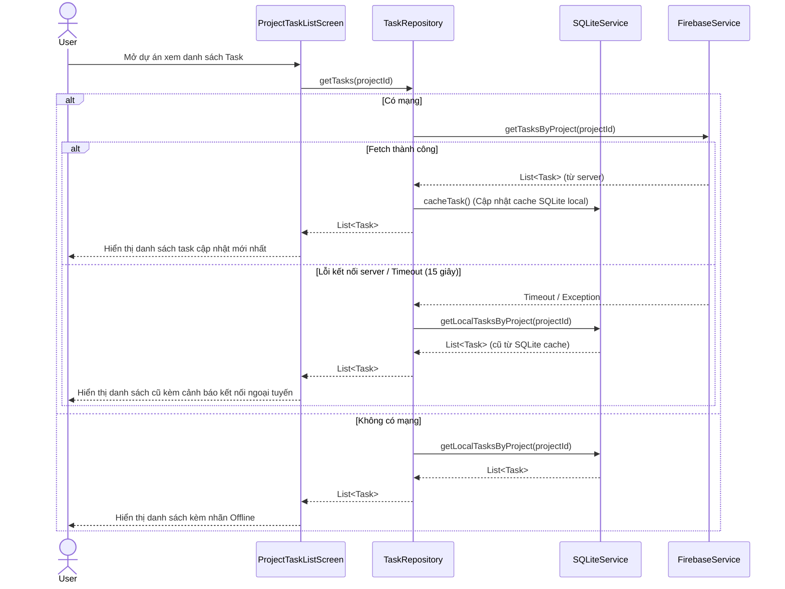

#### Sơ đồ 2.8: Luồng Khôi phục kết nối mạng - Auto Sync cả Project & Task (Sequence Diagram)

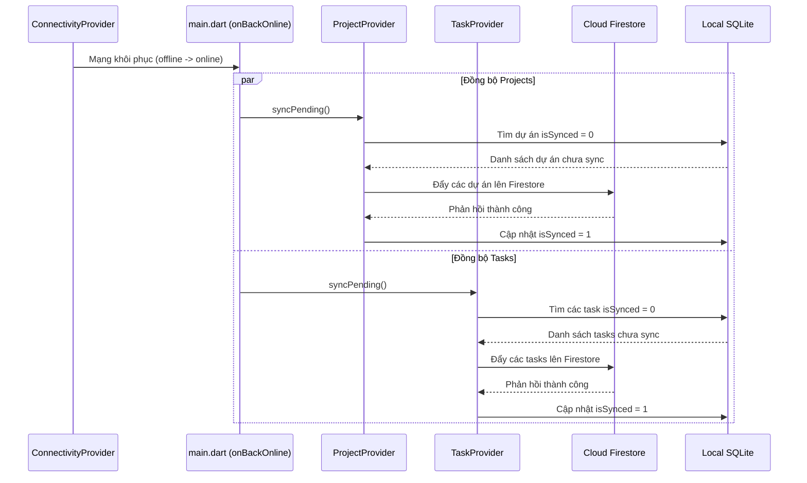

#### Sơ đồ 2.9: Luồng kiểm tra ràng buộc trước khi xóa thành viên dự án (Sequence Diagram)

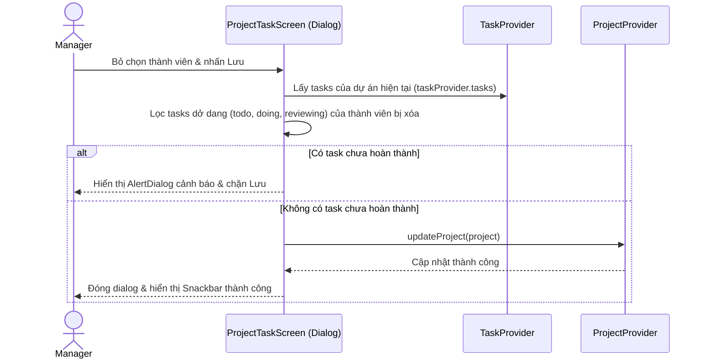

#### Sơ đồ 2.10: Sơ đồ Chuyển đổi trạng thái nhiệm vụ (State Diagram - State Machine)

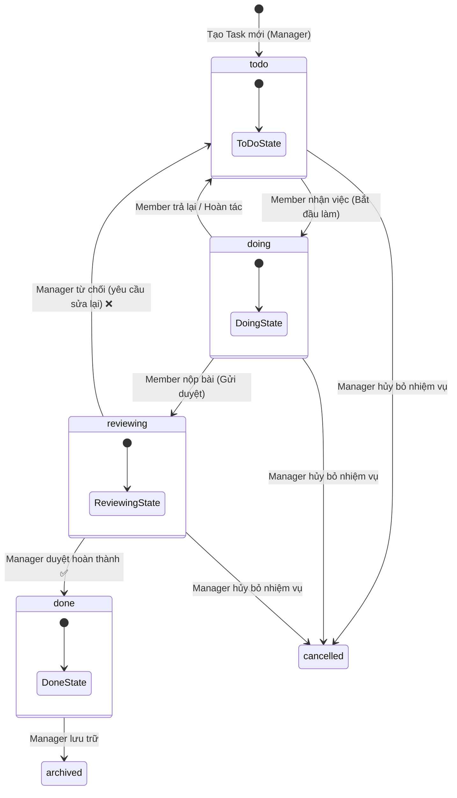

---

## CÂU 4: THIẾT KẾ MÀN HÌNH (SCREENS DESIGN) VÀ LOGIC ĐIỀU HƯỚNG (FLOW OF WORK)

Ứng dụng **TaskFlow** sử dụng thanh điều hướng nổi (**Floating Bottom Navigation Bar**) thiết kế bo tròn dạng viên thuốc, tạo cảm giác hiện đại và tối ưu không gian hiển thị:

### 1. Danh sách và luồng các màn hình
1. **Login & Register Screen:** 
   * *Giao diện:* Sử dụng tông màu Primary `#4F46E5` kết hợp nền xám Slate nhẹ `#F8FAFC`, form nhập bo góc mềm mại `12px`, có nút chuyển đổi hiển thị mật khẩu.
   * *Logic:* Đăng nhập Firebase Auth trước. Nếu thành công sẽ nạp role của User từ Firestore để chuyển đổi giao diện tương ứng.
2. **MainScreen (Giao diện khung):**
   * *Giao diện:* Bottom Navigation Bar nổi bo tròn `30px`, cách đáy màn hình `24px`.
   * *Phân quyền:* Manager nhìn thấy 4 Tabs (Home, Project, Group, Profile) + nút FAB tròn nổi ở giữa để tạo Task nhanh. Member chỉ nhìn thấy 3 Tabs (Home, Project, Profile) và ẩn hoàn toàn nút FAB.
3. **HomeScreen (Trang chủ tổng quan):**
   * *Manager:* Hiển thị lưới thống kê 2x2 (Tổng số task, task đang làm, task hoàn thành, số lượng thành viên). Có khu vực thẻ Hero chứa task cần duyệt gấp nhất kèm nút duyệt/từ chối nhanh.
   * *Member:* Hiển thị thẻ Hero của công việc khẩn cấp đang làm, biểu đồ tròn tiến độ cá nhân, và danh sách các task mới cần làm.
4. **ProjectListScreen (Danh sách dự án):**
   * Hiển thị các dự án dưới dạng Card bo góc `20px` kèm thanh tiến độ `LinearProgressIndicator` của từng dự án.
   * Manager có nút (+) trên AppBar để mở dialog tạo dự án mới, hỗ trợ nhập tên, mô tả và chọn thành viên tham gia qua các checkbox.
5. **ProjectTaskScreen (Chi tiết công việc dự án):**
   * Hỗ trợ hai chế độ xem: **Dạng danh sách (List)** hoặc **Bảng Kanban (Kanban Board)**.
   * Tích hợp thanh lịch biểu mini hàng tháng (Calendar View) hiển thị số lượng chấm màu tương ứng với số task trong ngày.
6. **TaskDetailScreen (Chi tiết nhiệm vụ):**
   * Hiển thị chi tiết nội dung, nhãn trạng thái và thời gian.
   * Có thanh lịch sử trạng thái dạng trục dọc (Vertical Status Timeline).
   * Manager có thêm nút Edit (mở dialog sửa tiêu đề, mô tả, deadline, gán lại người thực hiện) và nút Delete để xóa task.

---

## CÂU 5: THỰC HIỆN LAYOUT/MÀN HÌNH MẪU (THEO IMG_5518.PNG)

Màn hình chi tiết công việc dự án và biểu diễn Kanban/Calendar đã được thực hiện bằng Flutter với các thông số cấu trúc trực quan cao cấp:

* **Mã màu chủ đạo (HSL Palette):**
  * Nền ứng dụng: `#F8FAFC` (Slate Light)
  * Thẻ hiển thị: `#FFFFFF` (Trắng tinh khiết)
  * Primary: `#4F46E5` (Indigo Modern)
  * Nhãn trạng thái: `Todo` (Đỏ `#EF4444`), `Doing` (Vàng hổ phách `#F59E0B`), `Reviewing` (Xanh dương `#3B82F6`), `Done` (Xanh lá `#10B981`).
* **Widget sử dụng cho Calendar Tab:**
  * Sử dụng một Custom Calendar Widget: Sử dụng `GridView.builder` với 7 cột để vẽ lưới ngày trong tháng.
  * Các ngày có Task sẽ vẽ các chấm tròn màu (`Container` dạng `BoxShape.circle`) tương ứng với màu trạng thái của Task đó. Ngày hiện tại được bao quanh bởi viền màu Primary của ứng dụng.
* **Widget sử dụng cho Kanban Tab:**
  * Sử dụng `SingleChildScrollView` cuộn ngang (`scrollDirection: Axis.horizontal`).
  * Bên trong chứa các cột trạng thái (`todo`, `doing`, `reviewing`, `done`) được thiết kế dưới dạng thẻ rộng `MediaQuery.of(context).size.width * 0.78` giúp người dùng lướt ngang mượt mà.
  * Mỗi cột chứa một `ListView.builder` dọc để hiển thị các thẻ Task tương ứng.
* **Widget cho Trục lịch sử (Timeline) ở chi tiết:**
  * Được thiết kế dạng danh sách liên kết dọc (`ListView.builder` kết hợp các đường kẻ dọc và icon trạng thái tròn). Thể hiện trực quan thời điểm chuyển dịch trạng thái của Task.

---

## CÂU 6: THỰC HIỆN CODE CÁC CÂU CHUYỆN NGƯỜI DÙNG Ở CÂU 1

Dưới đây là một số lát cắt mã nguồn quan trọng thể hiện việc thực thi các User Stories:

### 1. Lọc và gán việc trong phạm vi thành viên dự án (US-M3)
Đoạn mã lọc thành viên dự án trong [project_task_screen.dart](file:///d:/Workspace/TBDD/TaskFlow_Huong_Thuong_Cuong_N03_1_2026/lib/screens/project_task_screen.dart):
```dart
// Lọc danh sách thành viên thực tế của dự án
final List<UserModel> projectMembers = projectProvider.allUsers
    .where((u) => project.memberIds.contains(u.id))
    .toList();

// Hiển thị Dropdown giao việc cho thành viên thuộc dự án
DropdownButtonFormField<String>(
  value: selectedUser,
  items: projectMembers.map((u) {
    return DropdownMenuItem<String>(
      value: u.id,
      child: Text(u.name),
    );
  }).toList(),
  onChanged: (val) => setState(() => selectedUser = val),
);
```

### 2. Thao tác trạng thái của Member và Manager (US-ME3, US-ME4, US-M5)
Đoạn mã chuyển trạng thái trong [task_detail_screen.dart](file:///d:/Workspace/TBDD/TaskFlow_Huong_Thuong_Cuong_N03_1_2026/lib/screens/task_detail_screen.dart):
```dart
Widget _buildActions(BuildContext context, TaskProvider provider, Task currentTask, bool isManager, bool isAssignedToMe) {
  final status = currentTask.status.toLowerCase();

  // Thành viên tự nhận việc hoặc nộp bài
  if (!isManager && isAssignedToMe) {
    if (status == 'todo') {
      return _buildFullWidthButton('BẮT ĐẦU LÀM', AppColors.doing, () => _updateStatus(context, provider, currentTask, 'doing'));
    }
    if (status == 'doing') {
      return _buildFullWidthButton('GỬI DUYỆT 📤', AppColors.reviewing, () => _updateStatus(context, provider, currentTask, 'reviewing'));
    }
  }

  // Quản lý phê duyệt hoặc từ chối
  if (isManager && status == 'reviewing') {
    return Row(
      children: [
        Expanded(child: _buildFullWidthButton('Từ chối', AppColors.error, () => _showRejectDialog(context, provider, currentTask.id))),
        const SizedBox(width: 16),
        Expanded(child: _buildFullWidthButton('DUYỆT', AppColors.done, () => _approveTask(context, provider, currentTask.id))),
      ],
    );
  }
  return const SizedBox.shrink();
}
```

---

## CÂU 7: KẾT NỐI CƠ SỞ DỮ LIỆU VÀ THỰC HIỆN ORM VỚI FIREBASE DOCUMENTS & SQLITE

### 1. Kiến trúc lưu trữ và Ánh xạ ORM

Mối liên kết giữa các Dart Object định nghĩa kiểu dữ liệu trong Flutter và tài liệu dạng BSON/JSON trên Cloud Firestore được thực hiện thông qua cơ chế ORM thủ công hiệu năng cao trong các Models:

#### 1.1. Ánh xạ đối tượng Nhiệm vụ (Task Model ORM)
Chi tiết trong [task_model.dart](file:///d:/Workspace/TBDD/TaskFlow_Huong_Thuong_Cuong_N03_1_2026/lib/models/task_model.dart):
```dart
class Task {
  String id;
  String title;
  String description;
  String projectId;
  String assignedTo;
  String status;
  DateTime deadline;
  String assigneeName;
  String assigneeAvatar;
  bool isUrgent;
  DateTime updatedAt;
  String rejectionReason;
  int isSynced;

  Task({
    required this.id,
    required this.title,
    this.description = '',
    required this.projectId,
    required this.assignedTo,
    required this.status,
    required this.deadline,
    this.assigneeName = '',
    this.assigneeAvatar = '',
    this.isUrgent = false,
    DateTime? updatedAt,
    this.rejectionReason = '',
    this.isSynced = 1,
  }) : updatedAt = (updatedAt ?? DateTime.now()).toUtc();

  // Đọc dữ liệu từ Document Firestore hoặc SQLite Map (Deserialization)
  factory Task.fromMap(Map<String, dynamic> data, String id) {
    return Task(
      id: id,
      title: data['title'] ?? '',
      description: data['description'] ?? '',
      projectId: data['projectId'] ?? '',
      assignedTo: data['assignedTo'] ?? '',
      status: data['status'] ?? 'todo',
      deadline: DateTime.tryParse(data['deadline'] ?? '') ?? DateTime.now(),
      assigneeName: data['assigneeName'] ?? '',
      assigneeAvatar: data['assigneeAvatar'] ?? '',
      isUrgent: (data['isUrgent'] == 1 || data['isUrgent'] == true),
      updatedAt: DateTime.tryParse(data['updatedAt'] ?? '')?.toUtc() ?? DateTime.now().toUtc(),
      rejectionReason: data['rejectionReason'] ?? '',
      isSynced: data['isSynced'] ?? 1,
    );
  }

  // Xuất dữ liệu sang định dạng Map Document (Serialization)
  Map<String, dynamic> toMap() {
    return {
      'title': title,
      'description': description,
      'projectId': projectId,
      'assignedTo': assignedTo,
      'status': status,
      'deadline': deadline.toIso8601String(),
      'assigneeName': assigneeName,
      'assigneeAvatar': assigneeAvatar,
      'isUrgent': isUrgent,
      'updatedAt': updatedAt.toIso8601String(),
      'rejectionReason': rejectionReason,
    };
  }
}
```

### 2. Thiết Kế SQLite Local Database (Version 7)

SQLite sử dụng file cơ sở dữ liệu cục bộ `taskflow.db`. Dưới đây là đặc tả chi tiết của 4 bảng trong hệ thống:

#### Bảng 2.1: `users_local` (Thông tin người dùng cục bộ)
Lưu trữ thông tin tài khoản đã đăng nhập trên thiết bị để hỗ trợ xác thực offline.

| Tên trường | Kiểu dữ liệu | Ràng buộc / Mặc định | Ý nghĩa |
| :--- | :--- | :--- | :--- |
| `id` | `TEXT` | `PRIMARY KEY` | Firebase Auth UID duy nhất |
| `name` | `TEXT` | | Tên hiển thị của người dùng |
| `email` | `TEXT` | | Địa chỉ Email đăng nhập |
| `role` | `TEXT` | | Vai trò: `manager` hoặc `member` |
| `offlineAuthHash` | `TEXT` | | Chuỗi mật khẩu băm/mã hóa (để xác thực offline, tránh dùng tên cột "password" trực tiếp) |
| `avatarChar` | `TEXT` | | Chữ cái đầu hiển thị làm avatar |

---

#### Bảng 2.2: `projects_local` (Thông tin dự án cục bộ)
Quản lý các dự án được tạo trong hệ thống.

| Tên trường | Kiểu dữ liệu | Ràng buộc / Mặc định | Ý nghĩa |
| :--- | :--- | :--- | :--- |
| `id` | `TEXT` | `PRIMARY KEY` | ID duy nhất của dự án |
| `name` | `TEXT` | | Tên dự án |
| `description` | `TEXT` | | Mô tả chi tiết dự án |
| `memberIds` | `TEXT` | | Danh sách UID thành viên cách nhau bởi dấu phẩy `,` (Quan hệ logic, không phải khóa ngoại vật lý) |
| `syncedAt` | `TEXT` | | Thời điểm đồng bộ cuối cùng |
| `isSynced` | `INTEGER` | `DEFAULT 1` | Cờ đồng bộ: `0` (Chưa đồng bộ), `1` (Đã đồng bộ) |
| `updatedAt` | `TEXT` | | Thời điểm cập nhật cuối cùng để giải quyết xung đột khi sửa offline |

> **Ghi chú thiết kế về `memberIds`**: Để đơn giản hóa cấu trúc bảng trong phạm vi đồ án tốt nghiệp nhỏ, danh sách các thành viên dự án được lưu dưới dạng chuỗi nối nhau bằng dấu phẩy (CSV) thay vì thiết lập bảng trung gian nhiều-nhiều (`project_members_local`).

---

#### Bảng 2.3: `tasks_local` (Danh sách nhiệm vụ cục bộ)
Lưu trữ chi tiết các công việc/nhiệm vụ được giao.

| Tên trường | Kiểu dữ liệu | Ràng buộc / Mặc định | Ý nghĩa |
| :--- | :--- | :--- | :--- |
| `id` | `TEXT` | `PRIMARY KEY` | ID duy nhất của nhiệm vụ |
| `title` | `TEXT` | | Tiêu đề công việc |
| `description` | `TEXT` | | Mô tả chi tiết công việc |
| `projectId` | `TEXT` | `REFERENCES projects_local(id) ON DELETE CASCADE` | Khóa ngoại liên kết dự án (Xóa dự án tự động xóa sạch task) |
| `assignedTo` | `TEXT` | | UID của thành viên nhận việc |
| `status` | `TEXT` | | Trạng thái: `todo`, `doing`, `reviewing`, `done`, `cancelled`, `archived` |
| `deadline` | `TEXT` | | Hạn hoàn thành |
| `assigneeName` | `TEXT` | | Tên hiển thị người nhận việc |
| `assigneeAvatar` | `TEXT` | | Chữ cái đại diện avatar người nhận |
| `isUrgent` | `INTEGER` | `DEFAULT 0` | Cờ khẩn cấp: `0` (Thường), `1` (Khẩn cấp) |
| `updatedAt` | `TEXT` | | Thời điểm cập nhật cuối cùng của task |
| `syncedAt` | `TEXT` | | Thời điểm đồng bộ cuối cùng |
| `isSynced` | `INTEGER` | `DEFAULT 1` | Cờ đồng bộ: `0` (Chưa đồng bộ), `1` (Đã đồng bộ) |
| `rejectionReason` | `TEXT` | | Lý do Manager từ chối duyệt |

---

#### Bảng 2.4: `notifications_local` (Trung tâm thông báo cục bộ)
Quản lý các thông báo đẩy nội bộ được tạo dựa trên sự thay đổi trạng thái của task.

| Tên trường | Kiểu dữ liệu | Ràng buộc / Mặc định | Ý nghĩa |
| :--- | :--- | :--- | :--- |
| `id` | `TEXT` | `PRIMARY KEY` | ID duy nhất của thông báo |
| `userId` | `TEXT` | | UID của người dùng nhận thông báo (để cô lập dữ liệu) |
| `relatedTaskId` | `TEXT` | | ID nhiệm vụ liên quan (để click điều hướng) |
| `title` | `TEXT` | | Tiêu đề thông báo |
| `message` | `TEXT` | | Nội dung chi tiết thông báo |
| `createdAt` | `TEXT` | | Thời gian tạo thông báo |
| `isRead` | `INTEGER` | `DEFAULT 0` | Cờ đã đọc: `0` (Chưa đọc), `1` (Đã đọc) |
| `type` | `TEXT` | | Phân loại: `task_assigned`, `task_rejected`, `task_approved`, v.v. |

---

#### 2.5. Giới hạn thiết kế và định hướng nâng cấp
Trong phạm vi đồ án, hệ thống không tách bảng `project_members_local` mà lưu danh sách UID thành viên trong trường `memberIds`. Đây là phương án đơn giản hóa nhằm giảm độ phức tạp khi đồng bộ offline-first giữa SQLite và Firestore. Trường `memberIds` được xem là liên kết logic, không phải khóa ngoại vật lý trong SQLite.

Thiết kế này phù hợp khi số lượng thành viên và dự án nhỏ. Nếu hệ thống mở rộng với nhiều thành viên hoặc cần truy vấn phức tạp theo user, có thể cải tiến bằng bảng trung gian `project_members_local` để chuẩn hóa quan hệ nhiều-nhiều.

---

### 3. Cấu trúc Collections Cloud Firestore (Remote Database NoSQL)

Firestore tổ chức dữ liệu theo mô hình tài liệu phi quan hệ (NoSQL Document Store) gồm 3 Collections chính:

```
/users/{uid}       --> [Document chứa thông tin User]
/projects/{pid}    --> [Document chứa thông tin Project]
/tasks/{tid}       --> [Document chứa thông tin Task]
```

#### 3.1. Sơ đồ thực thể quan hệ logic (ERD - Cloud Firestore)
Dưới đây là sơ đồ thực thể quan hệ logic (ERD) mô tả mối quan hệ giữa các tài liệu trong Firestore:

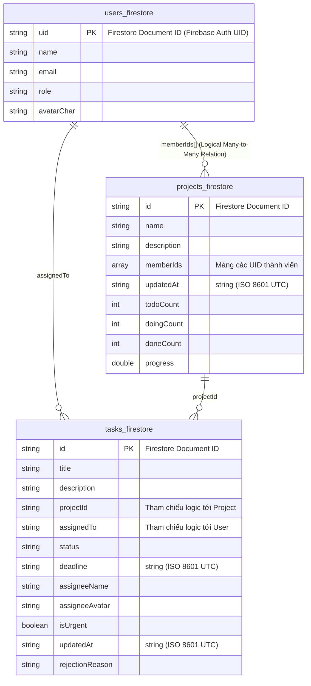

#### 3.2. Collection `users`
*   **Document ID**: `uid` (Trùng khớp 100% với Firebase Auth UID).
*   **Các trường dữ liệu**:
    ```json
    {
      "name": "Nguyen Van A",
      "email": "a@taskflow.com",
      "role": "member",
      "avatarChar": "N"
    }
    ```
> **Nguyên tắc bảo mật**: Không lưu thuộc tính mật khẩu (`password` hay `hashed_password`) trên Firestore. Firebase Auth đã chịu trách nhiệm quản lý, mã hóa và bảo mật mật khẩu ở tầng dịch vụ xác thực chuyên biệt.

#### 3.3. Collection `projects`
*   **Document ID**: Tự sinh bởi Firestore (UUID).
*   **Các trường dữ liệu**:
    ```json
    {
      "name": "Dự án Thiết Kế Website",
      "description": "Xây dựng website bán hàng chuẩn SEO",
      "memberIds": ["uid_1", "uid_2", "uid_3"],
      "updatedAt": "2026-06-12T00:15:30.000Z",
      "todoCount": 0,
      "doingCount": 0,
      "doneCount": 0,
      "progress": 0.0
    }
    ```

#### 3.4. Collection `tasks`
*   **Document ID**: Tự sinh bởi Firestore (UUID).
*   **Các trường dữ liệu**:
    ```json
    {
      "title": "Thiết kế Figma màn hình Home",
      "description": "Thiết kế UI/UX theo yêu cầu khách hàng",
      "projectId": "project_id_123",
      "assignedTo": "uid_2",
      "status": "reviewing",
      "deadline": "2026-06-20T23:59:59.000Z",
      "assigneeName": "Nguyen Van B",
      "assigneeAvatar": "B",
      "isUrgent": true,
      "updatedAt": "2026-06-12T00:15:30.000Z",
      "rejectionReason": ""
    }
    ```

---

### 4. Nguyên Tắc Định Danh & Ràng Buộc Dữ Liệu

Để đảm bảo an toàn thông tin và tránh rò rỉ dữ liệu giữa các tài khoản, hệ thống áp dụng các nguyên tắc định danh nghiêm ngặt:

1.  **Firebase Auth UID làm ID gốc**: Mỗi khi tài khoản được tạo online thông qua Firebase Auth, UID tự sinh trên Auth chính là ID định danh duy nhất của user đó trên toàn hệ thống.
2.  **Đồng bộ ID cục bộ và đám mây**: Bảng `users_local.id` và tài liệu `/users/{uid}` trên Firestore bắt buộc phải sử dụng chung giá trị UID này. Tuyệt đối không sinh thêm ID cục bộ khác cho user đã đăng nhập Firebase.
3.  **Tham chiếu an toàn**:
    - Trường `assignedTo` trong bảng Task, `userId` trong bảng Notification, và các phần tử trong mảng `memberIds` của Project đều tham chiếu trực tiếp đến UID này.
    - Dữ liệu thông báo được lọc theo điều kiện `userId = ?` tương ứng với UID đang đăng nhập, giúp ngăn chặn triệt để tình trạng người dùng xem trộm thông báo của tài khoản khác.
4.  **Tối ưu hóa và giới hạn truy vấn (Query Limitation):**
    - Để tuân thủ đúng Firestore Security Rules, khi truy vấn danh sách Task cho tài khoản Member, ứng dụng bắt buộc phải lọc theo điều kiện cụ thể: `.where('assignedTo', isEqualTo: currentUser.uid)` (lấy task cá nhân được giao) hoặc lọc theo `projectId` của dự án mà họ tham gia.
    - Tuyệt đối không thực hiện truy vấn toàn bộ `/tasks` đối với tài khoản Member để tránh bị chặn bởi Security Rules từ phía máy chủ và tối ưu hóa băng thông.

---

### 5. Firestore Security Rules (Cơ chế bảo mật trên máy chủ)

Dưới đây là cấu hình quy tắc bảo mật thực tế đang được sử dụng trong dự án tại tệp `firestore.rules`:

```javascript
rules_version = '2';
service cloud.firestore {
  match /databases/{database}/documents {

    function isAuthenticated() {
      return request.auth != null;
    }

    function getUserData() {
      return get(/databases/$(database)/documents/users/$(request.auth.uid)).data;
    }

    function isManager() {
      return isAuthenticated() && getUserData().role == 'manager';
    }

    function isUserProjectMember(projectId, userId) {
      return isAuthenticated()
        && projectId is string
        && userId is string
        && exists(/databases/$(database)/documents/projects/$(projectId))
        && userId in get(/databases/$(database)/documents/projects/$(projectId)).data.memberIds;
    }

    function isProjectMember(projectId) {
      return isUserProjectMember(projectId, request.auth.uid);
    }

    match /users/{userId} {
      allow read: if isAuthenticated();

      allow create: if isAuthenticated()
        && request.auth.uid == userId;

      allow update: if isAuthenticated()
        && request.auth.uid == userId
        && request.resource.data.role == resource.data.role;

      allow delete: if false;
    }

    match /projects/{projectId} {
      allow read: if isAuthenticated()
        && (
          isManager()
          || request.auth.uid in resource.data.memberIds
        );

      allow create, update, delete: if isManager();
    }

    match /tasks/{taskId} {
      allow read: if isAuthenticated()
        && (
          isManager()
          || resource.data.assignedTo == request.auth.uid
          || isProjectMember(resource.data.projectId)
        );

      allow create: if isManager()
        && request.resource.data.projectId is string
        && request.resource.data.assignedTo is string
        && isUserProjectMember(
          request.resource.data.projectId,
          request.resource.data.assignedTo
        );

      allow update: if isAuthenticated()
        && (
          (
            isManager()
            && request.resource.data.projectId is string
            && request.resource.data.assignedTo is string
            && isUserProjectMember(
              request.resource.data.projectId,
              request.resource.data.assignedTo
            )
          )
          ||
          (
            resource.data.assignedTo == request.auth.uid
            && request.resource.data.diff(resource.data).affectedKeys().hasOnly(['status', 'updatedAt'])
            && (
              (resource.data.status == 'todo' && request.resource.data.status == 'doing')
              ||
              (resource.data.status == 'doing' && request.resource.data.status == 'reviewing')
            )
          )
        );

      allow delete: if isManager();
    }
  }
}
```

---

## CÂU 8: KIỂM THỬ VÀ KIỂM ĐỊNH (TESTING & VALIDATION)

Để đảm bảo phần mềm hoạt động trơn tru trong mọi trường hợp, ứng dụng đã tích hợp cơ chế bắt lỗi đa tầng và bộ test tự động:

### 1. Các cơ chế bắt lỗi và bảo vệ dữ liệu (Error Handling)
* **Bảo vệ chuyển đổi trạng thái (State Validation):** Việc chuyển đổi trạng thái của Task được kiểm soát bởi ma trận `allowedTransitions` trong lớp Task. Mọi nỗ lực bypass thông qua giao diện hoặc gọi API trái phép đều bị chặn cả ở tầng logic của Flutter và tầng Firestore Security Rules.
* **Giới hạn Timeout mạng:** Khi thực hiện gọi API Firebase (Đăng nhập, đọc danh sách dự án...), hệ thống áp dụng giới hạn `.timeout(Duration(seconds: 15))` để ngăn chặn ứng dụng bị treo vô hạn khi mạng chập chờn, tự động chuyển vùng dữ liệu sang SQLite để người dùng tiếp tục thao tác.
* **Khắc phục lỗi đồng bộ khi khôi phục kết nối (Re-connection Sync Fix):** Phát hiện lỗi hệ thống chỉ kích hoạt đồng bộ dự án ngoại tuyến (`projectProvider.syncPending()`) mà bỏ quên đồng bộ danh sách nhiệm vụ (`taskProvider.syncPending()`) khi mạng trực tuyến trở lại. Lỗi này đã được vá triệt để bằng cách tích hợp cả hai lời gọi đồng bộ song song trong callback `onBackOnline` tại tệp `lib/main.dart` của `ConnectivityProvider`.

### 2. Viết đơn vị kiểm định (Unit Test & Widget Test)
Dự án triển khai kiểm thử tự động toàn diện cho các vai trò và tính năng cốt lõi:

* **Ví dụ Widget Test kiểm định phân quyền điều hướng Bottom NavBar** từ [integration_verification_test.dart](file:///d:/Workspace/TBDD/TaskFlow_Huong_Thuong_Cuong_N03_1_2026/test/integration_verification_test.dart):
```dart
testWidgets('A2. Member sees 3 tabs and NO FAB on MainScreen', (WidgetTester tester) async {
  mockAuthProvider.setCurrentUser(memberUser);
  await tester.pumpWidget(createMainScreen());
  await tester.pumpAndSettle();

  // Xác nhận Member chỉ nhìn thấy 3 icons điều hướng
  expect(find.byIcon(Icons.home_rounded), findsOneWidget);
  expect(find.byIcon(Icons.folder_outlined), findsOneWidget);
  expect(find.byIcon(Icons.person_outline_rounded), findsOneWidget);
  
  // Xác nhận Member KHÔNG nhìn thấy tab Quản lý nhóm và nút FAB tạo việc
  expect(find.byIcon(Icons.group_outlined), findsNothing);
  expect(find.byType(FloatingActionButton), findsNothing);
});
```

* **Xác nhận kết quả chạy Test:**
  Chạy lệnh `flutter test` xác nhận bộ kiểm thử bao phủ các nhóm chức năng chính như Lịch biểu, Phân quyền, Đồng bộ ngoại tuyến và Giao diện chính. Kết quả kiểm thử cuối cùng:
  `00:48 +73: All tests passed!`

---

## PHẦN VII: HƯỚNG PHÁT TRIỂN HỆ THỐNG

Nhằm nâng cấp ứng dụng **TaskFlow** từ một sản phẩm ở mức đồ án môn học thành một giải pháp quản lý công việc và dự án chuyên nghiệp, có khả năng mở rộng mạnh mẽ và đáp ứng tốt nhu cầu thực tế của các doanh nghiệp, hệ thống được định hướng phát triển theo lộ trình (Roadmap) gồm 10 mục tiêu chiến lược sau:

### 1. Mô hình quản lý đa dự án (Multi-Project Manager)
* **Hiện trạng:** Hệ thống hiện sử dụng mô hình **Manager toàn cục (Global Manager)**. Một tài khoản Manager có thể tạo và quản lý nhiều dự án, mỗi dự án có danh sách thành viên và danh sách nhiệm vụ riêng.
* **Hướng phát triển:** Mở rộng sang mô hình **Project Manager**, trong đó quyền quản lý được gắn theo từng dự án thay vì mặc định toàn cục. Mô hình mục tiêu là `1 Manager -> N Projects -> N Members`, cho phép một tài khoản quản lý nhiều dự án độc lập với các nhóm thành viên khác nhau.
  * *Ví dụ thực tế:* Manager Duy có thể quản lý song song *Dự án A* (gồm các thành viên Thương, Duy) và *Dự án B* (gồm các thành viên Hường, Cường, Thương, Duy) trên cùng một tài khoản.

### 2. Hỗ trợ nhiều tài khoản quản lý (Multiple Managers)
* **Hiện trạng:** Hệ thống có phân quyền `manager` và `member`, nhưng chưa chuẩn hóa đầy đủ quyền sở hữu dự án theo từng Manager trong dữ liệu.
* **Hướng phát triển:** Hỗ trợ nhiều tài khoản Manager đồng thời. Mỗi Manager quản lý một tập dự án riêng biệt, hoặc cùng tham gia đồng quản trị (Co-managing) trong một dự án chung khi cần.

### 3. Ràng buộc phụ thuộc nhiệm vụ (Task Dependency)
* **Hiện trạng:** Các nhiệm vụ được thực hiện độc lập, chưa kiểm soát được trình tự và mối liên hệ giữa các đầu việc.
* **Hướng phát triển:** Tích hợp tính năng thiết lập ràng buộc phụ thuộc (Task Dependency). Một nhiệm vụ chỉ được phép bắt đầu (chuyển sang trạng thái `doing`) khi và chỉ khi tất cả các nhiệm vụ tiền nhiệm (predecessors) của nó đã được phê duyệt hoàn thành (`done`).
  * *Ví dụ thực tế:* Thiết lập chuỗi công việc: *Task A (Thiết kế UI)* -> *Task B (Code UI)* -> *Task C (Test UI)*. Thành viên chỉ được mở khóa và nhận *Task B* khi Manager đã duyệt hoàn thành *Task A*.

### 4. Chia nhỏ nhiệm vụ (Subtask)
* **Hiện trạng:** Một nhiệm vụ trong hệ thống là một khối công việc đơn nhất, khó theo dõi chi tiết các bước triển khai nhỏ hơn.
* **Hướng phát triển:** Hỗ trợ mô hình nhiệm vụ con (Subtask) tương tự các công cụ quản lý chuyên nghiệp (Jira, Trello, ClickUp). Một nhiệm vụ lớn (Parent Task) như "Xây dựng màn hình Login" sẽ được phân rã thành nhiều nhiệm vụ con như:
  * Thiết kế UI màn hình
  * Code giao diện Flutter
  * Viết logic Validate Form
  * Kiểm thử đơn vị (Unit Test)
  * *Ràng buộc:* Nhiệm vụ cha chỉ được tự động chuyển sang trạng thái hoàn thành khi toàn bộ các nhiệm vụ con bên trong đã được hoàn tất.

### 5. Chế độ tối và tùy biến giao diện (Dark Mode & Theme Switching)
* **Hiện trạng:** Chức năng Dark Mode chưa được triển khai hoàn chỉnh. Ứng dụng hiện chủ yếu sử dụng giao diện sáng (Light Mode) dựa trên ngôn ngữ thiết kế Glassmorphism.
* **Hướng phát triển:** Triển khai tính năng Chế độ tối (Dark Mode) hoàn chỉnh, cho phép chuyển đổi giao diện linh hoạt giữa Sáng/Tối (Theme Switching) hoặc tự động nhận diện thiết lập giao diện của hệ điều hành (System Theme Detection) để tối ưu hóa trải nghiệm thị giác người dùng trong điều kiện thiếu sáng và tiết kiệm năng lượng cho thiết bị.

### 6. Thông báo đẩy nâng cao (Firebase Cloud Messaging)
* **Hiện trạng:** Hệ thống thông báo hiện tại hoạt động dựa trên cơ chế lắng nghe Firestore stream cục bộ khi ứng dụng đang mở (Foreground) và lưu trữ thông báo vào SQLite cục bộ.
* **Hướng phát triển:** Tích hợp Firebase Cloud Messaging (FCM), Push Notification, Background Notification và Notification Sync Multi-Device. Khi đó người dùng vẫn nhận được thông báo khi ứng dụng chạy nền hoặc đã đóng, đồng thời trạng thái đã đọc có thể đồng bộ giữa nhiều thiết bị.

### 7. Bảng điều khiển phân tích chuyên sâu (Advanced Statistics Dashboard)
* **Hiện trạng:** Thống kê của hệ thống mới dừng lại ở việc biểu diễn số lượng Task theo các trạng thái cơ bản (Todo, Doing, Done) và hiển thị phần trăm tiến độ tổng quan.
* **Hướng phát triển:** Tích hợp các biểu đồ quản trị nâng cao và chuyên sâu của phương pháp Agile/Scrum:
  * *Burn-down Chart:* Biểu đồ theo dõi tiến độ thời gian thực để dự báo khả năng hoàn thành dự án đúng hạn.
  * *Velocity Chart:* Biểu đồ đo lường tốc độ và năng suất hoàn thành công việc qua từng chu kỳ.
  * *Productivity Score & Team Performance Dashboard:* Bảng chấm điểm hiệu suất và trực quan hóa năng lực cống hiến của từng thành viên trong nhóm.

### 8. Chuẩn hóa quan hệ Nhiều - Nhiều bằng bảng trung gian (Project Member Mapping Table)
* **Hiện trạng:** Hệ thống đang lưu danh sách ID thành viên dự án dưới dạng chuỗi CSV (`memberIds`) cách nhau bởi dấu phẩy trong bảng `projects_local` nhằm đơn giản hóa cấu trúc offline.
* **Hướng phát triển:** Chuẩn hóa cơ sở dữ liệu SQLite và Firestore bằng cách chuyển đổi sang sử dụng bảng trung gian `project_members` chứa các trường: `projectId`, `userId`, `role`.
  * *Lợi ích:* Đảm bảo tính toàn vẹn dữ liệu ở dạng chuẩn hóa (Normalized Form), tăng tốc độ truy vấn cơ sở dữ liệu SQLite khi dự án phình to, và hỗ trợ thiết lập quyền hạn chi tiết cho từng người dùng trong từng dự án cụ thể (ví dụ: User X là Manager của Dự án A nhưng chỉ là Member của Dự án B).

### 9. Cơ chế giải quyết xung đột nâng cao (Advanced Conflict Resolution)
* **Hiện trạng:** Đang áp dụng cơ chế giải quyết xung đột dựa trên nhãn thời gian cập nhật cuối cùng (`updatedAt` Timestamp Comparison) để tự động ghi đè dữ liệu mới nhất.
* **Hướng phát triển:** Xây dựng cơ chế giải quyết xung đột thông minh và tương tác trực quan:
  * Cho phép người dùng xem và so sánh sự khác biệt (Diff View) giữa hai phiên bản dữ liệu khi phát hiện xung đột lúc có mạng trở lại.
  * Hỗ trợ tự động gộp các trường dữ liệu không chồng chéo (Auto-Merge).
  * Cho phép người dùng thủ công lựa chọn giữ lại dữ liệu máy chủ hoặc đè dữ liệu cục bộ (User-Driven Choice).

### 10. Đồng bộ hóa trạng thái đa thiết bị (Multi-Device Synchronization)
* **Hiện trạng:** Hệ thống tối ưu hóa đồng bộ dữ liệu giữa thiết bị hiện tại và Firestore.
* **Hướng phát triển:** Xây dựng cơ chế đồng bộ trạng thái ứng dụng đồng thời trên nhiều thiết bị của cùng một tài khoản đăng nhập (ví dụ: máy tính bảng và điện thoại di động). Đảm bảo khi người dùng cập nhật công việc trên thiết bị A, thiết bị B ngay lập tức nhận được tín hiệu qua stream và cập nhật bộ đệm SQLite nội bộ mà không xảy ra xung đột hay mất mát dữ liệu.

---

## PHẦN PHỤ LỤC: HẠN CHẾ KỸ THUẬT VÀ HƯỚNG PHÁT TRIỂN CỦA HỆ THỐNG

Dưới đây là một số hạn chế kỹ thuật hiện tại ghi nhận trong phiên bản hiện tại (Basic Version) của dự án TaskFlow và đề xuất các giải pháp khắc phục, nâng cấp trong tương lai:

### 1. Ngăn chặn "Task mồ côi" khi xóa thành viên khỏi dự án (Đã giải quyết)
* **Giải pháp đã thực hiện:** Hệ thống hiện tại đã tích hợp cơ chế kiểm tra ràng buộc (Constraint Check) phía Client. Khi Manager quản lý danh sách thành viên và loại bỏ một người ra khỏi dự án (bằng cách bỏ tích chọn trong dialog Quản lý thành viên), hệ thống sẽ tự động quét toàn bộ các Task chưa hoàn thành (`todo`, `doing`, `reviewing`) được gán cho thành viên này trong dự án.
* **Cơ chế hoạt động:** Nếu phát hiện thấy thành viên bị xóa vẫn còn công việc dở dang, hệ thống sẽ chặn thao tác lưu và hiển thị hộp thoại cảnh báo chi tiết tên thành viên kèm số lượng nhiệm vụ dở dang, yêu cầu Manager phải chuyển giao (Reassign) các nhiệm vụ này cho người khác trước khi hoàn tất xóa. Quy trình này đảm bảo không có Task mồ côi tồn tại trong hệ thống.

### 2. Đồng bộ hóa thông tin người được gán (Stale denormalized assigneeName/avatar)
* **Hạn chế kỹ thuật hiện tại:** Để tối ưu hóa hiệu năng render danh sách Task (không cần join bảng nhiều lần) và hỗ trợ hoàn hảo chế độ Ngoại tuyến (Offline-First) với SQLite, cấu trúc dữ liệu của `Task` lưu tĩnh thông tin `assigneeName` và `assigneeAvatar` dưới dạng bản sao snapshot tại thời điểm giao việc. Do đó, khi một người dùng cập nhật thông tin hồ sơ của họ (như thay đổi Họ tên), thông tin này thay đổi trong Firestore `/users`, nhưng thuộc tính `assigneeName` trong các Task cũ đã gán không tự động cập nhật theo, dẫn đến sự không nhất quán dữ liệu hiển thị trên giao diện.
* **Hướng phát triển tương lai:** 
  * *Cách 1:* Thực hiện một Transaction ghi hàng loạt (Firestore Batch Write) cập nhật toàn bộ `assigneeName` và `assigneeAvatar` trên mọi Task liên quan khi người dùng thay đổi thông tin.
  * *Cách 2:* Tách biệt thông tin người dùng khỏi đối tượng Task. Lưu trữ danh sách User trong cache SQLite cục bộ (`users_cache_local`) và ánh xạ động thông qua `assignedTo` ID khi hiển thị giao diện, giúp dữ liệu luôn nhất quán mà vẫn hỗ trợ chế độ ngoại tuyến.
