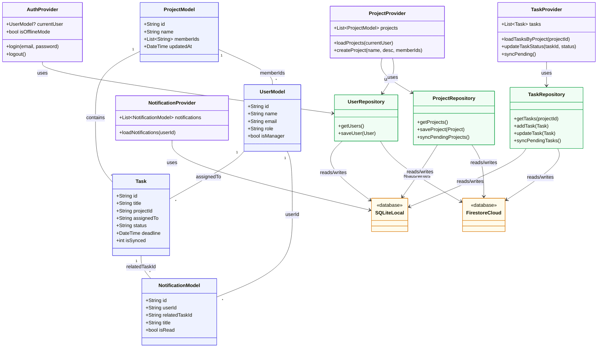
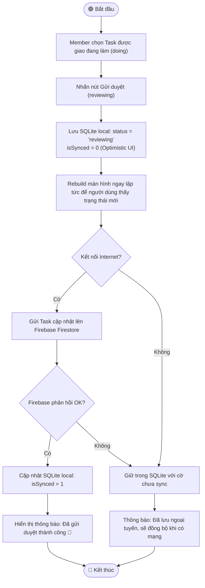
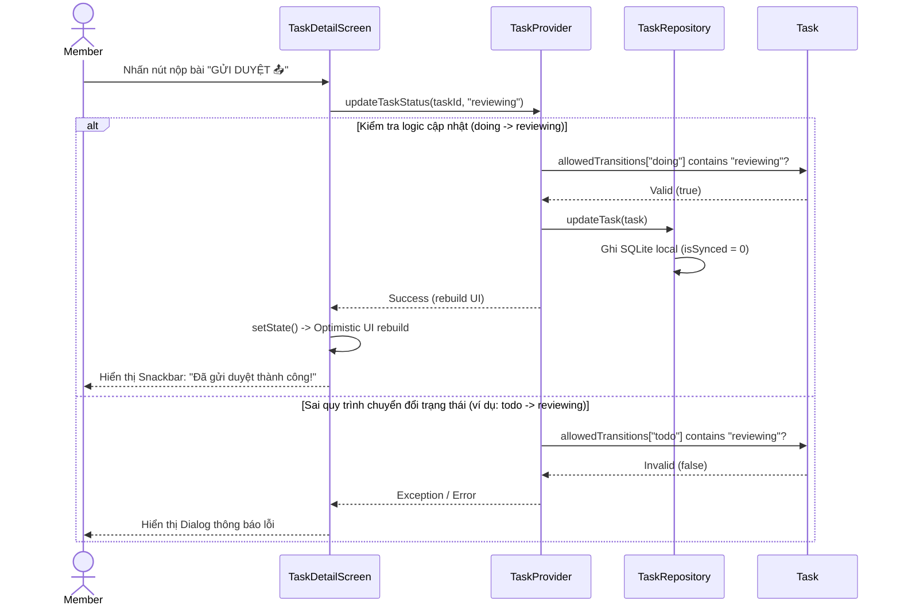
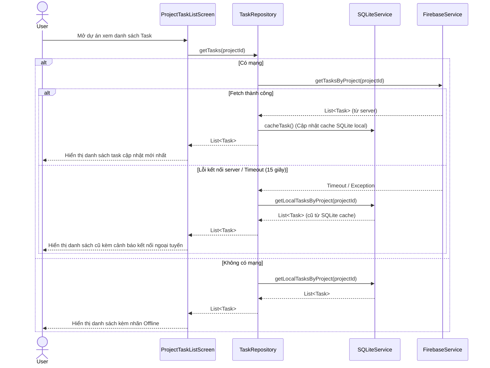
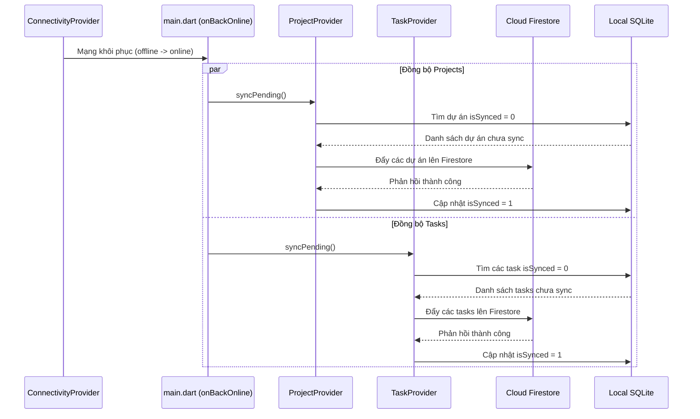
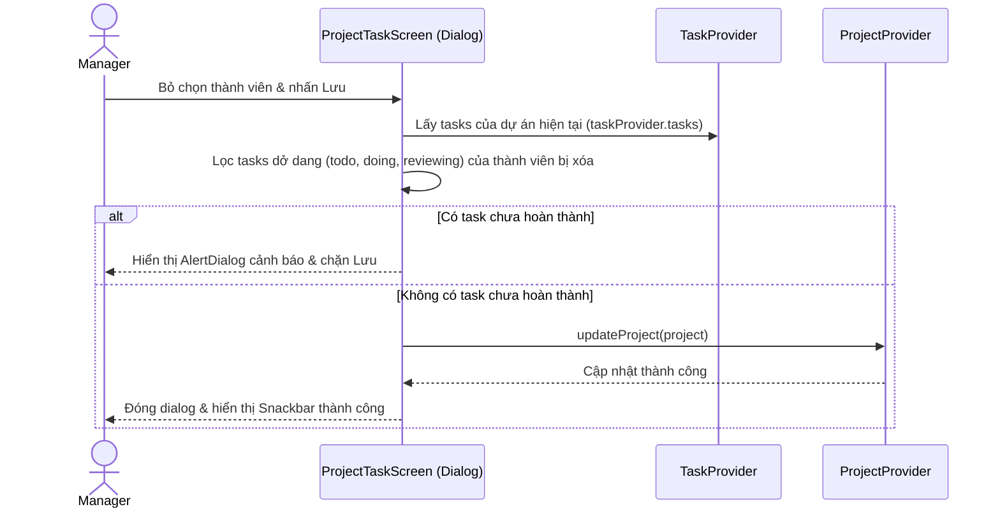
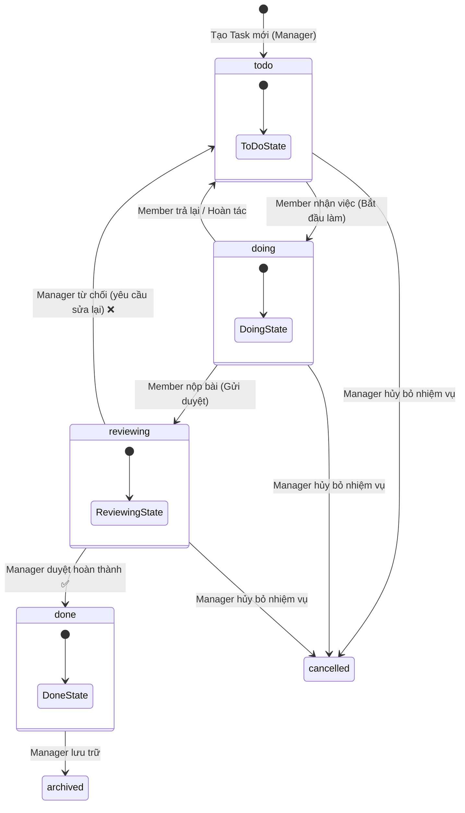
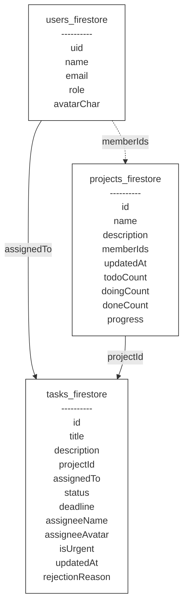

# BÁO CÁO BÀI TẬP LỚN CUỐI KỲ
## MÔN: PHÁT TRIỂN ỨNG DỤNG TRÊN THIẾT BỊ DI ĐỘNG (LỚP N03)
## ĐỀ TÀI: XÂY DỰNG VÀ PHÁT TRIỂN ỨNG DỤNG QUẢN LÝ CÔNG VIỆC NHÓM NHỎ TASKFLOW

**Thành viên thực hiện (Nhóm N03):** 
1. Trần Thị Thu Hường (Trưởng nhóm)
2. Nguyễn Việt Cường
3. Nguyễn Thị Thương

---

## PHÂN CHIA CÔNG VIỆC TRONG NHÓM

Dưới đây là chi tiết phân chia công việc và đóng góp kỹ thuật của các thành viên trong nhóm thực hiện dự án **TaskFlow**:

| Thành viên | Vai trò | Nhiệm vụ chính & Đóng góp kỹ thuật | Tỷ lệ đóng góp |
| :--- | :--- | :--- | :--- |
| **Trần Thị Thu Hường** | Trưởng nhóm (Team Leader) | - Quản lý tiến độ dự án, thiết lập kiến trúc phân lớp hệ thống (`UI → Provider → Repository → Service`).<br>- Thiết kế cấu trúc cơ sở dữ liệu cục bộ **SQLite Schema** và đám mây **Firestore Document Schema** cho các đối tượng: `User`, `Project`, `Task`, `Notification`.<br>- Phát triển và cấu hình các lớp logic xử lý dữ liệu: `SQLiteService`, `FirebaseService`, và triển khai toàn bộ các Repository (`LocalTaskRepository`, `LocalProjectRepository`, `LocalUserRepository`).<br>- Nghiên cứu và xây dựng công cụ đồng bộ dữ liệu ngoại tuyến **Offline-First (Offline-First Sync Engine)** giữa SQLite cục bộ và Cloud Firestore.<br>- Trực tiếp cấu hình và tích hợp **Firebase (Auth, Firestore)** để đồng bộ dữ liệu thời gian thực (real-time stream).<br>- Phát triển giao diện các màn hình cốt lõi:<br>&nbsp;&nbsp;+ `MainScreen`: Khung giao diện nổi phân quyền theo vai trò (Role-based Navigation).<br>&nbsp;&nbsp;+ `HomeScreen`: Dashboard tổng quan thống kê hiệu suất dạng biểu đồ tròn.<br>&nbsp;&nbsp;+ `ProjectTaskScreen`: Chi tiết công việc dự án (dạng Kanban cuộn ngang & Lịch biểu Calendar Tab).<br>&nbsp;&nbsp;+ `TaskDetailScreen`: Chi tiết nhiệm vụ và trục lịch sử trạng thái (Timeline).<br>&nbsp;&nbsp;+ `LoginScreen` & `RegisterScreen`: Đăng ký, đăng nhập và xác thực phiên hoạt động.<br>&nbsp;&nbsp;+ `UserListScreen` & `MemberTasksScreen`: Quản lý danh sách thành viên và theo dõi chi tiết task của từng người.<br>- Tối ưu hóa ràng buộc kiểm tra nghiệp vụ trên Client (**Constraint Check**): Ngăn chặn hành động xóa thành viên khỏi dự án nếu người đó đang có các Task dở dang (`todo`, `doing`, `reviewing`) để tránh lỗi "Task mồ côi", và biên soạn kịch bản video demo (`KICH_BAN_VIDEO_DEMO.md`). | 50% |
| **Nguyễn Việt Cường** | Nhà phát triển giao diện & UML (Frontend Developer & UML Designer) | - Thiết kế và vẽ toàn bộ các sơ đồ UML của hệ thống (sơ đồ Use Case tổng quan, sơ đồ cấu trúc lớp Class Diagram, các sơ đồ tuần tự Sequence Diagrams và sơ đồ hoạt động Activity Diagrams).<br>- Hỗ trợ xây dựng giao diện danh sách dự án (`ProjectListScreen`) và hiển thị thanh tiến độ phần trăm hoàn thành công việc (`LinearProgressIndicator`). | 25% |
| **Nguyễn Thị Thương** | Nhà thiết kế UI/UX & Tài liệu hệ thống (UI/UX Designer & Document Specialist) | - Thiết kế giao diện nguyên mẫu trên Figma (Wireframes & UI Design) và sơ đồ luồng hoạt động ứng dụng.<br>- Phát triển giao diện các màn hình:<br>&nbsp;&nbsp;+ `ProfileScreen` & `EditProfileScreen`: Trang hồ sơ cá nhân, chỉnh sửa thông tin và đổi mật khẩu offline.<br>&nbsp;&nbsp;+ `NotificationScreen`: Trung tâm thông báo và danh sách thông báo thay đổi trạng thái task.<br>- Xây dựng tính năng Thông báo cục bộ (**Local Notifications**) thông qua `NotificationProvider` tự động lắng nghe sự kiện thay đổi dữ liệu.<br>- Biên soạn và hiệu chỉnh hệ thống tài liệu báo cáo: Báo cáo bài tập lớn cuối kỳ (`bao_cao_bai_tap_lon_cuoi_ky.md`), tài liệu thiết kế cơ sở dữ liệu (`database_report.md`), sơ đồ UML (`uml_va_luong_hoat_dong.md`). | 25% |

---


## CÂU 1: TRÌNH BÀY USER STORIES (CÂU CHUYỆN NGƯỜI DÙNG)

Hệ thống **TaskFlow** được thiết kế phân quyền rõ ràng thành hai vai trò cốt lõi: **Manager (Quản lý)** và **Member (Thành viên nhóm)**. Các câu chuyện người dùng được xây dựng để đảm bảo tính cộng tác và quản lý tối ưu:

### 1. Vai trò Manager (Quản lý dự án)
Hệ thống TaskFlow được xây dựng cho môi trường làm việc nhóm, trong đó Manager là người quản lý dự án, phân công nhiệm vụ, theo dõi tiến độ và kiểm duyệt kết quả thực hiện của các thành viên.

#### Nhóm: Đăng nhập, phân quyền và quản lý phiên làm việc
* **US-M1**: Là một Manager, tôi muốn đăng nhập bằng tài khoản đã được cấp quyền quản lý để có thể truy cập đúng các chức năng dành cho vai trò Manager.
* **US-M2**: Là một Manager, tôi muốn hệ thống tự nhận diện vai trò sau khi đăng nhập để giao diện hiển thị các tab và thao tác quản lý phù hợp.

#### Nhóm: Quản lý dự án và thành viên
* **US-M3**: Là một Manager, tôi muốn tạo dự án mới với tên, mô tả và danh sách thành viên tham gia để tổ chức các công việc có liên quan vào cùng một không gian quản lý.
* **US-M4**: Là một Manager, tôi muốn xem danh sách dự án kèm tiến độ hoàn thành để nhanh chóng nắm được tình trạng của từng dự án.
* **US-M5**: Là một Manager, tôi muốn thêm hoặc loại bỏ thành viên khỏi dự án để điều chỉnh nhân sự theo nhu cầu thực tế của nhóm.
* **US-M6**: Là một Manager, tôi muốn hệ thống ngăn xóa thành viên khi người đó còn task dở dang để tránh phát sinh task không còn người phụ trách.

#### Nhóm: Quản lý nhiệm vụ và phân công công việc
* **US-M7**: Là một Manager, tôi muốn tạo task mới trong dự án, nhập tiêu đề, mô tả, hạn chót và người được giao để phân công công việc rõ ràng cho từng thành viên.
* **US-M8**: Là một Manager, tôi muốn chỉnh sửa thông tin task hoặc gán lại người thực hiện khi kế hoạch thay đổi để đảm bảo công việc luôn được cập nhật đúng thực tế.
* **US-M9**: Là một Manager, tôi muốn xem task theo trạng thái todo, doing, reviewing và done để theo dõi luồng xử lý công việc theo dạng Kanban.
* **US-M10**: Là một Manager, tôi muốn phê duyệt task khi thành viên gửi duyệt hoặc từ chối kèm lý do để kiểm soát chất lượng đầu ra.
* **US-M14**: Là một Manager, tôi muốn tìm kiếm dự án và lọc các nhiệm vụ theo từ khóa để nhanh chóng định vị và kiểm tra tình trạng công việc.
* **US-M15**: Là một Manager, tôi muốn xem lịch sử thay đổi trạng thái của từng nhiệm vụ (Timeline) để nắm được quá trình thực hiện từ khi tạo đến lúc hoàn thành.

#### Nhóm: Theo dõi tiến độ, thông báo và đồng bộ
* **US-M11**: Là một Manager, tôi muốn xem dashboard tổng quan về số lượng task, task quá hạn và tiến độ dự án để đánh giá tình hình làm việc của nhóm.
* **US-M12**: Là một Manager, tôi muốn nhận thông báo khi có task mới, task gửi duyệt hoặc task bị thay đổi trạng thái để phản hồi kịp thời.
* **US-M13**: Là một Manager, tôi muốn các thay đổi được lưu cục bộ trước và tự đồng bộ lên Firestore khi có mạng để có thể tiếp tục quản lý công việc trong điều kiện kết nối không ổn định.

---

### 2. Vai trò Member (Thành viên thực hiện)
Member là người tham gia dự án, nhận nhiệm vụ từ Manager, cập nhật tiến độ thực hiện và gửi kết quả để Manager kiểm tra, phê duyệt.

#### Nhóm: Xem dự án và công việc được giao
* **US-ME1**: Là một Member, tôi muốn đăng nhập vào hệ thống để xem các dự án mà mình tham gia và các task được giao cho tôi.
* **US-ME2**: Là một Member, tôi muốn xem danh sách task theo từng dự án để hiểu bối cảnh công việc và phối hợp với các thành viên khác.
* **US-ME3**: Là một Member, tôi muốn xem chi tiết task gồm mô tả, deadline, trạng thái, người phụ trách và lý do từ chối nếu có để biết chính xác cần thực hiện điều gì.
* **US-ME12**: Là một Member, tôi muốn xem lịch sử trạng thái (Timeline) của nhiệm vụ để kiểm tra lại thời gian bắt đầu, gửi duyệt hoặc các lý do từ chối từ Manager.

#### Nhóm: Cập nhật trạng thái và gửi duyệt
* **US-ME4**: Là một Member, tôi muốn chuyển task từ todo sang doing khi bắt đầu làm để Manager biết tôi đã nhận và đang xử lý công việc.
* **US-ME5**: Là một Member, tôi muốn chuyển task từ doing sang reviewing khi hoàn thành để gửi kết quả cho Manager kiểm tra.
* **US-ME6**: Là một Member, tôi muốn nhận lại task kèm lý do từ chối khi kết quả chưa đạt để có thể sửa đúng yêu cầu và gửi duyệt lại.
* **US-ME10**: Là một Member, tôi muốn tìm kiếm và lọc các nhiệm vụ được giao theo trạng thái hoặc từ khóa để dễ dàng quản lý khối lượng công việc cá nhân.

#### Nhóm: Lịch biểu, thông báo, hồ sơ và offline
* **US-ME7**: Là một Member, tôi muốn xem task trên Calendar Tab theo ngày deadline để sắp xếp mức độ ưu tiên công việc.
* **US-ME8**: Là một Member, tôi muốn nhận thông báo khi được giao việc hoặc khi task thay đổi trạng thái để không bỏ lỡ thông tin quan trọng.
* **US-ME9**: Là một Member, tôi muốn cập nhật hồ sơ cá nhân và tiếp tục xem/cập nhật task khi mất mạng để quá trình làm việc không bị gián đoạn.
* **US-ME11**: Là một Member, tôi muốn thay đổi mật khẩu tài khoản trực tiếp trong trang hồ sơ cá nhân (ngay cả khi offline nhờ cơ chế xác thực mã hóa cục bộ) để bảo mật tài khoản.
* **US-ME13**: Là một Member, tôi muốn có thể click trực tiếp vào thông báo nhận được để ứng dụng tự động chuyển đến chi tiết nhiệm vụ tương ứng, đồng thời tự động đánh dấu thông báo là đã đọc.

---

## CÂU 2: PHÂN TÍCH YÊU CẦU, ĐỐI TƯỢNG, MỐI QUAN HỆ VÀ PHƯƠNG THỨC HOẠT ĐỘNG

### 1. Tác nhân tham gia hệ thống (Actors)
Hệ thống **TaskFlow** có 2 tác nhân chính tham gia vào quy trình quản lý công việc dự án và 1 tác nhân hệ thống tự động:
* **Manager (Quản lý dự án):** Người sở hữu toàn quyền quản trị dự án, thiết lập đội ngũ nhân sự, phân công đầu việc, theo dõi biểu đồ tiến độ dự án, trực tiếp phê duyệt kết quả thực hiện hoặc trả lại yêu cầu sửa đổi cho thành viên.
* **Member (Thành viên nhóm):** Người tham gia thực hiện các nhiệm vụ được giao, cập nhật tiến trình làm việc cục bộ, gửi kết quả công việc lên để chờ phê duyệt, nhận thông báo đẩy và sắp xếp lịch công việc cá nhân.
* **Hệ thống đồng bộ (Offline Sync Engine):** Tác nhân chạy nền (background system agent) chịu trách nhiệm theo dõi trạng thái mạng (`ConnectivityService`), thực hiện ghi đè thông minh và đẩy các dữ liệu cục bộ chờ đồng bộ (`isSynced = 0`) lên Firestore khi có kết nối Internet trở lại.

### 2. Phân tích Yêu cầu Chức năng (Functional Requirements)
Yêu cầu chức năng được thiết kế chuyên biệt và tối ưu hóa tối đa cho từng nhóm đối tượng cụ thể:
* **Đối với vai trò Manager (Quản lý):**
  - Thực hiện đăng ký, đăng nhập và duy trì phiên hoạt động bảo mật thông qua Firebase Authentication.
  - Khởi tạo dự án mới (CRUD), điền thông tin mô tả chi tiết và gán danh sách thành viên tham gia (`memberIds`).
  - Quản lý danh sách thành viên dự án, bổ sung hoặc loại bỏ nhân sự linh hoạt.
  - Tạo nhiệm vụ mới (CRUD), phân phối công việc cho một thành viên cụ thể và thiết lập deadline.
  - Giám sát tiến độ toàn cục thông qua Dashboard (biểu đồ tròn thể hiện tỉ lệ phần trăm task).
  - Phê duyệt hoàn thành (`done`) hoặc từ chối duyệt (`rejected`) kèm theo lý do cụ thể để thành viên chỉnh sửa.
  - Tìm kiếm dự án và lọc nhanh danh sách nhiệm vụ của các thành viên.
* **Đối với vai trò Member (Thành viên):**
  - Đăng nhập hệ thống, xem tổng quan các dự án đang tham gia và lọc các nhiệm vụ được giao cho riêng mình.
  - Quản lý luồng trạng thái công việc (Workflow) tuân thủ nghiêm ngặt máy trạng thái: `todo → doing → reviewing → done`.
  - Nhận phản hồi từ chối từ Manager và thực hiện sửa đổi đầu việc để gửi duyệt lại.
  - Sử dụng Calendar Tab để quét nhanh hạn chót (deadline) của các task trong tháng, hỗ trợ sắp xếp công việc ưu tiên hàng ngày.
  - Chỉnh sửa hồ sơ cá nhân (tên hiển thị, avatar đại diện) và thay đổi mật khẩu trực tiếp (hỗ trợ lưu băm offline).
* **Đối với Hệ thống Dữ liệu và Đồng bộ:**
  - Tổ chức và lưu trữ dữ liệu cục bộ an toàn trong SQLite để hỗ trợ chiến lược Offline-First.
  - Thiết lập luồng trao đổi dữ liệu an toàn, tuân thủ nghiêm ngặt mô hình: `UI → Provider → Repository → SQLite / Firestore`.
  - Tự động phát hiện trạng thái mạng và kích hoạt tiến trình đẩy dữ liệu đồng bộ ngược (Upstream Sync) cho các bản ghi có trạng thái `isSynced = 0`.
  - Nhận diện sự kiện thay đổi dữ liệu thời gian thực (Real-time stream) từ Firestore để hiển thị thông báo tức thời tới thiết bị của người dùng liên quan.

### 3. Yêu cầu Phi chức năng (Non-functional Requirements)
* **Hiệu năng & Tối ưu hóa:** Giao diện Flutter đảm bảo mượt mà (60fps), dữ liệu được quản lý qua Provider để hạn chế tối đa việc Rebuild widget không cần thiết.
* **Ngoại tuyến trước (Offline-First):** Ứng dụng ưu tiên lưu trữ và xử lý toàn bộ thao tác người dùng dưới SQLite cục bộ trước khi đồng bộ lên Cloud Firestore để đảm bảo trải nghiệm không bị đứt gãy khi mất kết nối mạng.
* **Bảo mật & Phân quyền:** Phân quyền giao diện và chức năng nghiêm ngặt theo vai trò (`manager` / `member`). Phía Cloud Firestore thiết lập Security Rules để ngăn chặn các truy cập ghi dữ liệu trái phép từ Client.
* **Dễ bảo trì & Mở rộng:** Cấu trúc dự án phân lớp rõ ràng (Clean Architecture), tách biệt hoàn toàn giữa giao diện hiển thị, logic điều khiển trạng thái (Providers), quản lý dữ liệu (Repositories) và các dịch vụ nền (Services).

### 4. Các đối tượng chính trong hệ thống (Entities)
* **`UserModel`:** Đại diện cho tài khoản. Gồm có: ID (UID từ Auth), Họ tên, Email, Vai trò (`manager`/`member`), và chữ cái đại diện Avatar.
* **`ProjectModel`:** Đại diện cho dự án. Gồm có: ID, Tên dự án, Mô tả dự án, Danh sách ID thành viên (`memberIds`), thời điểm cập nhật, và các thông số thống kê phục vụ UI (số task todo/doing/done, phần trăm tiến độ).
* **`Task`:** Đại diện cho một đầu việc. Gồm có: ID, Tiêu đề, Mô tả, ID dự án liên kết, ID người thực hiện (`assignedTo`), Trạng thái (`status`), Hạn chót (`deadline`), Dữ liệu snapshot của người được gán (tên/avatar), cờ khẩn cấp, lý do từ chối, cờ trạng thái đồng bộ (`isSynced`), và thời điểm cập nhật gần nhất.
* **`NotificationModel`:** Đại diện cho thông báo. Gồm có: ID, ID người nhận, ID task liên quan, Tiêu đề, Nội dung, Thời gian tạo, Cờ đã đọc (`isRead`), và phân loại thông báo.

### 5. Mối quan hệ giữa các đối tượng (Relationships)

Các đối tượng trong hệ thống có quan hệ chặt chẽ với nhau để phục vụ quá trình quản lý dự án, giao việc, theo dõi trạng thái và phát sinh thông báo. Bảng dưới đây trình bày các mối quan hệ chính trong mô hình dữ liệu của TaskFlow:

| Mối quan hệ | Kiểu quan hệ | Mô tả |
| :--- | :--- | :--- |
| Dự án - Nhiệm vụ | 1 - N | Một dự án chứa nhiều nhiệm vụ. Trong SQLite, liên kết `projectId` hỗ trợ `ON DELETE CASCADE` để xóa các nhiệm vụ thuộc dự án khi dự án bị xóa. |
| Người dùng - Nhiệm vụ | 1 - N | Một người dùng có thể được giao nhiều nhiệm vụ thông qua trường `assignedTo`. Task lưu thêm snapshot tên/avatar để hiển thị nhanh trên giao diện. |
| Người dùng - Dự án | N - N | Một người dùng có thể tham gia nhiều dự án và một dự án có nhiều thành viên. Quan hệ này được lưu logic bằng mảng `memberIds`. |
| Nhiệm vụ - Thông báo | 1 - N | Khi trạng thái nhiệm vụ thay đổi, hệ thống sinh ra thông báo tương ứng cho người dùng liên quan. |

### 6. Kiến trúc Tổng quan & Phương thức hoạt động (Offline-First)

Ứng dụng **TaskFlow** được xây dựng theo kiến trúc phân tầng kết hợp với mô hình **Offline-First**. Giao diện Flutter không truy cập trực tiếp vào cơ sở dữ liệu mà thông qua tầng Provider và Repository/Service. Cách tổ chức này giúp tách biệt giao diện, logic nghiệp vụ và dữ liệu, đồng thời hỗ trợ ứng dụng tiếp tục hoạt động khi thiết bị mất kết nối mạng.


Repository/Service là tầng trung gian chịu trách nhiệm điều phối dữ liệu giữa hai nguồn lưu trữ. Khi có kết nối mạng, dữ liệu được đồng bộ với Cloud Firestore để bảo đảm khả năng chia sẻ và cập nhật giữa các thiết bị. Khi không có mạng, dữ liệu được lưu vào SQLite Local Storage, sau đó được đồng bộ lại lên Firestore khi kết nối được khôi phục.

> **Lưu ý:** Firebase Auth được sử dụng để xác thực và lấy `uid` của người dùng. UID này là khóa định danh quan trọng để truy vấn dữ liệu người dùng, dự án và nhiệm vụ trong Firestore cũng như SQLite.

#### 6.1. Sơ đồ thực thể quan hệ cục bộ (ERD - SQLite Local)

Dưới đây là sơ đồ thực thể quan hệ (ERD) thể hiện cấu trúc các bảng và mối liên kết khóa ngoại/logic trong SQLite nội bộ:


#### 6.2. Luồng Vận Động Dữ Liệu & Đồng Bộ Offline-First

##### 6.2.1. Đồng bộ xuôi (Downstream - Firestore to SQLite)
1. Khi người dùng mở các màn hình liên quan, Repository tải dữ liệu `tasks` và `projects` từ Firestore theo quyền truy cập hiện tại rồi lưu về SQLite. Riêng `NotificationProvider` lắng nghe realtime stream của collection `tasks` để phát hiện sự kiện tạo thông báo.
2. Khi nhận dữ liệu từ Firestore, Repository kiểm tra thời điểm cập nhật `updatedAt` và cờ trạng thái `isSynced` của bản ghi local trước khi ghi đè để bảo vệ các thay đổi ngoại tuyến chưa kịp đồng bộ:
   - **Quy tắc bảo vệ**: Nếu bản ghi local đang có `isSynced = 0` (chờ đồng bộ) và có thời gian `updatedAt` mới hơn dữ liệu nhận từ máy chủ, Repository sẽ **giữ lại bản ghi local** và bỏ qua việc ghi đè từ server.
   - Ngược lại, dữ liệu từ server sẽ được lưu đè vào SQLite và cập nhật `isSynced = 1`.
3. Đối với thông báo, snapshot đầu tiên chỉ được dùng để tạo baseline `previousTasks`, không tạo thông báo cho dữ liệu cũ. Từ các snapshot tiếp theo, hệ thống kiểm tra thay đổi trạng thái/gán việc hợp lệ và chống trùng dựa trên bộ ba `(userId, relatedTaskId, type)` trước khi ghi thông báo mới vào `notifications_local`.

##### 6.2.2. Đồng bộ ngược (Upstream - SQLite to Firestore)
1. Khi không có mạng (Offline), người dùng có thể tạo/cập nhật dự án hoặc tạo/cập nhật trạng thái nhiệm vụ trong phạm vi chức năng được ứng dụng hỗ trợ.
2. Hệ thống ghi dữ liệu vào SQLite, gán thời gian `updatedAt = DateTime.now()` và đánh dấu cờ trạng thái đồng bộ `isSynced = 0`.
3. Khi thiết bị khôi phục kết nối Internet:
   - `ConnectivityProvider` kích hoạt hàm `syncPending()`.
   - Tìm kiếm các bản ghi chưa đồng bộ (`isSynced = 0`) trong `projects_local` và `tasks_local`.
   - Đẩy dữ liệu lên Firestore. Sau khi lưu thành công, cập nhật `isSynced = 1` ở local và gán thời gian `syncedAt`.

##### 6.2.3. Giải quyết xung đột (Conflict Resolution)
Nếu dữ liệu được sửa đổi ở cả local và server trong thời gian offline, hệ thống giải quyết bằng cơ chế **Timestamp Comparison**:
- So sánh thuộc tính thời gian cập nhật gần nhất `updatedAt` giữa Server Task/Project và Local Task/Project.
- Nếu `server.updatedAt` lớn hơn `local.updatedAt` $\to$ Cập nhật dữ liệu từ Server ghi đè vào Local.
- Ngược lại, nếu `local.updatedAt` lớn hơn $\to$ Thực hiện đẩy dữ liệu Local ghi đè lên Server.

---

## CÂU 3: SƠ ĐỒ CẤU TRÚC LỚP VÀ SƠ ĐỒ THUẬT TOÁN

Nội dung Câu 3 trình bày hệ thống sơ đồ thiết kế của dự án **TaskFlow**. Mục tiêu của phần này là làm rõ cách nhóm tổ chức cấu trúc mã nguồn, phân chia trách nhiệm giữa các tầng xử lý và mô tả luồng hoạt động của các chức năng chính trong ứng dụng. Thay vì chỉ liệt kê mã nguồn, các sơ đồ được sử dụng để thể hiện trực quan mối quan hệ giữa các lớp, các thành phần xử lý dữ liệu và các bước nghiệp vụ mà người dùng thực hiện trong hệ thống.

Các sơ đồ trong phần này được sắp xếp theo thứ tự từ cấu trúc tĩnh đến luồng xử lý động. Trước hết, báo cáo trình bày sơ đồ cấu trúc lớp để mô tả các thành phần chính trong kiến trúc. Tiếp theo, báo cáo tổng hợp vai trò của từng nhóm sơ đồ. Cuối cùng, các sơ đồ hoạt động, sơ đồ tuần tự và sơ đồ trạng thái được trình bày để minh họa chi tiết cách hệ thống vận hành trong các trường hợp nghiệp vụ quan trọng.

### 3.1. Sơ đồ cấu trúc lớp (Class Diagram)

Để thể hiện cấu trúc tĩnh, nguyên lý đóng gói dữ liệu và các mối quan hệ thành phần của hệ thống TaskFlow, cấu trúc lớp được thiết kế và tích hợp trong một sơ đồ lớp tổng thể duy nhất. Sơ đồ này biểu diễn đầy đủ cấu trúc các thực thể dữ liệu (Models), các lớp nghiệp vụ và dịch vụ (Repositories & Services), và các lớp quản lý trạng thái (Providers):


*Hình 3.1. Sơ đồ cấu trúc lớp tổng thể hệ thống TaskFlow.*

### 3.2. Tổng hợp các sơ đồ thiết kế trong Câu 3

Bảng dưới đây tổng hợp các sơ đồ được sử dụng trong thiết kế hệ thống và mục đích của từng sơ đồ nhằm cung cấp góc nhìn khái quát trước khi đi vào mô tả chi tiết:

| Nhóm sơ đồ | Tên sơ đồ | Mục đích |
| :--- | :--- | :--- |
| Class Diagram | Sơ đồ cấu trúc lớp tổng thể | Làm rõ cấu trúc tĩnh và mối liên hệ giữa các Models, Services, Repositories và Providers. |
| Activity Diagram | Đăng nhập, tạo task, cập nhật tiến độ, chỉnh sửa task, quản lý thành viên | Trực quan hóa luồng xử lý nghiệp vụ theo từng chức năng cốt lõi. |
| Sequence Diagram | Cập nhật trạng thái, Repository fallback, Auto Sync, kiểm tra ràng buộc | Mô tả trình tự tương tác và truyền thông điệp giữa các tầng UI, Provider, Repository và Service. |
| State Diagram | Chuyển đổi trạng thái nhiệm vụ | Biểu diễn vòng đời hợp lệ của một Task thông qua máy trạng thái. |

---

### 3.3. Sơ đồ Hoạt động & Thuật toán (Activity/Sequence Diagrams)

Sau khi xác định cấu trúc lớp, báo cáo tiếp tục trình bày các sơ đồ mô tả hoạt động của hệ thống. Nhóm sơ đồ này tập trung vào những luồng nghiệp vụ quan trọng nhất của TaskFlow, bao gồm đăng nhập, tạo nhiệm vụ, cập nhật tiến độ, đồng bộ dữ liệu ngoại tuyến và kiểm soát trạng thái nhiệm vụ.

#### 3.3.1. Luồng Đăng nhập & Phân quyền ứng dụng (Activity Diagram)

Sơ đồ này trình bày quá trình khởi động ứng dụng và xác định trạng thái đăng nhập của người dùng. Hệ thống kiểm tra phiên làm việc đã lưu, xác thực tài khoản qua Firebase Auth và điều hướng đến giao diện phù hợp theo vai trò Manager hoặc Member.


*Hình 3.3.1. Sơ đồ hoạt động luồng Đăng nhập và Phân quyền.*

#### 3.3.2. Luồng Tạo nhiệm vụ và phân công công việc (Activity Diagram)

Mô tả quy trình Manager tạo mới một nhiệm vụ trong dự án và giao cho một thành viên trong nhóm, đồng thời cập nhật dữ liệu xuống cả SQLite cục bộ và Cloud Firestore:


*Hình 3.3.2. Sơ đồ hoạt động luồng Tạo nhiệm vụ và phân công công việc.*

#### 3.3.3. Luồng Cập nhật Tiến độ & Đồng bộ (Activity Diagram)

Mô tả quy trình Member nhận việc và thay đổi trạng thái của Task, áp dụng cơ chế cập nhật giao diện lạc quan (Optimistic UI) trước khi đẩy dữ liệu bất đồng bộ lên máy chủ đám mây:


*Hình 3.3.3. Sơ đồ hoạt động luồng Cập nhật Tiến độ & Đồng bộ.*

#### 3.3.4. Luồng Chỉnh sửa Task của Manager (Activity Diagram)

Mô tả quy trình Manager sửa đổi thông tin chi tiết của một nhiệm vụ (tiêu đề, mô tả, người được gán, hạn chót):


*Hình 3.3.4. Sơ đồ hoạt động luồng Chỉnh sửa Task của Manager.*

#### 3.3.5. Luồng Quản lý thành viên & Chống Task mồ côi (Activity Diagram)

Mô tả thuật toán kiểm tra ràng buộc nghiệp vụ phía client, chặn hành động xóa thành viên ra khỏi dự án nếu thành viên đó đang còn các nhiệm vụ chưa hoàn thành dở dang:


*Hình 3.3.5. Sơ đồ hoạt động luồng Quản lý thành viên & Chống Task mồ côi.*

#### 3.3.6. Luồng Tương tác cập nhật trạng thái của Task (Sequence Diagram)

Sơ đồ tuần tự mô tả các bước giao tiếp và truyền thông điệp giữa giao diện, Provider, Repository và thực thể Task để đảm bảo các thay đổi trạng thái tuân thủ đúng máy trạng thái:


*Hình 3.3.6. Sơ đồ tuần tự luồng Tương tác cập nhật trạng thái của Task.*

#### 3.3.7. Luồng Repository Pattern - Offline Fallback & Error Handling (Sequence Diagram)

Sơ đồ tuần tự mô tả cơ chế xử lý ngoại lệ và tự động chuyển vùng dữ liệu dự phòng từ SQLite cache khi việc kết nối tới Cloud Firestore bị lỗi hoặc quá hạn thời gian chờ (Timeout 15 giây):


*Hình 3.3.7. Sơ đồ tuần tự luồng Repository Pattern - Offline Fallback & Error Handling.*

#### 3.3.8. Luồng Khôi phục kết nối mạng - Auto Sync cả Project & Task (Sequence Diagram)

Sơ đồ tuần tự mô tả quy trình Connectivity Provider phát hiện trạng thái mạng hoạt động trực tuyến trở lại và tự động kích hoạt quá trình đồng bộ song song (Parallel Synchronization) các bản ghi chưa đồng bộ từ SQLite lên Cloud Firestore:


*Hình 3.3.8. Sơ đồ tuần tự luồng Khôi phục mạng và tự động đồng bộ.*

#### 3.3.9. Luồng kiểm tra ràng buộc trước khi xóa thành viên dự án (Sequence Diagram)

Sơ đồ tuần tự chi tiết mô tả quá trình UI và các Provider phối hợp kiểm duyệt công việc dở dang của thành viên trước khi Manager xác nhận loại bỏ người đó ra khỏi dự án:


*Hình 3.3.9. Sơ đồ tuần tự luồng Kiểm tra ràng buộc trước khi xóa thành viên.*

#### 3.3.10. Sơ đồ Chuyển đổi trạng thái nhiệm vụ (State Diagram - State Machine)

Sơ đồ máy trạng thái (State Diagram) biểu diễn các trạng thái hợp lệ của đối tượng Task (`todo`, `doing`, `reviewing`, `done`, `cancelled`, `archived`) và các cung chuyển đổi trạng thái hợp lệ được phép thực hiện trong hệ thống:


*Hình 3.3.10. Sơ đồ chuyển đổi trạng thái nhiệm vụ.*


## CÂU 4: THIẾT KẾ MÀN HÌNH (WIREFRAME) VÀ LUỒNG CÔNG VIỆC

Phần thiết kế màn hình của **TaskFlow** được xây dựng theo hướng ưu tiên thao tác nhanh trên thiết bị di động. Người dùng có thể đăng nhập, xem tổng quan công việc, quản lý dự án, chuyển trạng thái nhiệm vụ và nhận thông báo trong cùng một luồng điều hướng thống nhất.

### 4.1. Danh sách màn hình chính

| Màn hình | Đối tượng sử dụng | Mục đích |
| :--- | :--- | :--- |
| Login / Register | Manager, Member | Đăng nhập, đăng ký tài khoản và xác thực bằng Firebase Auth |
| HomeScreen | Manager, Member | Hiển thị dashboard tổng quan theo vai trò |
| ProjectListScreen | Manager, Member | Xem danh sách dự án và tiến độ hoàn thành |
| ProjectTaskScreen | Manager, Member | Xem nhiệm vụ theo Kanban, danh sách hoặc lịch biểu |
| TaskDetailScreen | Manager, Member | Xem chi tiết nhiệm vụ và chuyển trạng thái công việc |
| NotificationScreen | Manager, Member | Theo dõi thông báo thay đổi nhiệm vụ/dự án |
| ProfileScreen / EditProfileScreen | Manager, Member | Xem và chỉnh sửa thông tin cá nhân |
| Team/Member Management | Manager | Quản lý thành viên trong dự án |

### 4.2. Wireframe màn hình đăng nhập và đăng ký

Màn hình đăng nhập sử dụng bố cục một cột, đặt logo/tên ứng dụng ở phía trên, form nhập email và mật khẩu ở giữa, nút đăng nhập chính ở cuối form. Từ màn hình này người dùng có thể chuyển sang đăng ký tài khoản mới.

> **[Chèn ảnh Wireframe 4.1 - Login/Register tại đây]**

Luồng xử lý:
1. Người dùng nhập email và mật khẩu.
2. Ứng dụng gọi Firebase Authentication để xác thực.
3. Sau khi đăng nhập thành công, ứng dụng đọc thông tin người dùng trong Firestore.
4. Dựa vào trường `role`, hệ thống chuyển đến giao diện Manager hoặc Member.

### 4.3. Wireframe màn hình chính theo vai trò

`MainScreen` đóng vai trò là khung điều hướng chính. Ứng dụng sử dụng Floating Bottom Navigation Bar để giữ các chức năng quan trọng luôn nằm trong tầm thao tác của người dùng.

| Vai trò | Tab hiển thị | Chức năng đặc biệt |
| :--- | :--- | :--- |
| Manager | Home, Project, Team, Notification, Profile | Có nút tạo nhanh dự án/nhiệm vụ và quyền duyệt nhiệm vụ |
| Member | Home, Project, Notification, Profile | Chỉ xem nhiệm vụ được giao và cập nhật trạng thái hợp lệ |

> **[Chèn ảnh Wireframe 4.2 - MainScreen Manager/Member tại đây]**

### 4.4. Wireframe Dashboard tổng quan

Dashboard được thiết kế khác nhau theo vai trò:

- **Manager:** xem tổng số dự án, tổng số nhiệm vụ, số nhiệm vụ đang chờ duyệt, tỷ lệ hoàn thành và danh sách công việc cần xử lý.
- **Member:** xem nhiệm vụ được giao, nhiệm vụ gần hạn, tiến độ cá nhân và thông báo mới.

> **[Chèn ảnh Wireframe 4.3 - Home Dashboard tại đây]**

### 4.5. Wireframe danh sách dự án và chi tiết dự án

Màn hình danh sách dự án hiển thị mỗi dự án dưới dạng một thẻ gồm tên dự án, mô tả ngắn, số lượng thành viên và thanh tiến độ. Khi chọn một dự án, người dùng được chuyển đến màn hình chi tiết nhiệm vụ của dự án.

Trong `ProjectTaskScreen`, hệ thống hỗ trợ ba cách xem:

- **List View:** phù hợp khi cần xem nhanh tất cả nhiệm vụ.
- **Kanban View:** chia nhiệm vụ theo trạng thái `todo`, `doing`, `reviewing`, `done`.
- **Calendar View:** hiển thị nhiệm vụ theo ngày hết hạn.

> **[Chèn ảnh Wireframe 4.4 - ProjectListScreen tại đây]**

> **[Chèn ảnh Wireframe 4.5 - ProjectTaskScreen Kanban/Calendar tại đây]**

### 4.6. Wireframe chi tiết nhiệm vụ

Màn hình chi tiết nhiệm vụ hiển thị tên nhiệm vụ, mô tả, người được giao, hạn hoàn thành, trạng thái hiện tại và lịch sử chuyển trạng thái. Các nút hành động được hiển thị theo vai trò:

- Member có thể chuyển `todo -> doing` và `doing -> reviewing`.
- Manager có thể duyệt `reviewing -> done` hoặc từ chối để đưa nhiệm vụ quay lại trạng thái cần chỉnh sửa.

> **[Chèn ảnh Wireframe 4.6 - TaskDetailScreen tại đây]**

### 4.7. Luồng công việc tổng quát

Luồng hoạt động chính của hệ thống:

| Bước | Tác nhân | Thao tác | Kết quả |
| :--- | :--- | :--- | :--- |
| 1 | Manager / Member | Đăng nhập vào ứng dụng | Hệ thống xác thực tài khoản bằng Firebase Auth |
| 2 | Hệ thống | Đọc thông tin người dùng | Xác định vai trò `manager` hoặc `member` |
| 3 | Manager / Member | Truy cập Dashboard | Hiển thị thông tin tổng quan theo vai trò |
| 4 | Manager | Tạo dự án, thêm thành viên, tạo nhiệm vụ | Dữ liệu dự án và nhiệm vụ được ghi vào SQLite/Firestore |
| 5 | Member | Nhận nhiệm vụ, cập nhật tiến độ, gửi duyệt | Trạng thái nhiệm vụ chuyển theo đúng State Machine |
| 6 | Manager | Kiểm tra, phê duyệt hoặc từ chối nhiệm vụ | Nhiệm vụ được hoàn thành hoặc trả về để chỉnh sửa |
| 7 | Hệ thống | Đồng bộ dữ liệu | SQLite đồng bộ với Firebase Firestore khi có mạng |

> **[Chèn sơ đồ luồng công việc tổng quát tại đây]**

---

## CÂU 5: THIẾT KẾ LAYOUT MẪU THEO YÊU CẦU (TIÊU CHÍ 5)

Layout mẫu của **TaskFlow** được triển khai theo phong cách ứng dụng quản lý công việc hiện đại, tập trung vào khả năng đọc nhanh, thao tác ít bước và phù hợp với màn hình điện thoại.

### 5.1. Nguyên tắc thiết kế layout

| Thành phần | Cách thiết kế |
| :--- | :--- |
| Nền ứng dụng | Màu sáng nhẹ, tạo cảm giác sạch và dễ đọc |
| Thẻ nội dung | Bo góc vừa phải, có khoảng trắng rõ ràng giữa các khối |
| Nút chính | Dùng màu chủ đạo để nhấn mạnh thao tác quan trọng |
| Trạng thái nhiệm vụ | Mỗi trạng thái có màu riêng để người dùng nhận biết nhanh |
| Điều hướng | Floating Bottom Navigation Bar nằm cố định ở đáy màn hình |
| Danh sách | Sử dụng card/list item ngắn gọn, hỗ trợ cuộn dọc |

### 5.2. Layout màn hình Dashboard

Dashboard sử dụng bố cục theo từng khối thông tin:

| Khu vực | Nội dung hiển thị | Mục đích |
| :--- | :--- | :--- |
| Header | Lời chào, tên người dùng, vai trò | Cá nhân hóa trải nghiệm sử dụng |
| Thống kê nhanh | Tổng nhiệm vụ, nhiệm vụ đang làm, chờ duyệt, hoàn thành | Giúp người dùng nắm tiến độ trong vài giây |
| Nhiệm vụ ưu tiên | Các task khẩn cấp hoặc gần hạn | Hỗ trợ xử lý công việc quan trọng trước |
| Thông báo | Cập nhật thay đổi dự án/nhiệm vụ | Nhắc người dùng theo dõi hoạt động mới |

> **[Chèn ảnh Layout mẫu 5.1 - Dashboard tại đây]**

### 5.3. Layout màn hình dự án

Màn hình dự án sử dụng danh sách thẻ dự án. Mỗi thẻ có:

| Thành phần trên thẻ dự án | Ý nghĩa |
| :--- | :--- |
| Tên dự án | Giúp người dùng nhận diện dự án |
| Mô tả ngắn | Tóm tắt mục tiêu hoặc phạm vi dự án |
| Số thành viên tham gia | Thể hiện quy mô nhóm thực hiện |
| Thanh tiến độ | Hiển thị phần trăm nhiệm vụ đã hoàn thành |
| Nút truy cập chi tiết | Mở danh sách nhiệm vụ, Kanban và Calendar của dự án |

> **[Chèn ảnh Layout mẫu 5.2 - Project List tại đây]**

### 5.4. Layout Kanban và Calendar

Kanban Board chia nhiệm vụ thành các cột trạng thái. Cách trình bày này giúp Manager dễ theo dõi tiến độ toàn dự án, đồng thời giúp Member biết nhiệm vụ của mình đang ở bước nào.

Calendar View hiển thị nhiệm vụ theo ngày hết hạn, phù hợp khi người dùng cần theo dõi deadline và sắp xếp thứ tự ưu tiên.

> **[Chèn ảnh Layout mẫu 5.3 - Kanban Board tại đây]**

> **[Chèn ảnh Layout mẫu 5.4 - Calendar View tại đây]**

### 5.5. Liên hệ với mã nguồn

Các màn hình và layout chính được triển khai trong các tệp:

- `lib/screens/main_screen.dart`: khung điều hướng chính.
- `lib/screens/home_screen.dart`: dashboard tổng quan.
- `lib/screens/project_list_screen.dart`: danh sách dự án.
- `lib/screens/project_task_screen.dart`: danh sách nhiệm vụ, Kanban và Calendar.
- `lib/screens/task_detail_screen.dart`: chi tiết nhiệm vụ và xử lý trạng thái.
- `lib/screens/profile_screen.dart`: hồ sơ người dùng.
- `lib/widgets/`: các widget dùng chung như task card, project card, dialog và thành phần giao diện lặp lại.

---

## CÂU 6: SCREEN THEO LUỒNG CÔNG VIỆC

Phần này trình bày các màn hình theo luồng công việc thực tế của ứng dụng **TaskFlow**, đồng thời trích dẫn các đoạn code tiêu biểu trong dự án để chứng minh việc hiện thực các User Stories đã nêu ở Câu 1. Các đoạn code được chọn từ tầng Screen, Provider và Repository nhằm thể hiện rõ mối liên kết giữa giao diện, xử lý trạng thái và lưu trữ dữ liệu.

### 6.1. Luồng đăng nhập và điều hướng theo vai trò

| Bước | Màn hình | Mô tả |
| :--- | :--- | :--- |
| 1 | LoginScreen | Người dùng nhập email và mật khẩu |
| 2 | AuthProvider | Xác thực tài khoản qua Firebase Auth |
| 3 | FirebaseService | Đọc hồ sơ người dùng trong collection `users` |
| 4 | MainScreen | Hiển thị giao diện tương ứng với vai trò |

Đoạn code trong `AuthProvider` thể hiện chức năng đăng nhập, quản lý trạng thái tải dữ liệu, xử lý lỗi và xác định chế độ offline/online của người dùng:

```dart
Future<bool> login(String email, String password) async {
  _isLoading = true;
  _errorMessage = null;
  _isOfflineMode = false;
  notifyListeners();

  try {
    _currentUser = await _authRepository.login(email, password);
    if (_currentUser == null) {
      _errorMessage = 'Email hoặc mật khẩu không đúng. Vui lòng thử lại.';
      _isLoading = false;
      notifyListeners();
      return false;
    }

    _isLoading = false;
    notifyListeners();
    return true;
  } catch (e) {
    _errorMessage = e.toString();
    _isLoading = false;
    notifyListeners();
    return false;
  }
}
```

*Nguồn: `lib/providers/auth_provider.dart`*

> **[Chèn Screen 6.1 - Đăng nhập thành công tại đây]**

### 6.2. Luồng Manager tạo dự án và giao nhiệm vụ

| Bước | Màn hình | Thao tác |
| :--- | :--- | :--- |
| 1 | HomeScreen | Manager xem tổng quan hệ thống |
| 2 | ProjectListScreen | Chọn nút tạo dự án |
| 3 | Project Dialog | Nhập tên, mô tả và chọn thành viên |
| 4 | ProjectTaskScreen | Tạo nhiệm vụ mới trong dự án |
| 5 | Task Dialog | Nhập tiêu đề, mô tả, deadline và người phụ trách |
| 6 | NotificationProvider | Gửi thông báo cục bộ cho thành viên được giao |

Trong `ProjectProvider`, chức năng tạo dự án được hiện thực bằng cách khởi tạo `ProjectModel`, gọi Repository để lưu dữ liệu và cập nhật lại danh sách dự án trên giao diện:

```dart
Future<void> createProject(
  String name,
  String description,
  List<String> memberIds,
) async {
  final newProject = ProjectModel(
    id: '',
    name: name,
    description: description,
    memberIds: memberIds,
  );
  await _projectRepository.addProject(newProject);
  _projects.add(newProject);
  notifyListeners();
}
```

*Nguồn: `lib/providers/project_provider.dart`*

Đối với chức năng tạo nhiệm vụ, `TaskProvider` khởi tạo đối tượng `Task` với trạng thái mặc định là `todo`, sau đó gọi Repository để lưu dữ liệu:

```dart
Future<void> createTask(
  String title,
  String description,
  String projectId,
  String assignedTo,
  DateTime deadline,
  {String assigneeName = '', String assigneeAvatar = '', bool isUrgent = false}
) async {
  final newTask = Task(
    id: '',
    title: title,
    description: description,
    projectId: projectId,
    assignedTo: assignedTo,
    status: 'todo',
    deadline: deadline,
    assigneeName: assigneeName,
    assigneeAvatar: assigneeAvatar,
    isUrgent: isUrgent,
  );
  await _taskRepository.addTask(newTask);
  _tasks.add(newTask);
  notifyListeners();
}
```

*Nguồn: `lib/providers/task_provider.dart`*

> **[Chèn Screen 6.2 - Manager tạo dự án tại đây]**

> **[Chèn Screen 6.3 - Manager tạo nhiệm vụ tại đây]**

### 6.3. Luồng Member nhận việc và gửi duyệt

| Bước | Màn hình | Thao tác |
| :--- | :--- | :--- |
| 1 | HomeScreen | Member xem nhiệm vụ được giao |
| 2 | TaskDetailScreen | Mở chi tiết nhiệm vụ |
| 3 | TaskDetailScreen | Chọn bắt đầu làm để chuyển `todo -> doing` |
| 4 | TaskDetailScreen | Chọn gửi duyệt để chuyển `doing -> reviewing` |
| 5 | ProjectTaskScreen | Nhiệm vụ xuất hiện ở cột đang chờ duyệt |

Tại màn hình chi tiết nhiệm vụ, các nút thao tác được hiển thị theo vai trò và trạng thái hiện tại của nhiệm vụ. Member chỉ được phép bắt đầu làm hoặc gửi duyệt nhiệm vụ được giao cho mình:

```dart
if (!isManager && isAssignedToMe) {
  if (status == 'todo') {
    return _buildFullWidthButton(
      'BẮT ĐẦU LÀM',
      AppColors.doing,
      () => _updateStatus(context, provider, currentTask, 'doing'),
    );
  }
  if (status == 'doing') {
    return _buildFullWidthButton(
      'GỬI DUYỆT 📤',
      AppColors.reviewing,
      () => _updateStatus(context, provider, currentTask, 'reviewing'),
    );
  }
}
```

*Nguồn: `lib/screens/task_detail_screen.dart`*

Việc cập nhật trạng thái được xử lý ở `TaskProvider`. Trước khi lưu dữ liệu, hệ thống kiểm tra tính hợp lệ của bước chuyển trạng thái để bảo đảm nhiệm vụ đi đúng quy trình:

```dart
Future<bool> updateTaskStatus(String taskId, String newStatus) async {
  final task = await _findMutableTaskById(taskId);
  if (task != null) {
    final validationError = Task.validateTransition(task.status, newStatus);
    if (validationError != null) return false;

    if (await task.updateStatus(newStatus)) {
      await _taskRepository.updateTask(task);
      _upsertTask(task);
      notifyListeners();
      return true;
    }
  }
  return false;
}
```

*Nguồn: `lib/providers/task_provider.dart`*

> **[Chèn Screen 6.4 - Member nhận nhiệm vụ tại đây]**

> **[Chèn Screen 6.5 - Member gửi duyệt nhiệm vụ tại đây]**

### 6.4. Luồng Manager duyệt hoặc từ chối nhiệm vụ

| Bước | Màn hình | Thao tác |
| :--- | :--- | :--- |
| 1 | HomeScreen | Manager xem danh sách nhiệm vụ đang chờ duyệt |
| 2 | TaskDetailScreen | Kiểm tra nội dung nhiệm vụ |
| 3 | TaskDetailScreen | Chọn duyệt để chuyển `reviewing -> done` |
| 4 | TaskDetailScreen | Hoặc nhập lý do từ chối để yêu cầu làm lại |

Khi nhiệm vụ ở trạng thái `reviewing`, Manager được hiển thị hai thao tác duyệt hoặc từ chối. Đây là phần hiện thực User Story liên quan đến kiểm tra và phê duyệt kết quả công việc:

```dart
if (isManager && status == 'reviewing') {
  return Row(
    children: [
      Expanded(
        child: _buildFullWidthButton(
          'Từ chối',
          AppColors.error,
          () => _showRejectDialog(context, provider, currentTask.id),
        ),
      ),
      const SizedBox(width: 16),
      Expanded(
        child: _buildFullWidthButton(
          'DUYỆT',
          AppColors.done,
          () => _approveTask(context, provider, currentTask.id),
        ),
      ),
    ],
  );
}
```

*Nguồn: `lib/screens/task_detail_screen.dart`*

Ở tầng Provider, thao tác duyệt chuyển nhiệm vụ từ `reviewing` sang `done`, còn thao tác từ chối đưa nhiệm vụ về `todo` kèm lý do để thành viên chỉnh sửa:

```dart
Future<bool> approveTask(String taskId) async {
  final task = await _findMutableTaskById(taskId);
  if (task != null) {
    final validationError = Task.validateTransition(task.status, 'done');
    if (validationError != null) return false;

    if (await task.updateStatus('done')) {
      task.rejectionReason = '';
      await _taskRepository.updateTask(task);
      _upsertTask(task);
      notifyListeners();
      return true;
    }
  }
  return false;
}
```

*Nguồn: `lib/providers/task_provider.dart`*

> **[Chèn Screen 6.6 - Manager duyệt nhiệm vụ tại đây]**

### 6.5. Luồng đồng bộ dữ liệu Offline-First

Khi thiết bị mất mạng, người dùng vẫn có thể thao tác với dữ liệu đã lưu trong SQLite. Các bản ghi mới hoặc bản ghi bị chỉnh sửa được đánh dấu `isSynced = 0`. Khi mạng hoạt động trở lại, hệ thống gọi `syncPending()` để đẩy dữ liệu lên Firebase Firestore và cập nhật lại trạng thái đồng bộ.

| Trạng thái | Nơi lưu | Cách xử lý |
| :--- | :--- | :--- |
| Có mạng | Firestore + SQLite | Ghi dữ liệu lên cloud và lưu cache cục bộ |
| Mất mạng | SQLite | Lưu dữ liệu cục bộ, đánh dấu chưa đồng bộ |
| Có mạng trở lại | Firestore | Đồng bộ các bản ghi `isSynced = 0` |

Trong `TaskRepositoryImpl`, dữ liệu nhiệm vụ luôn được ghi vào SQLite trước với `isSynced = false`. Nếu có mạng, hệ thống mới tiếp tục đẩy dữ liệu lên Firestore và đánh dấu đã đồng bộ:

```dart
Future<void> addTask(Task task) async {
  if (task.id.isEmpty) {
    task.id = const Uuid().v4();
  }
  task.updatedAt = DateTime.now().toUtc();

  await _sqliteService.cacheTask(task, isSynced: false);

  if (_isOnline) {
    try {
      await _firebaseService.saveTask(task);
      await _sqliteService.markTaskSynced(task.id);
    } catch (e) {
      // Offline hoặc lỗi Firestore -> task sẽ được sync sau
    }
  }
}
```

*Nguồn: `lib/repositories/impl/task_repository_impl.dart`*

Khi thiết bị có mạng trở lại, các task có `isSynced = 0` sẽ được quét và đồng bộ lên Firestore:

```dart
Future<void> syncPendingTasks() async {
  if (!_isOnline) return;

  final pendingTasks = await _sqliteService.getUnsyncedTasks();
  for (var task in pendingTasks) {
    await _firebaseService.saveTask(task);
    await _sqliteService.markTaskSynced(task.id);
  }
}
```

*Nguồn: `lib/repositories/impl/task_repository_impl.dart`*

> **[Chèn Screen 6.7 - Thao tác khi mất mạng tại đây]**

> **[Chèn Screen 6.8 - Đồng bộ sau khi có mạng tại đây]**

---

## CÂU 7: KẾT NỐI CƠ SỞ DỮ LIỆU FIREBASE (NoSQL) VÀ ÁNH XẠ DỮ LIỆU

### 7.1. Tổng quan về Cơ sở dữ liệu Firebase (NoSQL)

Trong dự án **TaskFlow**, Firebase được sử dụng làm nền tảng lưu trữ dữ liệu trực tuyến và xác thực người dùng. Thành phần chính được sử dụng là **Firebase Authentication** và **Cloud Firestore**. Firestore là cơ sở dữ liệu NoSQL dạng Document Database, trong đó dữ liệu được tổ chức theo mô hình `Collection -> Document -> Fields`.

Mô hình này phù hợp với ứng dụng quản lý công việc vì dữ liệu của hệ thống như người dùng, dự án, nhiệm vụ và thông báo có thể biểu diễn dưới dạng các tài liệu độc lập. Mỗi tài liệu có một mã định danh riêng, đồng thời các quan hệ giữa đối tượng được thể hiện thông qua các khóa logic như `projectId`, `assignedTo`, `memberIds`.

Hệ thống vẫn duy trì SQLite ở thiết bị để hỗ trợ cơ chế **Offline-First**. Khi thiết bị có mạng, dữ liệu được đồng bộ lên Firestore; khi mất mạng, dữ liệu được lưu cục bộ và đánh dấu trạng thái chờ đồng bộ.

### 7.2. Quá trình thiết lập và kết nối Firebase

Quá trình kết nối Firebase của dự án được thực hiện theo các bước sau:

| Bước | Công việc thiết lập | Kết quả trong dự án |
| :--- | :--- | :--- |
| 1 | Tạo Firebase Project trên Firebase Console | Có môi trường cloud cho TaskFlow |
| 2 | Đăng ký ứng dụng Android/Flutter với Firebase | Ứng dụng được liên kết với Firebase Project |
| 3 | Cấu hình `google-services.json` | Android có thể kết nối tới Firebase |
| 4 | Sinh `firebase_options.dart` | Flutter có tệp cấu hình đa nền tảng |
| 5 | Khởi tạo Firebase trong `lib/main.dart` | Firebase sẵn sàng trước khi ứng dụng chạy |
| 6 | Tích hợp Firebase Auth | Hỗ trợ đăng nhập, đăng ký, xác định UID người dùng |
| 7 | Tích hợp Cloud Firestore | Đọc/ghi dữ liệu người dùng, dự án, nhiệm vụ và đồng bộ |

Trong mã nguồn, các thao tác kết nối và truy cập dữ liệu được đóng gói ở tầng Service và Repository, giúp giao diện không phụ thuộc trực tiếp vào Firebase SDK. Cách tổ chức này giúp hệ thống dễ kiểm thử, dễ thay đổi nguồn dữ liệu và phù hợp với kiến trúc `UI -> Provider -> Repository -> Service`.

Đối với **TaskFlow**, quá trình kết nối Firebase không chỉ phục vụ thao tác lưu trữ trực tuyến mà còn là một phần của cơ chế đồng bộ Offline-First. Các lớp `FirebaseService`, `SQLiteService`, `LocalTaskRepository`, `LocalProjectRepository` và `LocalUserRepository` phối hợp để bảo đảm người dùng vẫn có thể xem và cập nhật dự án/nhiệm vụ ngay cả khi thiết bị tạm thời mất kết nối mạng.

### 7.3. Kỹ thuật Ánh xạ Đối tượng thành Tài liệu

Mối liên kết giữa các Dart Object định nghĩa kiểu dữ liệu trong Flutter và tài liệu dạng JSON trên Cloud Firestore được thực hiện thông qua cơ chế ánh xạ thủ công trong các Model. Mỗi Model cung cấp hai phương thức chính:

- `fromMap()`: chuyển dữ liệu từ Firestore Document hoặc SQLite Map thành đối tượng Dart.
- `toMap()`: chuyển đối tượng Dart thành cấu trúc Key-Value để lưu vào Firestore hoặc SQLite.

Ví dụ ánh xạ đối tượng Nhiệm vụ trong [task_model.dart](file:///d:/Workspace/TBDD/TaskFlow_Huong_Thuong_Cuong_N03_1_2026/lib/models/task_model.dart):

```dart
class Task {
  String id;
  String title;
  String description;
  String projectId;
  String assignedTo;
  String status;
  DateTime deadline;
  String assigneeName;
  String assigneeAvatar;
  bool isUrgent;
  DateTime updatedAt;
  String rejectionReason;
  int isSynced;

  Task({
    required this.id,
    required this.title,
    this.description = '',
    required this.projectId,
    required this.assignedTo,
    required this.status,
    required this.deadline,
    this.assigneeName = '',
    this.assigneeAvatar = '',
    this.isUrgent = false,
    DateTime? updatedAt,
    this.rejectionReason = '',
    this.isSynced = 1,
  }) : updatedAt = (updatedAt ?? DateTime.now()).toUtc();

  // Đọc dữ liệu từ Document Firestore hoặc SQLite Map (Deserialization)
  factory Task.fromMap(Map<String, dynamic> data, String id) {
    return Task(
      id: id,
      title: data['title'] ?? '',
      description: data['description'] ?? '',
      projectId: data['projectId'] ?? '',
      assignedTo: data['assignedTo'] ?? '',
      status: data['status'] ?? 'todo',
      deadline: DateTime.tryParse(data['deadline'] ?? '') ?? DateTime.now(),
      assigneeName: data['assigneeName'] ?? '',
      assigneeAvatar: data['assigneeAvatar'] ?? '',
      isUrgent: (data['isUrgent'] == 1 || data['isUrgent'] == true),
      updatedAt: DateTime.tryParse(data['updatedAt'] ?? '')?.toUtc() ?? DateTime.now().toUtc(),
      rejectionReason: data['rejectionReason'] ?? '',
      isSynced: data['isSynced'] ?? 1,
    );
  }

  // Xuất dữ liệu sang định dạng Map Document (Serialization)
  Map<String, dynamic> toMap() {
    return {
      'title': title,
      'description': description,
      'projectId': projectId,
      'assignedTo': assignedTo,
      'status': status,
      'deadline': deadline.toIso8601String(),
      'assigneeName': assigneeName,
      'assigneeAvatar': assigneeAvatar,
      'isUrgent': isUrgent,
      'updatedAt': updatedAt.toIso8601String(),
      'rejectionReason': rejectionReason,
    };
  }
}
```

### 7.4. Thiết kế SQLite Local Database (Version 7)

SQLite sử dụng file cơ sở dữ liệu cục bộ `taskflow.db`. Dưới đây là đặc tả chi tiết của 4 bảng trong hệ thống:

#### Bảng 2.1: `users_local` (Thông tin người dùng cục bộ)
Lưu trữ thông tin tài khoản đã đăng nhập trên thiết bị để hỗ trợ xác thực offline.

| Tên trường | Kiểu dữ liệu | Ràng buộc / Mặc định | Ý nghĩa |
| :--- | :--- | :--- | :--- |
| `id` | `TEXT` | `PRIMARY KEY` | Firebase Auth UID duy nhất |
| `name` | `TEXT` | | Tên hiển thị của người dùng |
| `email` | `TEXT` | | Địa chỉ Email đăng nhập |
| `role` | `TEXT` | | Vai trò: `manager` hoặc `member` |
| `offlineAuthHash` | `TEXT` | | Chuỗi mật khẩu băm/mã hóa (để xác thực offline, tránh dùng tên cột "password" trực tiếp) |
| `avatarChar` | `TEXT` | | Chữ cái đầu hiển thị làm avatar |

---

#### Bảng 2.2: `projects_local` (Thông tin dự án cục bộ)
Quản lý các dự án được tạo trong hệ thống.

| Tên trường | Kiểu dữ liệu | Ràng buộc / Mặc định | Ý nghĩa |
| :--- | :--- | :--- | :--- |
| `id` | `TEXT` | `PRIMARY KEY` | ID duy nhất của dự án |
| `name` | `TEXT` | | Tên dự án |
| `description` | `TEXT` | | Mô tả chi tiết dự án |
| `memberIds` | `TEXT` | | Danh sách UID thành viên cách nhau bởi dấu phẩy `,` (Quan hệ logic, không phải khóa ngoại vật lý) |
| `syncedAt` | `TEXT` | | Thời điểm đồng bộ cuối cùng |
| `isSynced` | `INTEGER` | `DEFAULT 1` | Cờ đồng bộ: `0` (Chưa đồng bộ), `1` (Đã đồng bộ) |
| `updatedAt` | `TEXT` | | Thời điểm cập nhật cuối cùng để giải quyết xung đột khi sửa offline |

> **Ghi chú thiết kế về `memberIds`**: Để đơn giản hóa cấu trúc bảng trong phạm vi đồ án tốt nghiệp nhỏ, danh sách các thành viên dự án được lưu dưới dạng chuỗi nối nhau bằng dấu phẩy (CSV) thay vì thiết lập bảng trung gian nhiều-nhiều (`project_members_local`).

---

#### Bảng 2.3: `tasks_local` (Danh sách nhiệm vụ cục bộ)
Lưu trữ chi tiết các công việc/nhiệm vụ được giao.

| Tên trường | Kiểu dữ liệu | Ràng buộc / Mặc định | Ý nghĩa |
| :--- | :--- | :--- | :--- |
| `id` | `TEXT` | `PRIMARY KEY` | ID duy nhất của nhiệm vụ |
| `title` | `TEXT` | | Tiêu đề công việc |
| `description` | `TEXT` | | Mô tả chi tiết công việc |
| `projectId` | `TEXT` | `REFERENCES projects_local(id) ON DELETE CASCADE` | Khóa ngoại liên kết dự án (Xóa dự án tự động xóa sạch task) |
| `assignedTo` | `TEXT` | | UID của thành viên nhận việc |
| `status` | `TEXT` | | Trạng thái: `todo`, `doing`, `reviewing`, `done`, `cancelled`, `archived` |
| `deadline` | `TEXT` | | Hạn hoàn thành |
| `assigneeName` | `TEXT` | | Tên hiển thị người nhận việc |
| `assigneeAvatar` | `TEXT` | | Chữ cái đại diện avatar người nhận |
| `isUrgent` | `INTEGER` | `DEFAULT 0` | Cờ khẩn cấp: `0` (Thường), `1` (Khẩn cấp) |
| `updatedAt` | `TEXT` | | Thời điểm cập nhật cuối cùng của task |
| `syncedAt` | `TEXT` | | Thời điểm đồng bộ cuối cùng |
| `isSynced` | `INTEGER` | `DEFAULT 1` | Cờ đồng bộ: `0` (Chưa đồng bộ), `1` (Đã đồng bộ) |
| `rejectionReason` | `TEXT` | | Lý do Manager từ chối duyệt |

---

#### Bảng 2.4: `notifications_local` (Trung tâm thông báo cục bộ)
Quản lý các thông báo đẩy nội bộ được tạo dựa trên sự thay đổi trạng thái của task.

| Tên trường | Kiểu dữ liệu | Ràng buộc / Mặc định | Ý nghĩa |
| :--- | :--- | :--- | :--- |
| `id` | `TEXT` | `PRIMARY KEY` | ID duy nhất của thông báo |
| `userId` | `TEXT` | | UID của người dùng nhận thông báo (để cô lập dữ liệu) |
| `relatedTaskId` | `TEXT` | | ID nhiệm vụ liên quan (để click điều hướng) |
| `title` | `TEXT` | | Tiêu đề thông báo |
| `message` | `TEXT` | | Nội dung chi tiết thông báo |
| `createdAt` | `TEXT` | | Thời gian tạo thông báo |
| `isRead` | `INTEGER` | `DEFAULT 0` | Cờ đã đọc: `0` (Chưa đọc), `1` (Đã đọc) |
| `type` | `TEXT` | | Phân loại: `task_assigned`, `task_rejected`, `task_approved`, v.v. |

---

#### 2.5. Giới hạn thiết kế và định hướng nâng cấp
Trong phạm vi đồ án, hệ thống không tách bảng `project_members_local` mà lưu danh sách UID thành viên trong trường `memberIds`. Đây là phương án đơn giản hóa nhằm giảm độ phức tạp khi đồng bộ offline-first giữa SQLite và Firestore. Trường `memberIds` được xem là liên kết logic, không phải khóa ngoại vật lý trong SQLite.

Thiết kế này phù hợp khi số lượng thành viên và dự án nhỏ. Nếu hệ thống mở rộng với nhiều thành viên hoặc cần truy vấn phức tạp theo user, có thể cải tiến bằng bảng trung gian `project_members_local` để chuẩn hóa quan hệ nhiều-nhiều.

---

### 7.5. Cấu trúc Collections Cloud Firestore (Remote Database NoSQL)

Firestore tổ chức dữ liệu theo mô hình tài liệu phi quan hệ (NoSQL Document Store) gồm 3 Collections chính:

```
/users/{uid}       --> [Document chứa thông tin User]
/projects/{pid}    --> [Document chứa thông tin Project]
/tasks/{tid}       --> [Document chứa thông tin Task]
```

#### 3.1. Sơ đồ thực thể quan hệ logic (ERD - Cloud Firestore)
Dưới đây là sơ đồ thực thể quan hệ logic (ERD) mô tả mối quan hệ giữa các tài liệu trong Firestore:



#### 3.2. Collection `users`
*   **Document ID**: `uid` (Trùng khớp 100% với Firebase Auth UID).
*   **Các trường dữ liệu**:
    ```json
    {
      "name": "Nguyen Van A",
      "email": "a@taskflow.com",
      "role": "member",
      "avatarChar": "N"
    }
    ```
> **Nguyên tắc bảo mật**: Không lưu thuộc tính mật khẩu (`password` hay `hashed_password`) trên Firestore. Firebase Auth đã chịu trách nhiệm quản lý, mã hóa và bảo mật mật khẩu ở tầng dịch vụ xác thực chuyên biệt.

#### 3.3. Collection `projects`
*   **Document ID**: Tự sinh bởi Firestore (UUID).
*   **Các trường dữ liệu**:
    ```json
    {
      "name": "Dự án Thiết Kế Website",
      "description": "Xây dựng website bán hàng chuẩn SEO",
      "memberIds": ["uid_1", "uid_2", "uid_3"],
      "updatedAt": "2026-06-12T00:15:30.000Z",
      "todoCount": 0,
      "doingCount": 0,
      "doneCount": 0,
      "progress": 0.0
    }
    ```

#### 3.4. Collection `tasks`
*   **Document ID**: Tự sinh bởi Firestore (UUID).
*   **Các trường dữ liệu**:
    ```json
    {
      "title": "Thiết kế Figma màn hình Home",
      "description": "Thiết kế UI/UX theo yêu cầu khách hàng",
      "projectId": "project_id_123",
      "assignedTo": "uid_2",
      "status": "reviewing",
      "deadline": "2026-06-20T23:59:59.000Z",
      "assigneeName": "Nguyen Van B",
      "assigneeAvatar": "B",
      "isUrgent": true,
      "updatedAt": "2026-06-12T00:15:30.000Z",
      "rejectionReason": ""
    }
    ```

---

### 7.6. Nguyên tắc định danh và ràng buộc dữ liệu

Để đảm bảo an toàn thông tin và tránh rò rỉ dữ liệu giữa các tài khoản, hệ thống áp dụng các nguyên tắc định danh nghiêm ngặt:

1.  **Firebase Auth UID làm ID gốc**: Mỗi khi tài khoản được tạo online thông qua Firebase Auth, UID tự sinh trên Auth chính là ID định danh duy nhất của user đó trên toàn hệ thống.
2.  **Đồng bộ ID cục bộ và đám mây**: Bảng `users_local.id` và tài liệu `/users/{uid}` trên Firestore bắt buộc phải sử dụng chung giá trị UID này. Tuyệt đối không sinh thêm ID cục bộ khác cho user đã đăng nhập Firebase.
3.  **Tham chiếu an toàn**:
    - Trường `assignedTo` trong bảng Task, `userId` trong bảng Notification, và các phần tử trong mảng `memberIds` của Project đều tham chiếu trực tiếp đến UID này.
    - Dữ liệu thông báo được lọc theo điều kiện `userId = ?` tương ứng với UID đang đăng nhập, giúp ngăn chặn triệt để tình trạng người dùng xem trộm thông báo của tài khoản khác.
4.  **Tối ưu hóa và giới hạn truy vấn (Query Limitation):**
    - Để tuân thủ đúng Firestore Security Rules, khi truy vấn danh sách Task cho tài khoản Member, ứng dụng bắt buộc phải lọc theo điều kiện cụ thể: `.where('assignedTo', isEqualTo: currentUser.uid)` (lấy task cá nhân được giao) hoặc lọc theo `projectId` của dự án mà họ tham gia.
    - Tuyệt đối không thực hiện truy vấn toàn bộ `/tasks` đối với tài khoản Member để tránh bị chặn bởi Security Rules từ phía máy chủ và tối ưu hóa băng thông.

---

### 7.7. Firestore Security Rules (Cơ chế bảo mật trên máy chủ)

Dưới đây là cấu hình quy tắc bảo mật thực tế đang được sử dụng trong dự án tại tệp `firestore.rules`:

```javascript
rules_version = '2';
service cloud.firestore {
  match /databases/{database}/documents {

    function isAuthenticated() {
      return request.auth != null;
    }

    function getUserData() {
      return get(/databases/$(database)/documents/users/$(request.auth.uid)).data;
    }

    function isManager() {
      return isAuthenticated() && getUserData().role == 'manager';
    }

    function isUserProjectMember(projectId, userId) {
      return isAuthenticated()
        && projectId is string
        && userId is string
        && exists(/databases/$(database)/documents/projects/$(projectId))
        && userId in get(/databases/$(database)/documents/projects/$(projectId)).data.memberIds;
    }

    function isProjectMember(projectId) {
      return isUserProjectMember(projectId, request.auth.uid);
    }

    match /users/{userId} {
      allow read: if isAuthenticated();

      allow create: if isAuthenticated()
        && request.auth.uid == userId;

      allow update: if isAuthenticated()
        && request.auth.uid == userId
        && request.resource.data.role == resource.data.role;

      allow delete: if false;
    }

    match /projects/{projectId} {
      allow read: if isAuthenticated()
        && (
          isManager()
          || request.auth.uid in resource.data.memberIds
        );

      allow create, update, delete: if isManager();
    }

    match /tasks/{taskId} {
      allow read: if isAuthenticated()
        && (
          isManager()
          || resource.data.assignedTo == request.auth.uid
          || isProjectMember(resource.data.projectId)
        );

      allow create: if isManager()
        && request.resource.data.projectId is string
        && request.resource.data.assignedTo is string
        && isUserProjectMember(
          request.resource.data.projectId,
          request.resource.data.assignedTo
        );

      allow update: if isAuthenticated()
        && (
          (
            isManager()
            && request.resource.data.projectId is string
            && request.resource.data.assignedTo is string
            && isUserProjectMember(
              request.resource.data.projectId,
              request.resource.data.assignedTo
            )
          )
          ||
          (
            resource.data.assignedTo == request.auth.uid
            && request.resource.data.diff(resource.data).affectedKeys().hasOnly(['status', 'updatedAt'])
            && (
              (resource.data.status == 'todo' && request.resource.data.status == 'doing')
              ||
              (resource.data.status == 'doing' && request.resource.data.status == 'reviewing')
            )
          )
        );

      allow delete: if isManager();
    }
  }
}
```

---

## CÂU 8: KIỂM THỬ HỆ THỐNG

Kiểm thử hệ thống được thực hiện nhằm đánh giá mức độ hoàn thiện của ứng dụng **TaskFlow** trước khi nộp bài tập lớn cuối kỳ. Hoạt động kiểm thử tập trung vào tính đúng đắn của nghiệp vụ, tính ổn định của giao diện, khả năng phân quyền theo vai trò, khả năng lưu trữ dữ liệu và cơ chế đồng bộ Offline-First.

### 8.1. Mục tiêu kiểm thử

Mục tiêu chính của quá trình kiểm thử gồm:

| Mục tiêu | Nội dung kiểm chứng |
| :--- | :--- |
| Đáp ứng User Stories | Các câu chuyện người dùng ở Câu 1 được hiện thực thành chức năng thực tế |
| Phân quyền đúng | Manager và Member nhìn thấy đúng màn hình, đúng quyền thao tác |
| Dữ liệu chính xác | User, Project, Task, Notification được lưu đúng trong SQLite và Firestore |
| State Machine hợp lệ | Task tuân thủ luồng `todo -> doing -> reviewing -> done` |
| Hỗ trợ offline | Người dùng vẫn thao tác được khi mất mạng và đồng bộ lại khi có mạng |
| Ổn định giao diện | Ứng dụng không crash trong các luồng thao tác chính |

### 8.2. Phạm vi kiểm thử

| Nhóm kiểm thử | Nội dung kiểm thử | Kết quả mong đợi |
| :--- | :--- | :--- |
| Xác thực người dùng | Đăng nhập, đăng xuất, đọc hồ sơ người dùng | Người dùng vào đúng giao diện theo vai trò |
| Phân quyền giao diện | Manager và Member nhìn thấy tab/nút khác nhau | Member không thấy chức năng quản lý nhóm và tạo nhanh không hợp lệ |
| Quản lý dự án | Tạo dự án, sửa thông tin, thêm/xóa thành viên | Dữ liệu dự án được lưu đúng và không tạo bản ghi lỗi |
| Quản lý nhiệm vụ | Tạo task, giao task, xem danh sách task | Task hiển thị đúng dự án, đúng người phụ trách |
| State Machine | Chuyển `todo -> doing -> reviewing -> done` | Chỉ cho phép chuyển trạng thái hợp lệ |
| Offline-First | Tạo/sửa dữ liệu khi mất mạng | Dữ liệu được lưu SQLite và đồng bộ lại khi có mạng |
| Thông báo | Lắng nghe thay đổi nhiệm vụ/dự án | Người dùng nhận thông báo cục bộ phù hợp |
| Hồ sơ cá nhân | Sửa tên hiển thị, đổi mật khẩu | Thông tin cập nhật đúng và có kiểm tra hợp lệ |

### 8.3. Môi trường và công cụ kiểm thử

| Thành phần | Mô tả |
| :--- | :--- |
| Framework | Flutter |
| Ngôn ngữ | Dart |
| Cơ sở dữ liệu cục bộ | SQLite |
| Cơ sở dữ liệu trực tuyến | Firebase Firestore |
| Xác thực | Firebase Authentication |
| Công cụ test | `flutter test`, Widget Test, Unit Test |
| Thiết bị kiểm thử | Android Emulator/thiết bị Android thật |
| Quản lý mã nguồn | Git và GitHub |

### 8.4. Kế hoạch kiểm thử tổng quan

Kế hoạch kiểm thử được chia theo các nhóm chức năng chính của **TaskFlow**, bám theo các màn hình và luồng nghiệp vụ đã triển khai trong ứng dụng:

| STT | Nhóm kiểm thử | Màn hình/lớp liên quan |
| :--- | :--- | :--- |
| 1 | Xác thực tài khoản | Login/Register, `AuthProvider`, Firebase Auth |
| 2 | Phân quyền giao diện | `MainScreen`, Bottom Navigation, Role-based UI |
| 3 | Quản lý dự án | `ProjectListScreen`, `ProjectProvider`, `ProjectRepository` |
| 4 | Quản lý nhiệm vụ | `ProjectTaskScreen`, `TaskDetailScreen`, `TaskProvider` |
| 5 | Chuyển trạng thái nhiệm vụ | Task State Machine, Firestore Rules |
| 6 | Cơ sở dữ liệu | SQLite, Firestore Collections |
| 7 | Đồng bộ Offline-First | `ConnectivityProvider`, `syncPending()` |
| 8 | Giao diện chính | `HomeScreen`, `ProjectTaskScreen`, `ProfileScreen` |
| 9 | Bắt lỗi và ngoại lệ | Provider, Repository, Service |

### 8.5. Các nhóm kiểm thử đã thực hiện

| Mã nhóm | Nhóm kiểm thử | Mục tiêu |
| :--- | :--- | :--- |
| TC-AUTH | Authentication Test | Kiểm tra đăng nhập, đăng xuất, xác định người dùng hiện tại |
| TC-ROLE | Role-based UI Test | Kiểm tra giao diện Manager và Member |
| TC-PROJECT | Project Test | Kiểm tra tạo, sửa, hiển thị dự án |
| TC-TASK | Task Test | Kiểm tra tạo, giao, cập nhật nhiệm vụ trong Kanban/List/Calendar |
| TC-STATE | State Machine Test | Kiểm tra quy tắc chuyển trạng thái task |
| TC-SYNC | Offline Sync Test | Kiểm tra lưu cục bộ và đồng bộ Firestore |
| TC-NOTI | Notification Test | Kiểm tra thông báo nội bộ |
| TC-UI | UI/Widget Test | Kiểm tra hiển thị màn hình và thành phần giao diện |

Bảng kiểm thử chuyển trạng thái nhiệm vụ:

| Vai trò | Trạng thái ban đầu | Hành động | Trạng thái sau |
| :--- | :--- | :--- | :--- |
| Member | `todo` | Bắt đầu làm | `doing` |
| Member | `doing` | Gửi duyệt | `reviewing` |
| Manager | `reviewing` | Duyệt | `done` |
| Manager | `reviewing` | Từ chối | Quay lại trạng thái cần xử lý |

Các trạng thái không hợp lệ sẽ bị chặn tại tầng Provider/Repository và tiếp tục được bảo vệ bằng Firestore Security Rules.

### 8.6. Unit Tests

Unit Test được sử dụng để kiểm tra các hàm xử lý logic độc lập, không phụ thuộc trực tiếp vào giao diện. Các thành phần được ưu tiên kiểm thử gồm Model, Provider, Repository và các hàm xử lý trạng thái.

Các trường hợp Unit Test tiêu biểu:

| Trường hợp kiểm thử | Lớp/đối tượng liên quan | Kết quả mong đợi |
| :--- | :--- | :--- |
| Ánh xạ `fromMap()` và `toMap()` | `Task`, `ProjectModel`, `UserModel` | Dữ liệu không thiếu trường, không sai kiểu |
| Chuyển trạng thái hợp lệ | `TaskProvider`, Task State Machine | Chỉ cho phép trạng thái hợp lệ |
| Tính toán tiến độ dự án | `ProjectProvider`, `TaskProvider` | Phần trăm hoàn thành cập nhật đúng |
| Lọc nhiệm vụ theo người được giao | `TaskProvider` | Member chỉ thấy task liên quan |
| Trạng thái đồng bộ | `isSynced`, Repository | Dữ liệu offline được đánh dấu chờ đồng bộ |
| Ràng buộc xóa thành viên | `ProjectProvider`, `TaskProvider` | Không xóa thành viên khi còn task chưa hoàn thành |

### 8.7. UI / Widget Tests

Ứng dụng kiểm tra vai trò người dùng sau khi đăng nhập. Manager được phép tạo dự án, tạo nhiệm vụ, quản lý thành viên và duyệt nhiệm vụ. Member chỉ được xem nhiệm vụ liên quan và cập nhật trạng thái trong phạm vi được giao.

Ví dụ kiểm thử Widget cho giao diện Member:

```dart
testWidgets('Member sees 3 tabs and no FAB on MainScreen', (WidgetTester tester) async {
  mockAuthProvider.setCurrentUser(memberUser);
  await tester.pumpWidget(createMainScreen());
  await tester.pumpAndSettle();

  expect(find.byIcon(Icons.home_rounded), findsOneWidget);
  expect(find.byIcon(Icons.folder_outlined), findsOneWidget);
  expect(find.byIcon(Icons.person_outline_rounded), findsOneWidget);
  expect(find.byIcon(Icons.group_outlined), findsNothing);
  expect(find.byType(FloatingActionButton), findsNothing);
});
```

Các Widget Test giúp bảo đảm giao diện hiển thị đúng theo từng vai trò. Ví dụ, Member không được nhìn thấy tab quản lý nhóm và không có nút tạo nhanh nhiệm vụ như Manager.

### 8.8. Workflow / Integration Tests

Workflow Test được thực hiện để kiểm tra các luồng nghiệp vụ hoàn chỉnh từ đầu đến cuối. Các luồng được kiểm thử gồm:

| Luồng kiểm thử | Các bước chính | Kết quả mong đợi |
| :--- | :--- | :--- |
| Manager tạo dự án và nhiệm vụ | Đăng nhập Manager -> tạo dự án -> thêm thành viên -> tạo task | Dự án/task xuất hiện đúng trong danh sách |
| Member xử lý nhiệm vụ | Đăng nhập Member -> nhận task -> bắt đầu làm -> gửi duyệt | Task chuyển từ `todo` sang `doing`, sau đó sang `reviewing` |
| Manager duyệt nhiệm vụ | Mở task `reviewing` -> duyệt hoặc từ chối | Task chuyển sang `done` hoặc quay lại trạng thái cần xử lý |
| Offline Sync | Mất mạng -> sửa dữ liệu -> có mạng lại -> đồng bộ | Dữ liệu SQLite được đẩy lên Firestore |
| Kiểm tra màn hình chính | Mở Dashboard, Kanban, Calendar, Notification | Dữ liệu hiển thị nhất quán giữa các màn hình |
| Cập nhật tiến độ | Hoàn thành task -> quay lại Project List | Thanh tiến độ dự án được cập nhật |

### 8.9. QA Smoke Integration Test

Smoke Test được thực hiện sau mỗi lần chỉnh sửa lớn để bảo đảm ứng dụng vẫn chạy được các chức năng tối thiểu. Các bước kiểm tra nhanh gồm:

1. Mở ứng dụng không bị crash.
2. Đăng nhập bằng tài khoản hợp lệ.
3. Điều hướng giữa các tab chính.
4. Mở danh sách dự án.
5. Mở chi tiết nhiệm vụ.
6. Thực hiện một thao tác cập nhật trạng thái.
7. Kiểm tra dữ liệu vẫn hiển thị sau khi tải lại ứng dụng.

### 8.10. Kiểm thử thủ công và hiệu năng

Kiểm thử thủ công được thực hiện trên các màn hình chính nhằm đánh giá tính ổn định và trải nghiệm sử dụng. Ứng dụng được quan sát theo các tiêu chí:

| Tiêu chí | Cách kiểm tra | Kết quả mong đợi |
| :--- | :--- | :--- |
| Không crash | Chuyển liên tục giữa Home, Project, Task Detail, Profile | Ứng dụng hoạt động ổn định |
| Không treo giao diện | Tải dữ liệu khi mạng yếu hoặc chưa có dữ liệu | Có trạng thái loading/empty phù hợp |
| Cuộn danh sách mượt | Cuộn danh sách dự án, nhiệm vụ, thông báo | Không giật, không vỡ layout |
| Phản hồi thao tác | Bấm tạo/sửa/chuyển trạng thái task | Có cập nhật giao diện hoặc thông báo |
| Bắt lỗi nhập liệu | Bỏ trống tên dự án, tiêu đề task, deadline | Hiển thị lỗi rõ ràng |
| Online/Offline | Tắt mạng, sửa dữ liệu, bật mạng lại | Không mất dữ liệu và có đồng bộ lại |

> **[Chèn ảnh kiểm thử thủ công và hiệu năng tại đây]**

### 8.11. Bảng Mapping Test

| Đối tượng | Nguồn dữ liệu | Đích ánh xạ | Trường kiểm tra |
| :--- | :--- | :--- | :--- |
| UserModel | Firestore `users` | Dart Object / SQLite `users_local` | `id`, `name`, `email`, `role`, `avatarChar` |
| ProjectModel | Firestore `projects` | Dart Object / SQLite `projects_local` | `id`, `name`, `description`, `memberIds`, `updatedAt` |
| Task | Firestore `tasks` | Dart Object / SQLite `tasks_local` | `id`, `title`, `projectId`, `assignedTo`, `status`, `deadline`, `isSynced` |
| NotificationModel | SQLite `notifications_local` | Dart Object / UI | `id`, `userId`, `title`, `message`, `isRead`, `type` |

Mapping Test giúp bảo đảm dữ liệu không bị sai kiểu, thiếu trường hoặc mất quan hệ logic khi chuyển đổi giữa Object trong Flutter, bảng SQLite và Document của Firestore.

### 8.12. Đánh giá kết quả kiểm thử

Kết quả kiểm thử cho thấy các chức năng cốt lõi của **TaskFlow** hoạt động đúng theo yêu cầu:

- Đăng nhập và phân quyền hoạt động đúng.
- Manager và Member nhìn thấy giao diện khác nhau đúng theo vai trò.
- Dự án và nhiệm vụ được tạo, hiển thị và cập nhật ổn định.
- Quy tắc chuyển trạng thái nhiệm vụ được kiểm soát.
- Dữ liệu có thể lưu cục bộ và đồng bộ khi có mạng.
- Các màn hình chính không phát sinh lỗi nghiêm trọng trong luồng thao tác cơ bản.

Kết quả kiểm thử tự động của dự án:

```text
flutter test
00:48 +73: All tests passed!
```

### 8.13. Kết luận

Tổng kết lại, hệ thống đáp ứng các tiêu chí kiểm thử cơ bản của bài tập lớn. Ứng dụng đã có cơ chế bắt lỗi ở nhiều tầng, có kiểm thử tự động, có kiểm thử theo luồng công việc và có kiểm tra dữ liệu ánh xạ giữa Object, SQLite và Firestore. Các kết quả này là cơ sở để khẳng định ứng dụng có thể vận hành ổn định trong phạm vi yêu cầu của đồ án.

---

## CÂU 9: BÁO CÁO BẢN CỨNG, LINK DỰ ÁN, LINK DEMO VÀ ĐÓNG GÓP THÀNH VIÊN

Theo yêu cầu của học phần tại Đại học Phenikaa, nhóm thực hiện báo cáo tổng hợp cho dự án **TaskFlow** dưới dạng bản PDF và bản cứng. Nội dung báo cáo trình bày đầy đủ các phần: câu chuyện người dùng, phân tích yêu cầu, thiết kế hệ thống, thiết kế giao diện, hiện thực chức năng, kết nối cơ sở dữ liệu, kiểm thử và minh chứng đóng góp của từng thành viên.

### 9.1. Thông tin nộp bài

| Nội dung | Thông tin |
| :--- | :--- |
| Tên dự án | TaskFlow |
| Lớp | N03 |
| Hình thức báo cáo | Báo cáo nhóm, mỗi sinh viên in và nộp 01 bản theo quy định |
| Bản PDF | Nộp theo thời hạn yêu cầu của giảng viên |
| Bản cứng | Nộp trước 10h00 ngày 18/06/2026 |
| Bìa báo cáo | Mỗi sinh viên tự ghi tên và mã sinh viên của mình trên bìa bản nộp |

### 9.2. Link mã nguồn và video demo

| Hạng mục | Đường dẫn |
| :--- | :--- |
| GitHub Repository | `git@github.com:ttt-huong/TaskFlow_Huong_Thuong_Cuong_N03_1_2026.git` |
| Video demo | **[Nhóm bổ sung link video demo tại đây]** |
| README dự án | Tệp `README.md` được đóng kèm trong mã nguồn và có thể in kèm phụ lục báo cáo |

### 9.3. Bảng phân công và đóng góp của thành viên

| Thành viên | Vai trò | Nhiệm vụ chính và đóng góp kỹ thuật | Tỷ lệ đóng góp |
| :--- | :--- | :--- | :--- |
| **Trần Thị Thu Hường - 23010344** | Trưởng nhóm, phát triển kiến trúc và dữ liệu | Quản lý tiến độ dự án; thiết kế kiến trúc phân lớp `UI -> Provider -> Repository -> Service`; xây dựng SQLite Schema và Firestore Document Schema; phát triển `SQLiteService`, `FirebaseService`, các Repository cục bộ; triển khai cơ chế Offline-First Sync Engine; tích hợp Firebase Auth và Firestore; xây dựng `MainScreen`, Dashboard, màn hình quản lý nhiệm vụ, Kanban, Calendar; tối ưu ràng buộc nghiệp vụ và kịch bản demo. | 50% |
| **Nguyễn Việt Cường** | Frontend Developer và UML Designer | Thiết kế sơ đồ UML gồm Use Case, Class Diagram, Sequence Diagram, Activity Diagram; hỗ trợ xây dựng giao diện danh sách dự án `ProjectListScreen`; hiển thị tiến độ hoàn thành bằng `LinearProgressIndicator`; hỗ trợ cải thiện giao diện module dự án. | 25% |
| **Nguyễn Thị Thương** | UI/UX Designer và Document Specialist | Thiết kế wireframe, UI nguyên mẫu và luồng hoạt động; xây dựng màn hình hồ sơ cá nhân `ProfileScreen`, `EditProfileScreen`; hỗ trợ chức năng thông báo cục bộ thông qua `NotificationProvider`; biên soạn và hiệu chỉnh tài liệu báo cáo, tài liệu cơ sở dữ liệu và tài liệu UML. | 25% |

### 9.4. Phụ lục bắt buộc kèm báo cáo

Khi in và nộp bản cứng, nhóm cần bảo đảm các phụ lục sau được đóng kèm hoặc thể hiện rõ trong báo cáo:

| Phụ lục | Trạng thái cần chuẩn bị |
| :--- | :--- |
| Link GitHub Repository | Đã có đường dẫn repository, cần đặt ở trang riêng hoặc mục phụ lục |
| Link video demo | Nhóm bổ sung sau khi quay và tải video |
| Bảng phân công đóng góp | Đã có trong mục 9.3 |
| README dự án | Đóng kèm hoặc in phụ lục từ `README.md` |
| Ảnh wireframe/mockup Câu 4 | Nhóm chèn ảnh vẽ tay/Figma sau |
| Ảnh màn hình theo luồng Câu 6 | Nhóm chèn screenshot ứng dụng sau |
| Minh chứng Git Contributions Câu 10 | Chèn ảnh GitHub Commits/Contributors hoặc bảng commit |

---

## CÂU 10: LỊCH SỬ CODE VÀ MINH CHỨNG ĐÓNG GÓP QUA GIT COMMITS

Lịch sử phát triển mã nguồn của dự án được quản lý bằng Git và lưu trữ trên GitHub. Các commit thể hiện quá trình xây dựng ứng dụng theo từng giai đoạn: khởi tạo dự án, xây dựng giao diện, phát triển Provider/Repository, tích hợp cơ sở dữ liệu, bổ sung kiểm thử, hoàn thiện tài liệu và chuẩn bị báo cáo cuối kỳ.

### 10.1. Minh chứng commit tiêu biểu

| Thành viên/Tài khoản Git | Commit | Nội dung đóng góp thể hiện qua commit |
| :--- | :--- | :--- |
| `ttt-huong` | `14ee28a` | Cập nhật các tệp `.dart` và luồng điều hướng |
| `ttt-huong` | `8f3715b` | Cập nhật điều hướng Profile, loại bỏ các chức năng không thuộc phạm vi dự án |
| `ttt-huong` | `b494b09` | Bổ sung unit test và integration test cho phân quyền, giao việc lại, duyệt/từ chối nhiệm vụ |
| `ttt-huong` | `96eef1d` | Cập nhật model dữ liệu và repository để hỗ trợ lược đồ lưu trữ kép |
| `ttt-huong` | `7980006` | Cập nhật cấu hình Android, Firestore Rules, dịch vụ cơ sở dữ liệu và kết nối |
| `Vcuozg` | `501ca23` | Nâng cấp giao diện module dự án |
| `Vcuozg` | `f5f54e9` | Cải thiện `TaskProvider` |
| `Vcuozg` | `5c1bdd4` | Cải thiện `ProjectProvider` |
| `Vcuozg` | `19625ab` | Cập nhật khởi tạo ứng dụng |
| `Vcuozg` | `fe8bb00` | Cập nhật cấu hình Android Gradle |

### 10.2. Đánh giá đóng góp qua Git

Qua lịch sử commit, nhóm đã thực hiện phát triển dự án theo nhiều giai đoạn rõ ràng:

| Giai đoạn | Nội dung thực hiện | Minh chứng |
| :--- | :--- | :--- |
| Thiết kế | Bổ sung UML, ERD, kiến trúc hệ thống và tài liệu phân tích | Các commit `docs:` và tài liệu trong thư mục `docs/` |
| Phát triển lõi | Xây dựng Provider, Repository, Service, Model và Offline Sync | Các commit `feat(provider)`, `feat(repo)`, `feat(core)` |
| Phát triển giao diện | Hoàn thiện Dashboard, Project List, Project Task, Profile, Task Detail | Các commit cập nhật UI và màn hình |
| Kiểm thử | Bổ sung unit test, widget test và integration test | Commit `test: add unit and integration tests...` |
| Hoàn thiện | Cập nhật báo cáo, kịch bản demo, README và tài liệu cuối kỳ | Các commit `docs:` |

### 10.3. Minh chứng cần đính kèm khi nộp bản cứng

Để đáp ứng đầy đủ yêu cầu của giảng viên về lịch sử code của từng sinh viên, nhóm cần in hoặc chèn thêm một trong các minh chứng sau:

| Loại minh chứng | Nội dung thể hiện |
| :--- | :--- |
| Ảnh GitHub Commits | Danh sách commit, mã commit, tác giả và thời gian thực hiện |
| Ảnh GitHub Insights/Contributors | Số lượng đóng góp của từng tài khoản GitHub |
| Bảng thống kê commit | Tổng hợp commit theo thành viên/tài khoản |
| Phụ lục giải thích commit | Dùng khi thành viên làm chung máy hoặc commit qua cùng tài khoản |

---

## PHẦN VII: HƯỚNG PHÁT TRIỂN HỆ THỐNG

Nhằm nâng cấp ứng dụng **TaskFlow** từ một sản phẩm ở mức đồ án môn học thành một giải pháp quản lý công việc và dự án chuyên nghiệp, có khả năng mở rộng mạnh mẽ và đáp ứng tốt nhu cầu thực tế của các doanh nghiệp, hệ thống được định hướng phát triển theo lộ trình (Roadmap) gồm 10 mục tiêu chiến lược sau:

### 1. Mô hình quản lý đa dự án (Multi-Project Manager)
* **Hiện trạng:** Hệ thống hiện sử dụng mô hình **Manager toàn cục (Global Manager)**. Một tài khoản Manager có thể tạo và quản lý nhiều dự án, mỗi dự án có danh sách thành viên và danh sách nhiệm vụ riêng.
* **Hướng phát triển:** Mở rộng sang mô hình **Project Manager**, trong đó quyền quản lý được gắn theo từng dự án thay vì mặc định toàn cục. Mô hình mục tiêu là `1 Manager -> N Projects -> N Members`, cho phép một tài khoản quản lý nhiều dự án độc lập với các nhóm thành viên khác nhau.
  * *Ví dụ thực tế:* Manager Duy có thể quản lý song song *Dự án A* (gồm các thành viên Thương, Duy) và *Dự án B* (gồm các thành viên Hường, Cường, Thương, Duy) trên cùng một tài khoản.

### 2. Hỗ trợ nhiều tài khoản quản lý (Multiple Managers)
* **Hiện trạng:** Hệ thống có phân quyền `manager` và `member`, nhưng chưa chuẩn hóa đầy đủ quyền sở hữu dự án theo từng Manager trong dữ liệu.
* **Hướng phát triển:** Hỗ trợ nhiều tài khoản Manager đồng thời. Mỗi Manager quản lý một tập dự án riêng biệt, hoặc cùng tham gia đồng quản trị (Co-managing) trong một dự án chung khi cần.

### 3. Ràng buộc phụ thuộc nhiệm vụ (Task Dependency)
* **Hiện trạng:** Các nhiệm vụ được thực hiện độc lập, chưa kiểm soát được trình tự và mối liên hệ giữa các đầu việc.
* **Hướng phát triển:** Tích hợp tính năng thiết lập ràng buộc phụ thuộc (Task Dependency). Một nhiệm vụ chỉ được phép bắt đầu (chuyển sang trạng thái `doing`) khi và chỉ khi tất cả các nhiệm vụ tiền nhiệm (predecessors) của nó đã được phê duyệt hoàn thành (`done`).
  * *Ví dụ thực tế:* Thiết lập chuỗi công việc: *Task A (Thiết kế UI)* -> *Task B (Code UI)* -> *Task C (Test UI)*. Thành viên chỉ được mở khóa và nhận *Task B* khi Manager đã duyệt hoàn thành *Task A*.

### 4. Chia nhỏ nhiệm vụ (Subtask)
* **Hiện trạng:** Một nhiệm vụ trong hệ thống là một khối công việc đơn nhất, khó theo dõi chi tiết các bước triển khai nhỏ hơn.
* **Hướng phát triển:** Hỗ trợ mô hình nhiệm vụ con (Subtask) tương tự các công cụ quản lý chuyên nghiệp (Jira, Trello, ClickUp). Một nhiệm vụ lớn (Parent Task) như "Xây dựng màn hình Login" sẽ được phân rã thành nhiều nhiệm vụ con như:
  * Thiết kế UI màn hình
  * Code giao diện Flutter
  * Viết logic Validate Form
  * Kiểm thử đơn vị (Unit Test)
  * *Ràng buộc:* Nhiệm vụ cha chỉ được tự động chuyển sang trạng thái hoàn thành khi toàn bộ các nhiệm vụ con bên trong đã được hoàn tất.

### 5. Chế độ tối và tùy biến giao diện (Dark Mode & Theme Switching)
* **Hiện trạng:** Chức năng Dark Mode chưa được triển khai hoàn chỉnh. Ứng dụng hiện chủ yếu sử dụng giao diện sáng (Light Mode) dựa trên ngôn ngữ thiết kế Glassmorphism.
* **Hướng phát triển:** Triển khai tính năng Chế độ tối (Dark Mode) hoàn chỉnh, cho phép chuyển đổi giao diện linh hoạt giữa Sáng/Tối (Theme Switching) hoặc tự động nhận diện thiết lập giao diện của hệ điều hành (System Theme Detection) để tối ưu hóa trải nghiệm thị giác người dùng trong điều kiện thiếu sáng và tiết kiệm năng lượng cho thiết bị.

### 6. Thông báo đẩy nâng cao (Firebase Cloud Messaging)
* **Hiện trạng:** Hệ thống thông báo hiện tại hoạt động dựa trên cơ chế lắng nghe Firestore stream cục bộ khi ứng dụng đang mở (Foreground) và lưu trữ thông báo vào SQLite cục bộ.
* **Hướng phát triển:** Tích hợp Firebase Cloud Messaging (FCM), Push Notification, Background Notification và Notification Sync Multi-Device. Khi đó người dùng vẫn nhận được thông báo khi ứng dụng chạy nền hoặc đã đóng, đồng thời trạng thái đã đọc có thể đồng bộ giữa nhiều thiết bị.

### 7. Bảng điều khiển phân tích chuyên sâu (Advanced Statistics Dashboard)
* **Hiện trạng:** Thống kê của hệ thống mới dừng lại ở việc biểu diễn số lượng Task theo các trạng thái cơ bản (Todo, Doing, Done) và hiển thị phần trăm tiến độ tổng quan.
* **Hướng phát triển:** Tích hợp các biểu đồ quản trị nâng cao và chuyên sâu của phương pháp Agile/Scrum:
  * *Burn-down Chart:* Biểu đồ theo dõi tiến độ thời gian thực để dự báo khả năng hoàn thành dự án đúng hạn.
  * *Velocity Chart:* Biểu đồ đo lường tốc độ và năng suất hoàn thành công việc qua từng chu kỳ.
  * *Productivity Score & Team Performance Dashboard:* Bảng chấm điểm hiệu suất và trực quan hóa năng lực cống hiến của từng thành viên trong nhóm.

### 8. Chuẩn hóa quan hệ Nhiều - Nhiều bằng bảng trung gian (Project Member Mapping Table)
* **Hiện trạng:** Hệ thống đang lưu danh sách ID thành viên dự án dưới dạng chuỗi CSV (`memberIds`) cách nhau bởi dấu phẩy trong bảng `projects_local` nhằm đơn giản hóa cấu trúc offline.
* **Hướng phát triển:** Chuẩn hóa cơ sở dữ liệu SQLite và Firestore bằng cách chuyển đổi sang sử dụng bảng trung gian `project_members` chứa các trường: `projectId`, `userId`, `role`.
  * *Lợi ích:* Đảm bảo tính toàn vẹn dữ liệu ở dạng chuẩn hóa (Normalized Form), tăng tốc độ truy vấn cơ sở dữ liệu SQLite khi dự án phình to, và hỗ trợ thiết lập quyền hạn chi tiết cho từng người dùng trong từng dự án cụ thể (ví dụ: User X là Manager của Dự án A nhưng chỉ là Member của Dự án B).

### 9. Cơ chế giải quyết xung đột nâng cao (Advanced Conflict Resolution)
* **Hiện trạng:** Đang áp dụng cơ chế giải quyết xung đột dựa trên nhãn thời gian cập nhật cuối cùng (`updatedAt` Timestamp Comparison) để tự động ghi đè dữ liệu mới nhất.
* **Hướng phát triển:** Xây dựng cơ chế giải quyết xung đột thông minh và tương tác trực quan:
  * Cho phép người dùng xem và so sánh sự khác biệt (Diff View) giữa hai phiên bản dữ liệu khi phát hiện xung đột lúc có mạng trở lại.
  * Hỗ trợ tự động gộp các trường dữ liệu không chồng chéo (Auto-Merge).
  * Cho phép người dùng thủ công lựa chọn giữ lại dữ liệu máy chủ hoặc đè dữ liệu cục bộ (User-Driven Choice).

### 10. Đồng bộ hóa trạng thái đa thiết bị (Multi-Device Synchronization)
* **Hiện trạng:** Hệ thống tối ưu hóa đồng bộ dữ liệu giữa thiết bị hiện tại và Firestore.
* **Hướng phát triển:** Xây dựng cơ chế đồng bộ trạng thái ứng dụng đồng thời trên nhiều thiết bị của cùng một tài khoản đăng nhập (ví dụ: máy tính bảng và điện thoại di động). Đảm bảo khi người dùng cập nhật công việc trên thiết bị A, thiết bị B ngay lập tức nhận được tín hiệu qua stream và cập nhật bộ đệm SQLite nội bộ mà không xảy ra xung đột hay mất mát dữ liệu.

---

## PHẦN PHỤ LỤC: HẠN CHẾ KỸ THUẬT VÀ HƯỚNG PHÁT TRIỂN CỦA HỆ THỐNG

Dưới đây là một số hạn chế kỹ thuật hiện tại ghi nhận trong phiên bản hiện tại (Basic Version) của dự án TaskFlow và đề xuất các giải pháp khắc phục, nâng cấp trong tương lai:

### 1. Ngăn chặn "Task mồ côi" khi xóa thành viên khỏi dự án (Đã giải quyết)
* **Giải pháp đã thực hiện:** Hệ thống hiện tại đã tích hợp cơ chế kiểm tra ràng buộc (Constraint Check) phía Client. Khi Manager quản lý danh sách thành viên và loại bỏ một người ra khỏi dự án (bằng cách bỏ tích chọn trong dialog Quản lý thành viên), hệ thống sẽ tự động quét toàn bộ các Task chưa hoàn thành (`todo`, `doing`, `reviewing`) được gán cho thành viên này trong dự án.
* **Cơ chế hoạt động:** Nếu phát hiện thấy thành viên bị xóa vẫn còn công việc dở dang, hệ thống sẽ chặn thao tác lưu và hiển thị hộp thoại cảnh báo chi tiết tên thành viên kèm số lượng nhiệm vụ dở dang, yêu cầu Manager phải chuyển giao (Reassign) các nhiệm vụ này cho người khác trước khi hoàn tất xóa. Quy trình này đảm bảo không có Task mồ côi tồn tại trong hệ thống.

### 2. Đồng bộ hóa thông tin người được gán (Stale denormalized assigneeName/avatar)
* **Hạn chế kỹ thuật hiện tại:** Để tối ưu hóa hiệu năng render danh sách Task (không cần join bảng nhiều lần) và hỗ trợ hoàn hảo chế độ Ngoại tuyến (Offline-First) với SQLite, cấu trúc dữ liệu của `Task` lưu tĩnh thông tin `assigneeName` và `assigneeAvatar` dưới dạng bản sao snapshot tại thời điểm giao việc. Do đó, khi một người dùng cập nhật thông tin hồ sơ của họ (như thay đổi Họ tên), thông tin này thay đổi trong Firestore `/users`, nhưng thuộc tính `assigneeName` trong các Task cũ đã gán không tự động cập nhật theo, dẫn đến sự không nhất quán dữ liệu hiển thị trên giao diện.
* **Hướng phát triển tương lai:** 
  * *Cách 1:* Thực hiện một Transaction ghi hàng loạt (Firestore Batch Write) cập nhật toàn bộ `assigneeName` và `assigneeAvatar` trên mọi Task liên quan khi người dùng thay đổi thông tin.
  * *Cách 2:* Tách biệt thông tin người dùng khỏi đối tượng Task. Lưu trữ danh sách User trong cache SQLite cục bộ (`users_cache_local`) và ánh xạ động thông qua `assignedTo` ID khi hiển thị giao diện, giúp dữ liệu luôn nhất quán mà vẫn hỗ trợ chế độ ngoại tuyến.
