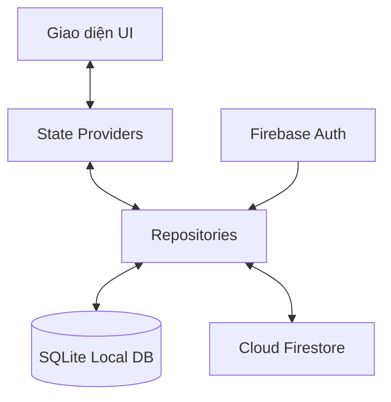
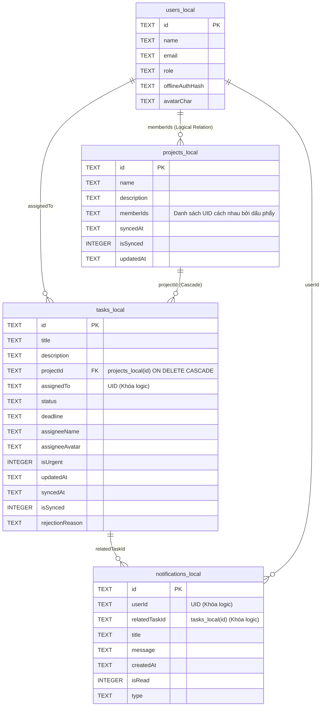
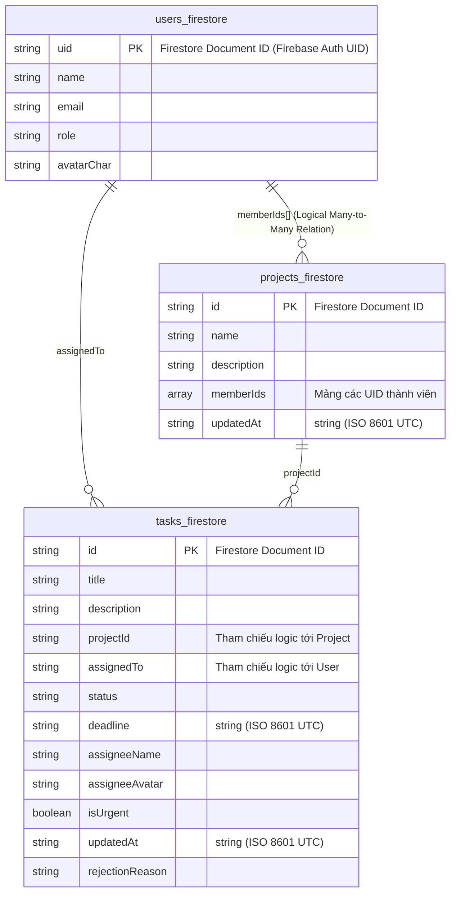

# Báo Cáo Kiến Trúc Cơ Sở Dữ Liệu — TaskFlow

Báo cáo này trình bày chi tiết thiết kế, cấu trúc cơ sở dữ liệu và luồng vận động dữ liệu của ứng dụng **TaskFlow** giữa cơ sở dữ liệu ngoại tuyến (SQLite Local) và cơ sở dữ liệu đám mây (Cloud Firestore).

---

## 1. Kiến Trúc Tổng Quan (Offline-First)

Ứng dụng TaskFlow hoạt động theo mô hình **Offline-First**. Giao diện người dùng tương tác trực tiếp với các State Provider, dữ liệu được ghi đè và lưu trữ cục bộ vào SQLite trước. Khi có kết nối mạng, dữ liệu sẽ được đồng bộ hai chiều (Bi-directional Synchronization) với Cloud Firestore thông qua Repository Pattern.


> **Lưu ý về dòng chảy dữ liệu (Data Flow):** Firebase Auth không trực tiếp đồng bộ dữ liệu với Firestore. Thay vào đó, Repository lấy định danh tài khoản (`currentUser.uid`) từ Firebase Auth, sau đó dùng UID này làm chìa khóa để thực hiện các truy vấn đọc/ghi trên Firestore và SQLite.

### 1.1. Sơ đồ thực thể quan hệ (ERD - SQLite Local)

Dưới đây là sơ đồ thực thể quan hệ (ERD) thể hiện cấu trúc các bảng và mối liên kết khóa ngoại/logic trong SQLite nội bộ:



---

## 2. Thiết Kế SQLite Local Database (Version 7)

SQLite sử dụng file cơ sở dữ liệu cục bộ `taskflow.db`. Dưới đây là đặc tả chi tiết của 4 bảng trong hệ thống:

### Bảng 2.1: `users_local` (Thông tin người dùng cục bộ)
Lưu trữ thông tin tài khoản đã đăng nhập trên thiết bị để hỗ trợ xác thực offline.

| Tên trường | Kiểu dữ liệu | Ràng buộc / Mặc định | Ý nghĩa |
| :--- | :--- | :--- | :--- |
| `id` | `TEXT` | `PRIMARY KEY` | Firebase Auth UID duy nhất |
| `name` | `TEXT` | | Tên hiển thị của người dùng |
| `email` | `TEXT` | | Địa chỉ Email đăng nhập |
| `role` | `TEXT` | | Vai trò: `manager` hoặc `member` |
| `offlineAuthHash` | `TEXT` | | Chuỗi mật khẩu băm/mã hóa (để xác thực offline, tránh dùng tên cột "password" trực tiếp) |
| `avatarChar` | `TEXT` | | Chữ cái đầu hiển thị làm avatar |

---

### Bảng 2.2: `projects_local` (Thông tin dự án cục bộ)
Quản lý các dự án được tạo trong hệ thống.

| Tên trường | Kiểu dữ liệu | Ràng buộc / Mặc định | Ý nghĩa |
| :--- | :--- | :--- | :--- |
| `id` | `TEXT` | `PRIMARY KEY` | ID duy nhất của dự án |
| `name` | `TEXT` | | Tên dự án |
| `description` | `TEXT` | | Mô tả chi tiết dự án |
| `memberIds` | `TEXT` | | Danh sách UID thành viên cách nhau bởi dấu phẩy `,` (Quan hệ logic, không phải khóa ngoại vật lý) |
| `syncedAt` | `TEXT` | | Thời điểm đồng bộ cuối cùng |
| `isSynced` | `INTEGER` | `DEFAULT 1` | Cờ đồng bộ: `0` (Chưa đồng bộ), `1` (Đã đồng bộ) |
| `updatedAt` | `TEXT` | | Thời điểm cập nhật cuối cùng để giải quyết xung đột khi sửa offline |

> **Ghi chú thiết kế về `memberIds`**: Để đơn giản hóa cấu trúc bảng trong phạm vi đồ án tốt nghiệp nhỏ, danh sách các thành viên dự án được lưu dưới dạng chuỗi nối nhau bằng dấu phẩy (CSV) thay vì thiết lập bảng trung gian nhiều-nhiều (`project_members_local`).

---

### Bảng 2.3: `tasks_local` (Danh sách nhiệm vụ cục bộ)
Lưu trữ chi tiết các công việc/nhiệm vụ được giao.

| Tên trường | Kiểu dữ liệu | Ràng buộc / Mặc định | Ý nghĩa |
| :--- | :--- | :--- | :--- |
| `id` | `TEXT` | `PRIMARY KEY` | ID duy nhất của nhiệm vụ |
| `title` | `TEXT` | | Tiêu đề công việc |
| `description` | `TEXT` | | Mô tả chi tiết công việc |
| `projectId` | `TEXT` | `REFERENCES projects_local(id) ON DELETE CASCADE` | Khóa ngoại liên kết dự án (Xóa dự án tự động xóa sạch task) |
| `assignedTo` | `TEXT` | | UID của thành viên nhận việc |
| `status` | `TEXT` | | Trạng thái: `todo`, `doing`, `reviewing`, `done`, `cancelled`, `archived` |
| `deadline` | `TEXT` | | Hạn hoàn thành |
| `assigneeName` | `TEXT` | | Tên hiển thị người nhận việc |
| `assigneeAvatar` | `TEXT` | | Chữ cái đại diện avatar người nhận |
| `isUrgent` | `INTEGER` | `DEFAULT 0` | Cờ khẩn cấp: `0` (Thường), `1` (Khẩn cấp) |
| `updatedAt` | `TEXT` | | Thời điểm cập nhật cuối cùng của task |
| `syncedAt` | `TEXT` | | Thời điểm đồng bộ cuối cùng |
| `isSynced` | `INTEGER` | `DEFAULT 1` | Cờ đồng bộ: `0` (Chưa đồng bộ), `1` (Đã đồng bộ) |
| `rejectionReason` | `TEXT` | | Lý do Manager từ chối duyệt |

---

### Bảng 2.4: `notifications_local` (Trung tâm thông báo cục bộ)
Quản lý các thông báo đẩy nội bộ được tạo dựa trên sự thay đổi trạng thái của task.

| Tên trường | Kiểu dữ liệu | Ràng buộc / Mặc định | Ý nghĩa |
| :--- | :--- | :--- | :--- |
| `id` | `TEXT` | `PRIMARY KEY` | ID duy nhất của thông báo |
| `userId` | `TEXT` | | UID của người dùng nhận thông báo (để cô lập dữ liệu) |
| `relatedTaskId` | `TEXT` | | ID nhiệm vụ liên quan (để click điều hướng) |
| `title` | `TEXT` | | Tiêu đề thông báo |
| `message` | `TEXT` | | Nội dung chi tiết thông báo |
| `createdAt` | `TEXT` | | Thời gian tạo thông báo |
| `isRead` | `INTEGER` | `DEFAULT 0` | Cờ đã đọc: `0` (Chưa đọc), `1` (Đã đọc) |
| `type` | `TEXT` | | Phân loại: `task_assigned`, `task_rejected`, `task_approved`, v.v. |

---

### 2.5. Giới hạn thiết kế và định hướng nâng cấp

Trong phạm vi đồ án, hệ thống không tách bảng `project_members_local` mà lưu danh sách UID thành viên trong trường `memberIds`. Đây là phương án đơn giản hóa nhằm giảm độ phức tạp khi đồng bộ offline-first giữa SQLite và Firestore. Trường `memberIds` được xem là liên kết logic, không phải khóa ngoại vật lý trong SQLite.

Thiết kế này phù hợp khi số lượng thành viên và dự án nhỏ. Nếu hệ thống mở rộng với nhiều thành viên hoặc cần truy vấn phức tạp theo user, có thể cải tiến bằng bảng trung gian `project_members_local` để chuẩn hóa quan hệ nhiều-nhiều.

---

## 3. Thiết Kế Remote Database (Cloud Firestore)

Firestore tổ chức dữ liệu theo mô hình tài liệu phi quan hệ (NoSQL Document Store) gồm 3 Collections chính:

```
/users/{uid}       --> [Document chứa thông tin User]
/projects/{pid}    --> [Document chứa thông tin Project]
/tasks/{tid}       --> [Document chứa thông tin Task]
```

### 3.1. Sơ đồ thực thể quan hệ logic (ERD - Cloud Firestore)

Dưới đây là sơ đồ thực thể quan hệ logic (ERD) mô tả mối quan hệ giữa các tài liệu trong Firestore:



### 3.2. Collection `users`
*   **Document ID**: `uid` (Trùng khớp 100% với Firebase Auth UID).
*   **Các trường dữ liệu**:
    ```json
    {
      "name": "Nguyen Van A",
      "email": "a@taskflow.com",
      "role": "member",
      "avatarChar": "N"
    }
    ```
> **Nguyên tắc bảo mật**: Không lưu thuộc tính mật khẩu (`password` hay `hashed_password`) trên Firestore. Firebase Auth đã chịu trách nhiệm quản lý, mã hóa và bảo mật mật khẩu ở tầng dịch vụ xác thực chuyên biệt.

### 3.3. Collection `projects`
*   **Document ID**: Tự sinh bởi Firestore (UUID).
*   **Các trường dữ liệu**:
    ```json
    {
      "name": "Dự án Thiết Kế Website",
      "description": "Xây dựng website bán hàng chuẩn SEO",
      "memberIds": ["uid_1", "uid_2", "uid_3"],
      "updatedAt": "2026-06-12T00:15:30.000Z"
    }
    ```

### 3.4. Collection `tasks`
*   **Document ID**: Tự sinh bởi Firestore (UUID).
*   **Các trường dữ liệu**:
    ```json
    {
      "title": "Thiết kế Figma màn hình Home",
      "description": "Thiết kế UI/UX theo yêu cầu khách hàng",
      "projectId": "project_id_123",
      "assignedTo": "uid_2",
      "status": "reviewing",
      "deadline": "2026-06-20T23:59:59.000Z",
      "assigneeName": "Nguyen Van B",
      "assigneeAvatar": "B",
      "isUrgent": true,
      "updatedAt": "2026-06-12T00:15:30.000Z",
      "rejectionReason": ""
    }
    ```

---

## 4. Nguyên Tắc Định Danh & Ràng Buộc Dữ Liệu

Để đảm bảo an toàn thông tin và tránh rò rỉ dữ liệu giữa các tài khoản, hệ thống áp dụng các nguyên tắc định danh nghiêm ngặt:

1.  **Firebase Auth UID làm ID gốc**: Mỗi khi tài khoản được tạo online thông qua Firebase Auth, UID tự sinh trên Auth chính là ID định danh duy nhất của user đó trên toàn hệ thống.
2.  **Đồng bộ ID cục bộ và đám mây**: Bảng `users_local.id` và tài liệu `/users/{uid}` trên Firestore bắt buộc phải sử dụng chung giá trị UID này. Tuyệt đối không sinh thêm ID cục bộ khác cho user đã đăng nhập Firebase.
3.  **Tham chiếu an toàn**:
    - Trường `assignedTo` trong bảng Task, `userId` trong bảng Notification, và các phần tử trong mảng `memberIds` của Project đều tham chiếu trực tiếp đến UID này.
    - Dữ liệu thông báo được lọc theo điều kiện `userId = ?` tương ứng với UID đang đăng nhập, giúp ngăn chặn triệt để tình trạng người dùng xem trộm thông báo của tài khoản khác.
4.  **Tối ưu hóa và giới hạn truy vấn (Query Limitation):**
    - Để tuân thủ đúng Firestore Security Rules, khi truy vấn danh sách Task cho tài khoản Member, ứng dụng bắt buộc phải lọc theo điều kiện cụ thể: `.where('assignedTo', isEqualTo: currentUser.uid)` (lấy task cá nhân được giao) hoặc lọc theo `projectId` của dự án mà họ tham gia.
    - Tuyệt đối không thực hiện truy vấn toàn bộ `/tasks` đối với tài khoản Member để tránh bị chặn bởi Security Rules từ phía máy chủ và tối ưu hóa băng thông.

---

## 5. Luồng Vận Động Dữ Liệu & Đồng Bộ Offline-First

### 5.1. Đồng bộ xuôi (Downstream - Firestore to SQLite)
1. Ứng dụng khởi động và lắng nghe các collections `tasks` và `projects` từ Firebase.
2. Khi nhận dữ liệu từ Firestore, Repository kiểm tra thời điểm cập nhật `updatedAt` và cờ trạng thái `isSynced` của bản ghi local trước khi ghi đè để bảo vệ các thay đổi ngoại tuyến chưa kịp đồng bộ:
   - **Quy tắc bảo vệ**: Nếu bản ghi local đang có `isSynced = 0` (chờ đồng bộ) và có thời gian `updatedAt` mới hơn (hoặc bằng) dữ liệu nhận từ máy chủ, Repository sẽ **giữ lại bản ghi local** và bỏ qua việc ghi đè từ server.
   - Ngược lại, dữ liệu từ server sẽ được lưu đè vào SQLite và cập nhật `isSynced = 1`.
3. Đối với thông báo, hệ thống tiến hành kiểm tra chống trùng dựa trên bộ ba `(userId, relatedTaskId, type)`. Nếu không trùng, thông báo mới sẽ được ghi vào `notifications_local`.

### 5.2. Đồng bộ ngược (Upstream - SQLite to Firestore)
1. Khi không có mạng (Offline), người dùng tạo dự án hoặc cập nhật trạng thái nhiệm vụ.
2. Hệ thống ghi dữ liệu vào SQLite, gán thời gian `updatedAt = DateTime.now()` và đánh dấu cờ trạng thái đồng bộ `isSynced = 0`.
3. Khi thiết bị khôi phục kết nối Internet:
   - `ConnectivityProvider` kích hoạt hàm `syncPending()`.
   - Tìm kiếm các bản ghi chưa đồng bộ (`isSynced = 0`) trong `projects_local` và `tasks_local`.
   - Đẩy dữ liệu lên Firestore. Sau khi lưu thành công, cập nhật `isSynced = 1` ở local và gán thời gian `syncedAt`.

### 5.3. Giải quyết xung đột (Conflict Resolution)
Nếu dữ liệu được sửa đổi ở cả local và server trong thời gian offline, hệ thống giải quyết bằng cơ chế **Timestamp Comparison**:
- So sánh thuộc tính thời gian cập nhật gần nhất `updatedAt` giữa Server Task/Project và Local Task/Project.
- Nếu `server.updatedAt` lớn hơn `local.updatedAt` $\to$ Cập nhật dữ liệu từ Server ghi đè vào Local.
- Ngược lại, nếu `local.updatedAt` lớn hơn $\to$ Thực hiện đẩy dữ liệu Local ghi đè lên Server.

---

## 6. Firestore Security Rules

Dưới đây là cấu hình quy tắc bảo mật (Security Rules) thực tế đang được sử dụng cho Cloud Firestore trong tệp `firestore.rules`:

```javascript
rules_version = '2';

service cloud.firestore {
  match /databases/{database}/documents {

    function isAuthenticated() {
      return request.auth != null;
    }

    function getUserData() {
      return get(/databases/$(database)/documents/users/$(request.auth.uid)).data;
    }

    function isManager() {
      return isAuthenticated() && (
        getUserData().role == 'manager' || 
        request.auth.token.email == 'manager@gmail.com'
      );
    }

    function isUserProjectMember(projectId, userId) {
      return isAuthenticated() && 
        projectId != null &&
        userId != null &&
        exists(/databases/$(database)/documents/projects/$(projectId)) &&
        (userId in get(/databases/$(database)/documents/projects/$(projectId)).data.memberIds);
    }

    function isProjectMember(projectId) {
      return isUserProjectMember(projectId, request.auth.uid);
    }

    match /users/{userId} {
      allow read: if isAuthenticated();
      allow write: if isAuthenticated() && request.auth.uid == userId;
    }

    match /projects/{projectId} {
      allow read: if isAuthenticated() && (
        isManager() || (resource != null && request.auth.uid in resource.data.memberIds)
      );
      allow write: if isManager();
    }

    match /tasks/{taskId} {
      allow read: if isAuthenticated() && (
        isManager() || 
        isProjectMember(resource.data.projectId) || 
        ('projectId' in request.query && isProjectMember(request.query.projectId))
      );

      allow create: if isManager()
        && request.resource.data.projectId is string
        && isUserProjectMember(request.resource.data.projectId, request.resource.data.assignedTo);

      allow update: if isAuthenticated() && (
        (isManager() && isUserProjectMember(request.resource.data.projectId, request.resource.data.assignedTo)) ||
        (
          resource.data.assignedTo == request.auth.uid &&
          request.resource.data.diff(resource.data).affectedKeys().hasOnly(['status', 'updatedAt']) &&
          (
            (resource.data.status == 'todo' && request.resource.data.status == 'doing') ||
            (resource.data.status == 'doing' && request.resource.data.status == 'reviewing')
          )
        )
      );

      allow delete: if isManager();
    }
  }
}
```
