# UML & Luồng Hoạt Động – Dự án TaskFlow (Bản Kỹ Thuật Chi Tiết)

> Cập nhật: 2026-06-12 – Đồng bộ hoàn toàn với mã nguồn thực tế và các tính năng nâng cao  
> Cấu trúc dữ liệu, logic phân quyền và luồng đồng bộ đã được nâng cấp toàn diện

---

## 1. Class Diagram (Sơ đồ lớp)

### 1.1 Data Models (`models/`)

Sơ đồ biểu diễn cấu trúc của các đối tượng dữ liệu trong hệ thống:

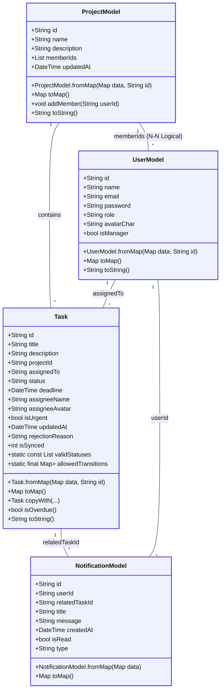

### 1.2 Generic Classes (`utils/`)

```mermaid
classDiagram
    class DataPrinter<T> {
        +T data
        +DataPrinter(T data)
        +void printData()
        +T getData()
        +void setData(T newData)
    }

    class DataListPrinter<T> {
        +List<T> dataList
        +DataListPrinter(List<T> dataList)
        +void printAllData()
        +void addData(T item)
        +List<T> getAllData()
    }

    style DataPrinter fill:#f8fafc,stroke:#64748b
    style DataListPrinter fill:#f8fafc,stroke:#64748b
```

> **Ghi chú**: Các Generic Classes này được giữ lại phục vụ cho Debug Mode và kiểm thử kiểu dữ liệu nhanh trong quá trình phát triển.

### 1.3 Repository & Services Pattern (`repositories/` & `services/`)

Sơ đồ mô tả cơ chế lưu trữ hai lớp (Local SQLite và Remote Firestore), cùng các lớp dịch vụ hạ tầng làm nhiệm vụ thao tác trực tiếp với dữ liệu:

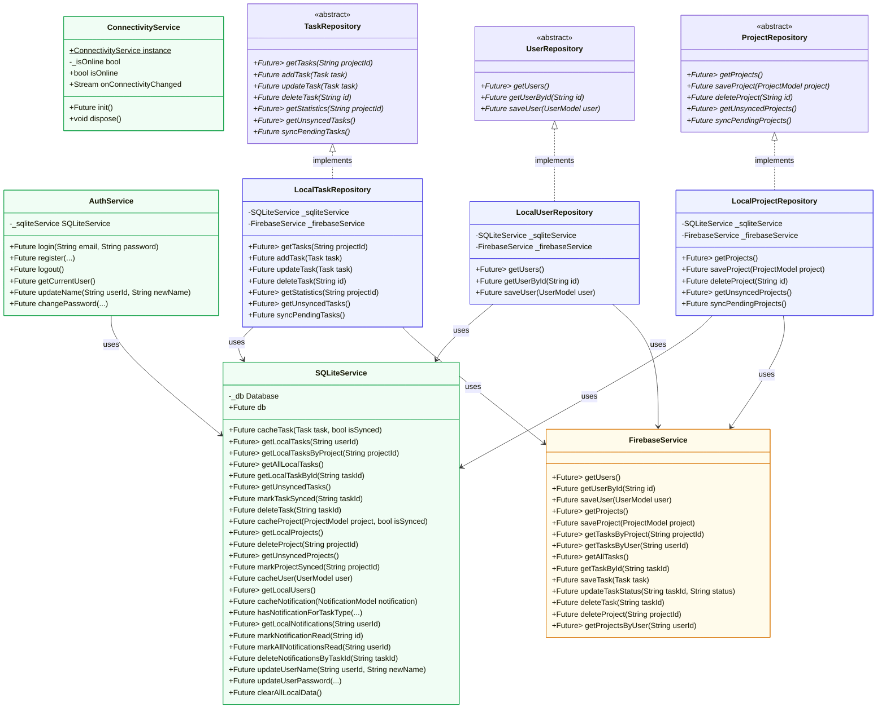

---

## 2. Use Case Diagram (Sơ đồ ca sử dụng)

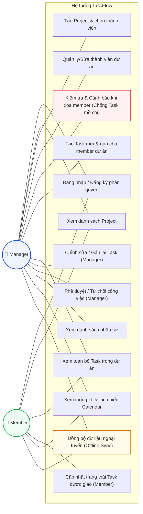

---

## 3. Activity Diagram (Sơ đồ hoạt động)

### 3.1 Luồng Đăng nhập & Phân quyền (Timeout & Offline Fallback)

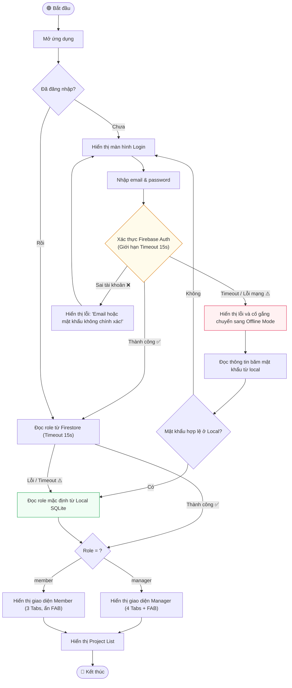

### 3.2 Luồng Tạo Task (Manager - Giới hạn gán cho thành viên thuộc dự án)

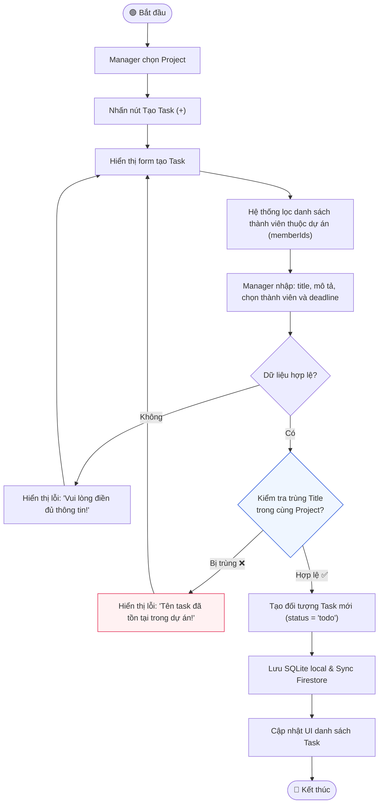

### 3.3 Luồng Cập nhật Tiến độ & Đồng bộ ngược (Optimistic UI & Auto Sync cả Project & Task khi Online)

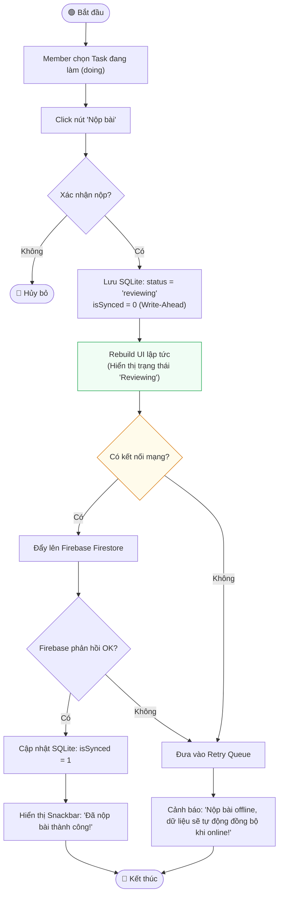

### 3.4 Luồng Chỉnh sửa/Gán lại Task (Manager)

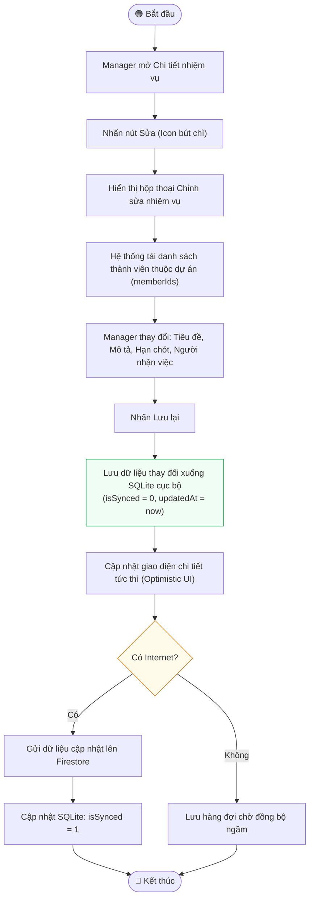

### 3.5 Luồng Quản lý thành viên & Ngăn chặn "Task mồ côi" (Manager)

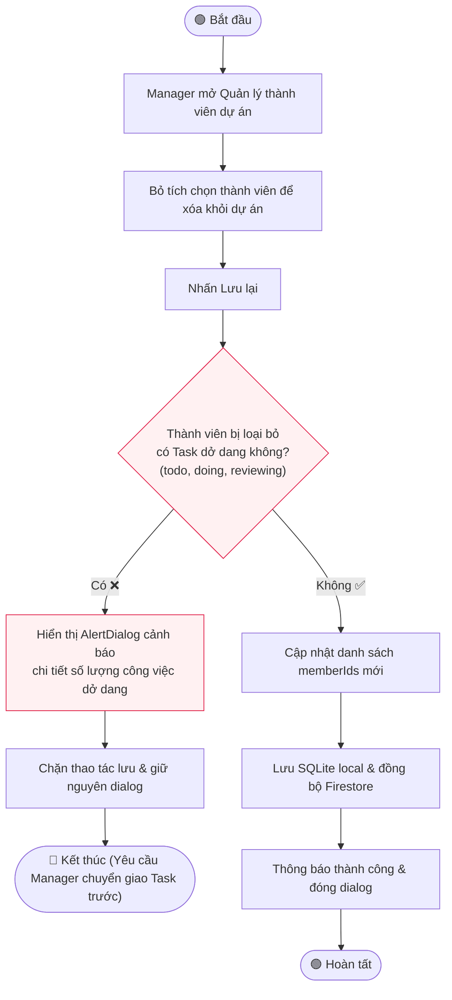

---

## 4. Sequence Diagram (Sơ đồ tuần tự)

### 4.1 Cập nhật trạng thái Task (Member nộp bài)

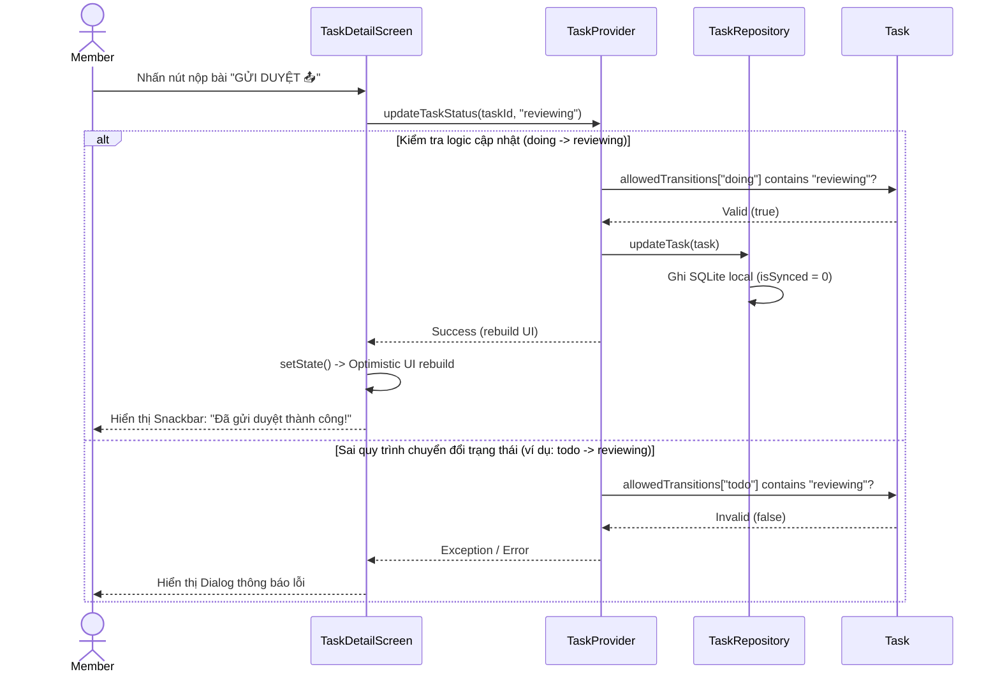

### 4.2 Luồng Repository Pattern (Offline Fallback & Error Handling)

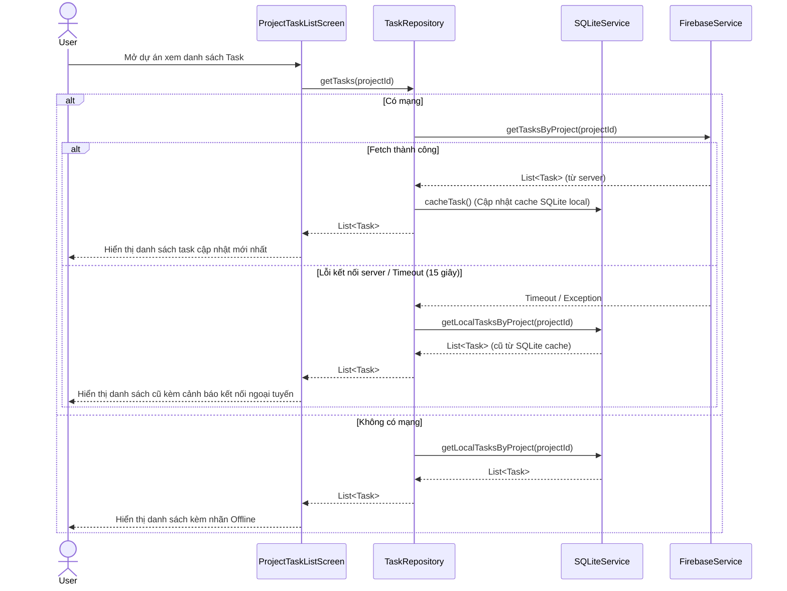

### 4.3 Luồng Khôi phục kết nối mạng (Auto Sync cả Project & Task)

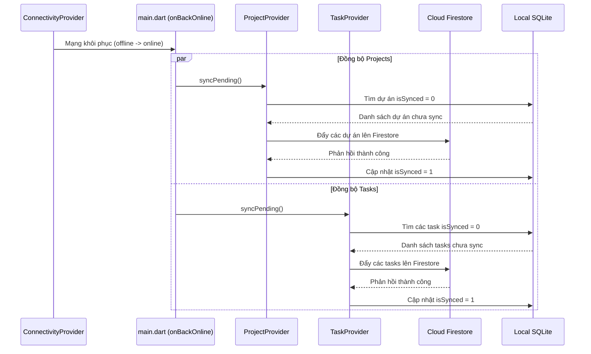

### 4.4 Luồng kiểm tra ràng buộc trước khi xóa thành viên dự án

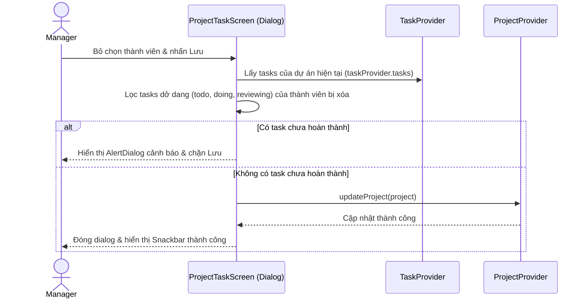

---

## 5. Sơ đồ Kiến trúc Hệ thống

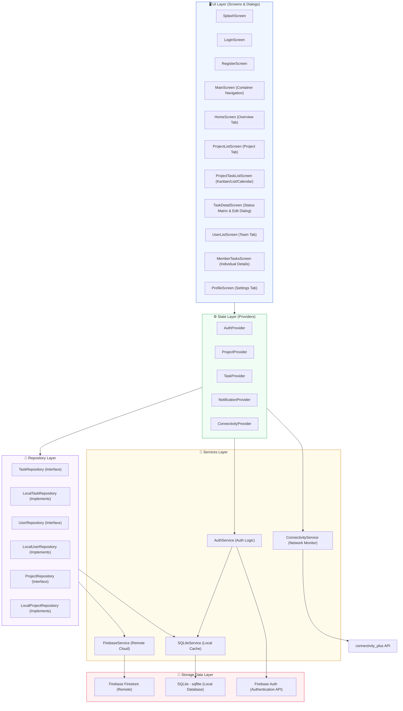

---

## 6. Sơ đồ Quan hệ Dữ liệu (ERD)

### 6.1 Bảng SQLite Local (Phiên bản Cơ sở dữ liệu 7)

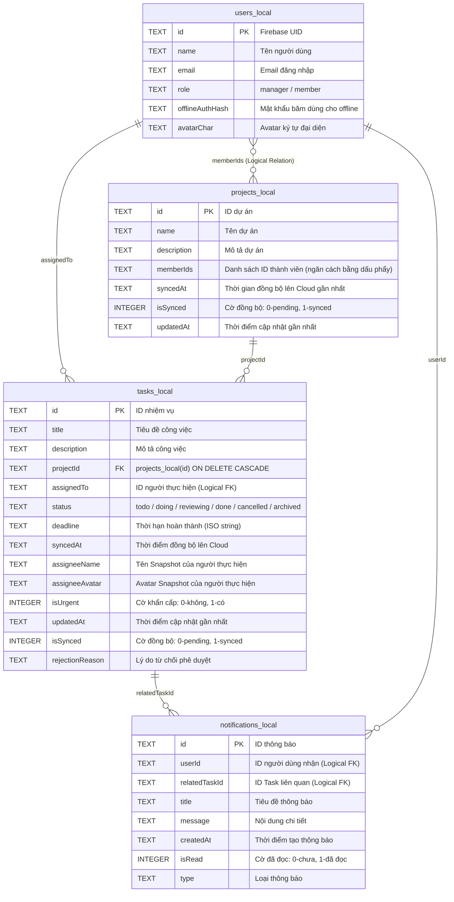

### 6.2 Cấu trúc Cloud Firestore (Remote NoSQL)

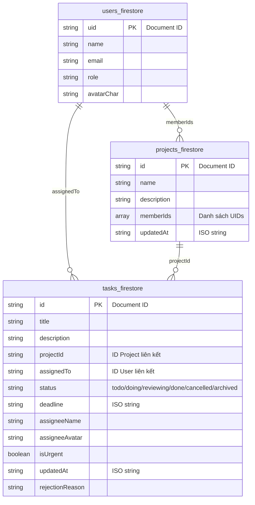

---

## 7. State Diagram – Trạng thái Task

Sơ đồ chuyển trạng thái chặt chẽ theo thiết kế State Machine định nghĩa trong code `Task.allowedTransitions`:

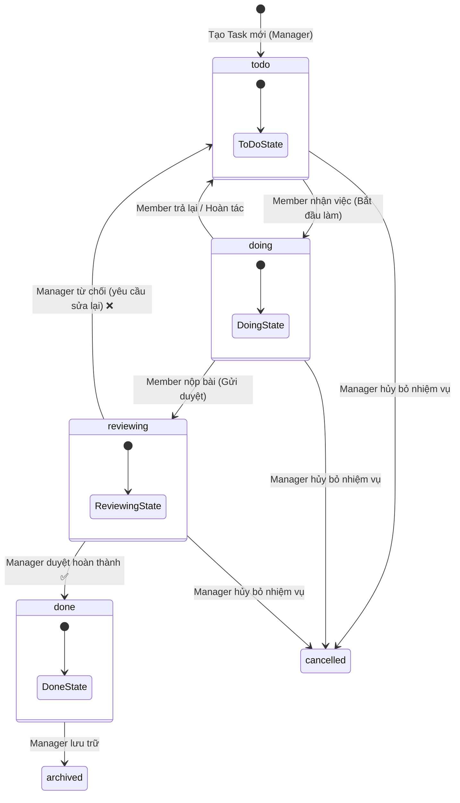

---

## 8. Sơ đồ Điều hướng Màn hình (Navigation Flow)

```mermaid
flowchart TD
    SPLASH(["🎬 SplashScreen"]) --> LOGIN["🔐 LoginScreen"]
    LOGIN --> REGISTER["📝 RegisterScreen"]
    REGISTER -->|Back| LOGIN
    
    LOGIN --> |"Đăng nhập thành công"| ROLE_DECISION{"Phân loại Role?"}
    
    ROLE_DECISION -->|Manager| MGR_DASHBOARD["📱 Manager Navigation Dashboard\n(Floating Bottom Nav Bar - 4 Tabs + FAB)"]
    ROLE_DECISION -->|Member| MEM_DASHBOARD["📱 Member Navigation Dashboard\n(Floating Bottom Nav Bar - 3 Tabs)"]
    
    %% Manager Navigation
    subgraph Manager Navigation (4 Tabs + FAB)
        MGR_DASHBOARD --> MGR_TAB0["🏠 HomeScreen\n(Thống kê & Thẻ duyệt việc nhanh)"]
        MGR_DASHBOARD --> MGR_TAB1["🗂 ProjectListScreen\n(Manager Mode - Tạo/Xóa dự án)"]
        MGR_DASHBOARD --> MGR_FAB["⚡ Nút FAB (+)\n(Tạo việc mới nhanh)"]
        MGR_DASHBOARD --> MGR_TAB2["👥 UserListScreen\n(Danh sách nhân sự & xem thống kê task)"]
        MGR_DASHBOARD --> MGR_TAB3["👤 ProfileScreen\n(Thông tin tài khoản & đăng xuất)"]
        
        MGR_TAB1 -->|"Tap Project"| MGR_TASK_LIST["📋 ProjectTaskListScreen\n(Chế độ Danh sách / Kanban / Lịch biểu)"]
        MGR_TASK_LIST -->|"Manage Members"| MGR_MEMBER_DIALOG["👥 Manage Members Dialog\n(Tích chọn thành viên, có chặn task dở dang)"]
        MGR_TASK_LIST -->|"Tap Task"| TASK_DETAIL["🔍 TaskDetailScreen\n(Manager Mode)"]
        
        TASK_DETAIL -->|"Edit"| EDIT_TASK_DIALOG["✏️ EditTaskDialog\n(Sửa tiêu đề, mô tả, deadline, gán lại)"]
        MGR_TAB2 -->|"Tap Member"| MEMBER_TASKS["📋 MemberTasksScreen\n(Xem chi tiết các task của thành viên)"]
    end
    
    %% Member Navigation
    subgraph Member Navigation (3 Tabs)
        MEM_DASHBOARD --> MEM_TAB0["🏠 HomeScreen\n(Task khẩn cấp & thống kê cá nhân)"]
        MEM_DASHBOARD --> MEM_TAB1["🗂 ProjectListScreen\n(Member Mode)"]
        MEM_DASHBOARD --> MEM_TAB2["👤 ProfileScreen"]
        
        MEM_TAB1 -->|"Tap Project"| MEM_TASK_LIST["📋 ProjectTaskListScreen\n(Xem toàn bộ task của dự án)"]
        MEM_TASK_LIST -->|"Tap Task"| MEM_TASK_DETAIL["🔍 TaskDetailScreen\n(Member Mode)"]
    end
    
    %% Back Stack pops
    TASK_DETAIL -->|"Back"| MGR_TASK_LIST
    MGR_TASK_LIST -->|"Back"| MGR_TAB1
    MEMBER_TASKS -->|"Back"| MGR_TAB2
    MEM_TASK_DETAIL -->|"Back"| MEM_TASK_LIST
    MEM_TASK_LIST -->|"Back"| MEM_TAB1
    
    MGR_TAB3 -->|"Đăng xuất"| LOGIN
    MEM_TAB2 -->|"Đăng xuất"| LOGIN
    
    style SPLASH fill:#9e9e9e,color:#fff
    style LOGIN fill:#f44336,color:#fff
    style ROLE_DECISION fill:#9c27b0,color:#fff
    style MGR_DASHBOARD fill:#3b82f6,color:#fff
    style MEM_DASHBOARD fill:#10b981,color:#fff
    style MGR_FAB fill:#6366f1,color:#fff
```

---

## 9. Sơ đồ Chiến lược Lưu trữ Kép (Dual Storage)

### 9.1 Luồng Đọc Dữ liệu (Read Data Flow) - Cache Invalidation

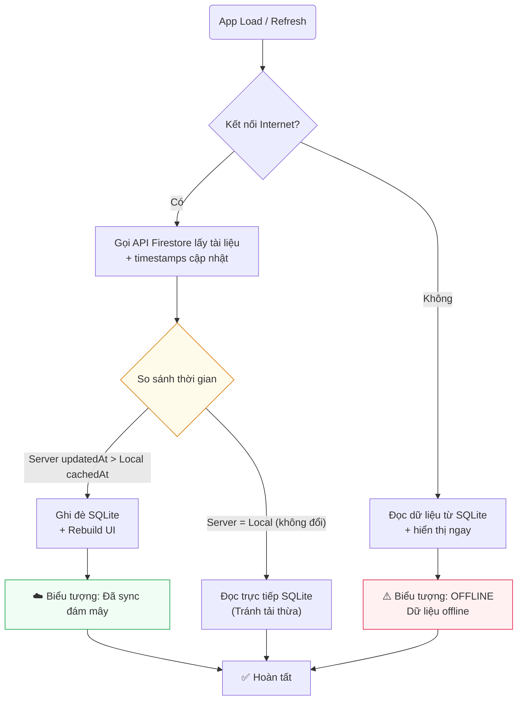

### 9.2 Luồng Ghi Dữ liệu (Write Data Flow) - Write-Ahead Logging & Optimistic UI

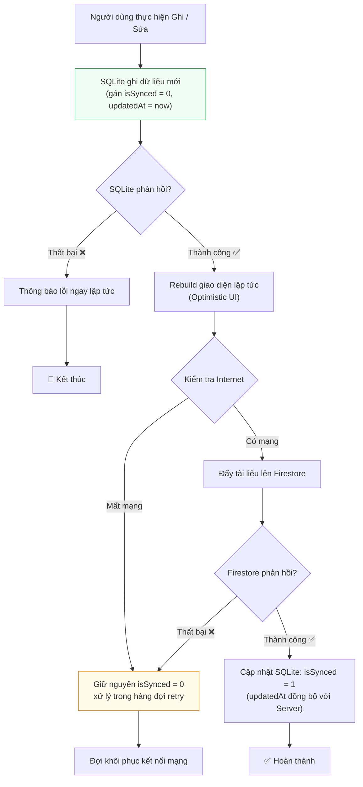

### 9.3 Luồng Đồng bộ Ngầm (Background Sync)

```mermaid
flowchart TD
    START(["⏰ Lắng nghe thay đổi kết nối\nhoặc Timer kích hoạt"]) --> CONNECTIVITY{Kết nối\nInternet?}
    
    CONNECTIVITY -- "Không ❌" --> WAIT(["😴 Tiếp tục chờ\n(Đợi sự kiện Network phục hồi)"])
    WAIT --> START
    
    CONNECTIVITY -- "Có ✅" --> GET_PENDING["Lấy danh sách các bản ghi chưa sync\n(isSynced = 0) từ SQLite"]
    GET_PENDING --> LOOP{Lặp từng bản ghi}
    
    LOOP --> UPLOAD["Đẩy dữ liệu lên\nCloud Firestore"]
    UPLOAD --> CHECK_ERR{Có lỗi xảy ra?}
    
    CHECK_ERR -- "Có ❌" --> LOG_ERR["Ghi log lỗi hệ thống\n+ Chuyển bản ghi sau"]
    CHECK_ERR -- "Không ✅" --> MARK_OK["Cập nhật SQLite: isSynced = 1\nsyncedAt = DateTime.now()"]
    
    MARK_OK --> LOOP
    LOG_ERR --> LOOP
    
    LOOP -- "Hết dữ liệu" --> DONE(["✅ Đồng bộ\nHoàn tất"])
    
    style START fill:#faf5ff,stroke:#7c3aed
    style DONE fill:#f0fdf4,stroke:#16a34a
```

### 9.4 Luồng Xử lý Xung đột Đồng bộ (Sync Conflict Resolution) - Triple Conflict Merge

```mermaid
flowchart TD
    START["Đồng bộ Batch dữ liệu"] --> FETCH["Đọc bản ghi tương ứng từ\nSQLite (Local) & Firestore (Server)"]
    FETCH --> FOR_EACH{Lặp từng bản ghi}
    
    FOR_EACH --> COMPARE{So sánh các trường hợp}
    
    CASE_1[Sửa ở Local + Server không có] --> PUSH["☁️ Đẩy Local lên Server"]
    
    CASE_2[Server có sửa + Local không có] --> PULL["📥 Kéo Server về ghi đè Local"]
    
    CASE_3[Local.updatedAt > Server.updatedAt] --> PUSH
    
    CASE_4[Server.updatedAt > Local.updatedAt] --> PULL
    
    CASE_5{Sửa cùng thời điểm\nnhưng khác dữ liệu?} --> CONFLICT[⚠️ XUNG ĐỘT\nTầng dữ liệu]
    CONFLICT --> USER_CHOOSE["🤔 Lựa chọn xử lý:\nGiữ bản Local / Đè bản Server"]
    
    USER_CHOOSE --> PUSH
    USER_CHOOSE --> PULL
    
    PUSH --> MARK["Đánh dấu isSynced = 1"]
    PULL --> MARK
    
    MARK --> MORE{Còn bản ghi?}
    MORE -- "Có" --> FOR_EACH
    MORE -- "Không" --> END["✅ Kết thúc đồng bộ"]
    
    style CONFLICT fill:#fff1f2,stroke:#e11d48
    style USER_CHOOSE fill:#fffbeb,stroke:#d97706
```

---

## 10. Sơ đồ Provider – Quản lý Trạng thái

```mermaid
classDiagram
    class AuthProvider {
        -AuthService _authService
        -UserModel? _currentUser
        +UserModel? currentUser
        +bool isAuthenticated
        +Future<bool> login(String email, String password)
        +Future<void> register(...)
        +Future<void> logout()
        +Future<void> checkCurrentUser()
        +Future<bool> updateName(String newName)
        +Future<bool_message> changePassword(...)
    }

    class ProjectProvider {
        -ProjectRepository _projectRepo
        -UserRepository _userRepo
        -List<ProjectModel> _projects
        -List<UserModel> _allUsers
        +List<ProjectModel> projects
        +List<UserModel> allUsers
        +Future<void> loadProjects()
        +Future<void> loadAllUsers()
        +Future<void> createProject(String name, String desc, List<String> memberIds)
        +Future<void> updateProject(ProjectModel project)
        +Future<void> deleteProject(String projectId)
        +Future<void> syncPending()
    }

    class TaskProvider {
        -TaskRepository _taskRepo
        -ProjectRepository _projectRepo
        -List<Task> _tasks
        -Map<String, Map<String, int>> _projectStats
        +List<Task> tasks
        +Map<String, Map<String, int>> projectStats
        +Future<void> loadTasksByProject(String projectId)
        +Future<void> loadMyTasks(String userId)
        +Future<void> createTask(Task task)
        +Future<void> editTask(Task task)
        +Future<void> updateTaskStatus(String taskId, String newStatus)
        +Future<void> approveTask(String taskId)
        +Future<void> rejectTask(String taskId, String reason)
        +Future<void> syncPending()
    }

    class NotificationProvider {
        -SQLiteService _sqliteService
        -List<NotificationModel> _notifications
        +List<NotificationModel> notifications
        +Future<void> loadNotifications(String userId)
        +Future<void> addNotification(NotificationModel notification)
        +Future<void> markAsRead(String id)
        +Future<void> markAllAsRead(String userId)
    }

    class ConnectivityProvider {
        -ConnectivityService _connectivityService
        -bool _isOnline
        -VoidCallback? _onBackOnline
        +bool isOnline
        +void init(VoidCallback onBackOnline)
        +void updateSyncCallback(VoidCallback callback)
    }

    ChangeNotifier <|-- AuthProvider
    ChangeNotifier <|-- ProjectProvider
    ChangeNotifier <|-- TaskProvider
    ChangeNotifier <|-- NotificationProvider
    ChangeNotifier <|-- ConnectivityProvider

    style AuthProvider fill:#eef2ff,stroke:#4f46e5
    style ProjectProvider fill:#eef2ff,stroke:#4f46e5
    style TaskProvider fill:#eef2ff,stroke:#4f46e5
    style NotificationProvider fill:#eef2ff,stroke:#4f46e5
    style ConnectivityProvider fill:#eef2ff,stroke:#4f46e5
```

---

## 11. Cấu trúc Điều hướng Bottom Navigation Bar & Tổ chức các Màn hình

Ứng dụng TaskFlow tổ chức luồng giao diện thông qua một màn hình khung chính (**MainScreen**) đóng vai trò làm Router cục bộ và quản lý trạng thái điều hướng đa nhiệm qua **Bottom Navigation Bar**.

### 11.1 Cấu trúc Thanh điều hướng nổi (Floating Bottom Navigation Bar)

Thanh Bottom Navigation được thiết kế theo dạng **Floating Glassmorphism** (Thanh nổi bo tròn, phủ kính mờ) nằm cách đáy màn hình `24px` để tăng tính hiện đại và cao cấp cho giao diện.

- **Đặc trưng phân quyền (Role-Based Tabs)**:
  - **Manager (Quản trị viên)**: Hiển thị **4 Tabs** + **1 Nút FAB (+)** nổi bật ở giữa:
    - Tab 0: Trang chủ (`HomeScreen`)
    - Tab 1: Dự án (`ProjectListScreen`)
    - [Center]: Nút **FAB (+)** thêm nhiệm vụ nhanh (`FloatingActionButton` ở vị trí `centerDocked`)
    - Tab 2: Nhóm (`UserListScreen`)
    - Tab 3: Hồ sơ (`ProfileScreen`)
  - **Member (Thành viên)**: Hiển thị **3 Tabs** và **ẨN HOÀN TOÀN** nút FAB (+) ở giữa:
    - Tab 0: Trang chủ (`HomeScreen`)
    - Tab 1: Dự án (`ProjectListScreen`)
    - Tab 2: Hồ sơ (`ProfileScreen`)

### 11.2 Sơ đồ Điều hướng và Chuyển trang (Main Navigation Flow)

Dưới đây là sơ đồ Mermaid mô tả luồng điều hướng hoạt động trong `MainScreen`:

```mermaid
flowchart TD
    START(["👤 Đăng nhập vào App"]) --> CHECK_ROLE{Kiểm tra vai trò\ncurrentUser.role}
    
    CHECK_ROLE -- "isManager = true 👑" --> BUILD_MANAGER_SHELL["🏗️ Render MainScreen (Manager)\n- Hiện 4 Tabs\n- Hiện FAB (+) ở centerDocked"]
    CHECK_ROLE -- "isManager = false 👥" --> BUILD_MEMBER_SHELL["🏗️ Render MainScreen (Member)\n- Hiện 3 Tabs\n- Ẩn FAB (+)"]

    subgraph Manager Navigation Tabs
        BUILD_MANAGER_SHELL --> M_TAB0["Tab 0: Trang chủ\nHomeScreen\n(Tổng quan nhóm & duyệt việc nhanh)"]
        BUILD_MANAGER_SHELL --> M_TAB1["Tab 1: Dự án\nProjectListScreen\n(Quản trị dự án & xem việc)"]
        BUILD_MANAGER_SHELL --> M_FAB["⚡ Nút FAB (+)\n(Tạo việc mới gán cho thành viên)"]
        BUILD_MANAGER_SHELL --> M_TAB2["Tab 2: Thành viên\nUserListScreen\n(Danh sách nhân sự & thống kê task)"]
        BUILD_MANAGER_SHELL --> M_TAB3["Tab 3: Hồ sơ\nProfileScreen\n(Thông tin tài khoản & đăng xuất)"]
    end

    subgraph Member Navigation Tabs
        BUILD_MEMBER_SHELL --> MEM_TAB0["Tab 0: Trang chủ\nHomeScreen\n(Việc đang làm & tiến độ cá nhân)"]
        BUILD_MEMBER_SHELL --> MEM_TAB1["Tab 1: Dự án\nProjectListScreen\n(Xem dự án tham gia & nhận việc)"]
        BUILD_MEMBER_SHELL --> MEM_TAB2["Tab 2: Hồ sơ\nProfileScreen\n(Thông tin cá nhân)"]
    end

    style M_FAB fill:#5b5fef,color:#fff,stroke-width:2px
    style START fill:#10b981,color:#fff
```

### 11.3 Danh sách Tổ chức các Màn hình Chính (Screen Hierarchy)

Toàn bộ các màn hình chính nằm dưới thư mục `lib/screens/` và được tổ chức một cách khoa học:

| Tên màn hình | Đường dẫn file | Vai trò chính trong hệ thống | Phân quyền hiển thị |
| :--- | :--- | :--- | :--- |
| **Login Screen** | [login_screen.dart](file:///d:/Workspace/TBDD/TaskFlow_Huong_Thuong_Cuong_N03_1_2026/lib/screens/login_screen.dart) | Màn hình xác thực đăng nhập, tích hợp xử lý ngoại tuyến. | Tất cả người dùng |
| **Register Screen** | [register_screen.dart](file:///d:/Workspace/TBDD/TaskFlow_Huong_Thuong_Cuong_N03_1_2026/lib/screens/register_screen.dart) | Đăng ký tài khoản mới, cho phép chọn vai trò Manager/Member. | Khách vãng lai |
| **Main Screen** | [main_screen.dart](file:///d:/Workspace/TBDD/TaskFlow_Huong_Thuong_Cuong_N03_1_2026/lib/screens/main_screen.dart) | Khung sườn điều hướng chung, chứa Floating Bottom NavBar. | Tất cả người dùng |
| **Home Screen** | [home_screen.dart](file:///d:/Workspace/TBDD/TaskFlow_Huong_Thuong_Cuong_N03_1_2026/lib/screens/home_screen.dart) | Giao diện tổng quan & thẻ duyệt nhanh / task khẩn cấp. | Tất cả người dùng |
| **Project List Screen** | [project_list_screen.dart](file:///d:/Workspace/TBDD/TaskFlow_Huong_Thuong_Cuong_N03_1_2026/lib/screens/project_list_screen.dart) | Xem danh sách dự án. Manager có quyền Tạo/Xóa dự án. | Tất cả người dùng |
| **Project Task Screen** | [project_task_screen.dart](file:///d:/Workspace/TBDD/TaskFlow_Huong_Thuong_Cuong_N03_1_2026/lib/screens/project_task_screen.dart) | Hiển thị chi tiết tất cả đầu việc (Kanban/Calendar). Có tính năng Quản lý thành viên. | Tất cả người dùng |
| **User List Screen** | [user_list_screen.dart](file:///d:/Workspace/TBDD/TaskFlow_Huong_Thuong_Cuong_N03_1_2026/lib/screens/user_list_screen.dart) | Danh sách thành viên phục vụ giao việc và theo dõi hiệu suất. | **Chỉ Manager** |
| **Member Tasks Screen** | [member_tasks_screen.dart](file:///d:/Workspace/TBDD/TaskFlow_Huong_Thuong_Cuong_N03_1_2026/lib/screens/member_tasks_screen.dart) | Xem chi tiết danh sách nhiệm vụ đã gán của một thành viên. | **Chỉ Manager** |
| **Profile Screen** | [profile_screen.dart](file:///d:/Workspace/TBDD/TaskFlow_Huong_Thuong_Cuong_N03_1_2026/lib/screens/profile_screen.dart) | Xem thông tin tài khoản cá nhân, đổi trạng thái và đăng xuất. | Tất cả người dùng |
