# UML & Luồng Hoạt Động – Dự án TaskFlow (Bản Kỹ Thuật Chi Tiết)

> Cập nhật: 2026-04-26 – Đồng bộ hoàn toàn với mã nguồn nâng cao  
> CRUD thực tế nằm trong `repositories/`, Models thuần trong `models/`

---

## 1. Class Diagram (Sơ đồ lớp)

### 1.1 Data Models (`models/`)

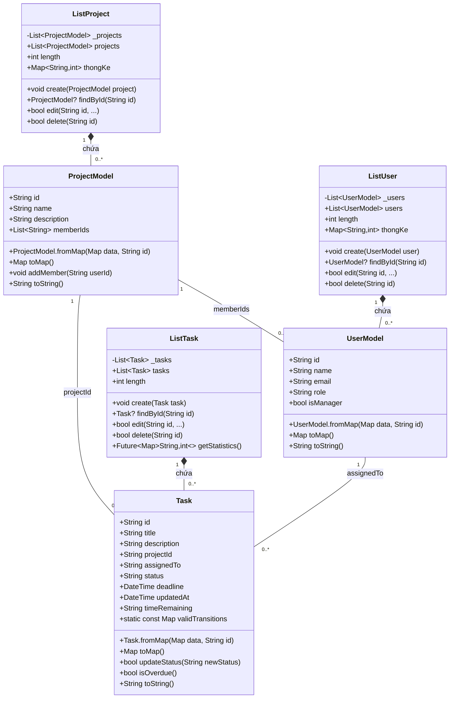

### 1.2 Generics Classes (`utils/`)

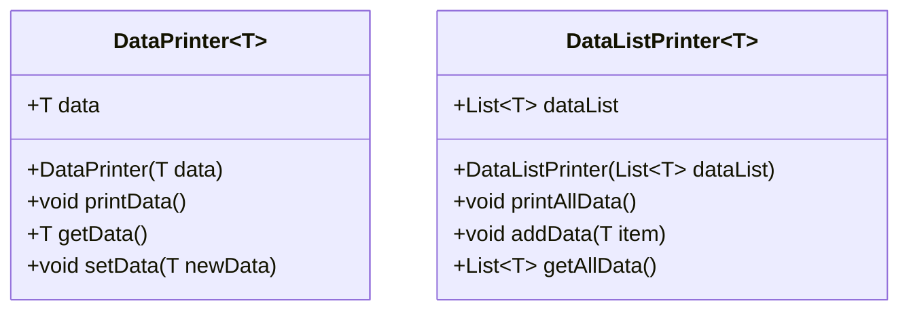

### 1.3 Repository Pattern (`repositories/`)

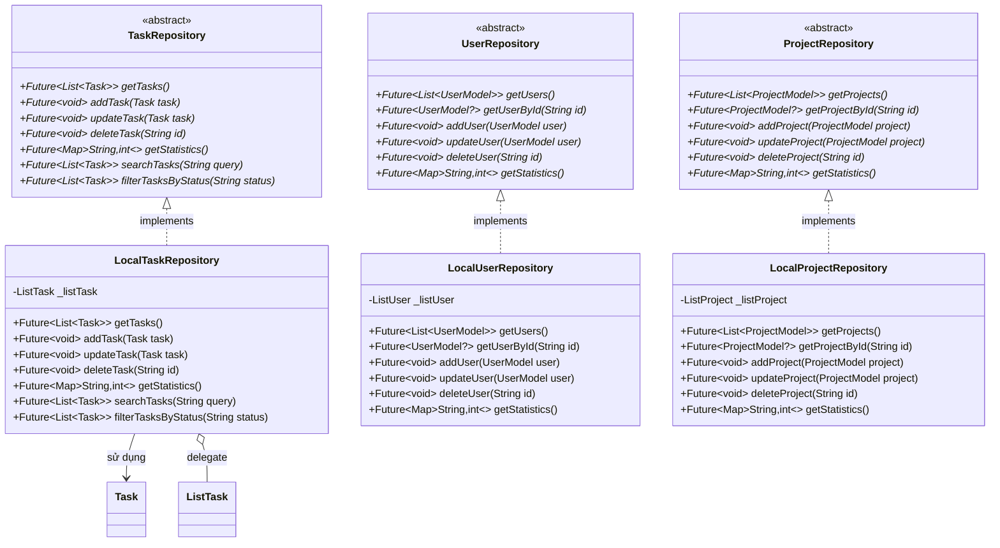

---

## 2. Use Case Diagram (Sơ đồ ca sử dụng)

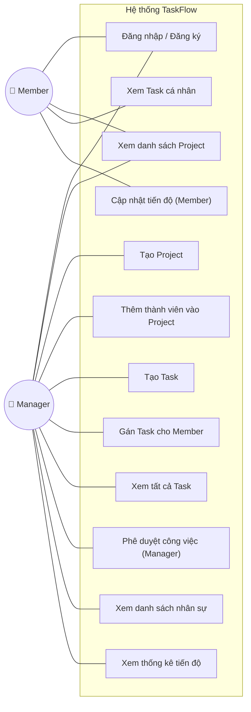

---

## 3. Activity Diagram (Sơ đồ hoạt động)

### 3.1 Luồng Đăng nhập & Phân quyền

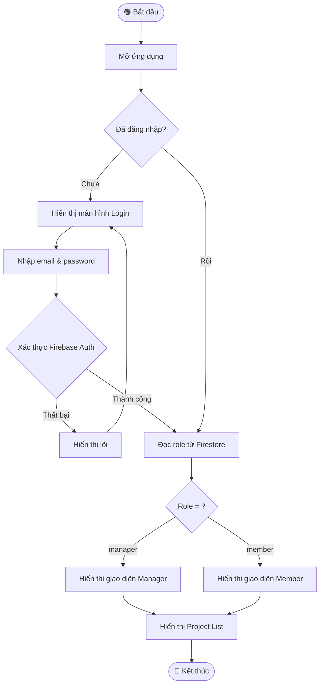

### 3.2 Luồng Tạo Task (Manager)

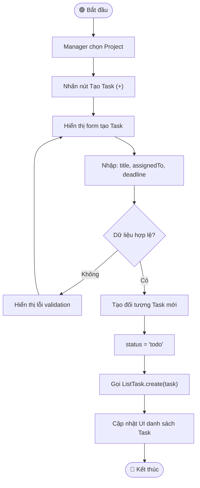

    O --> P(["🔴 Kết thúc"])

### 3.4 Luồng Chỉnh sửa Task (Manager Only - Error Handling)

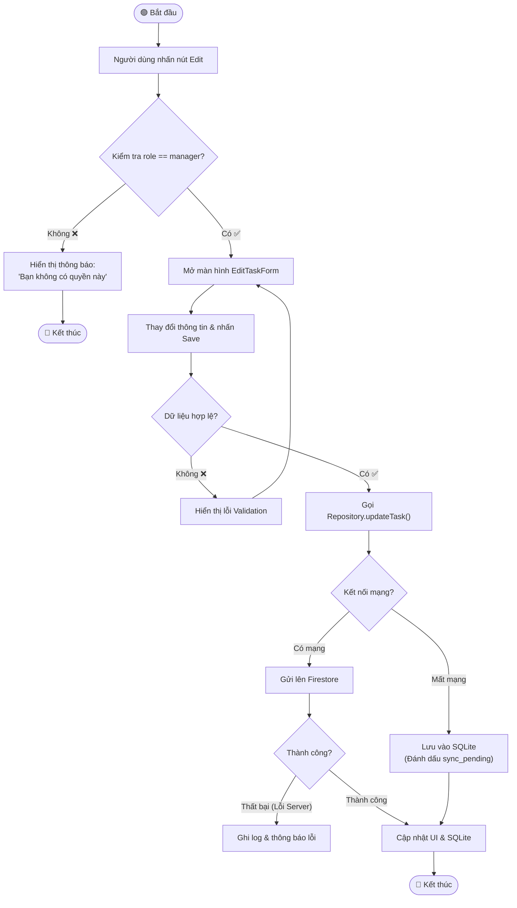

---

## 4. Sequence Diagram (Sơ đồ tuần tự)

### 4.1 Cập nhật trạng thái Task (Member nộp bài)

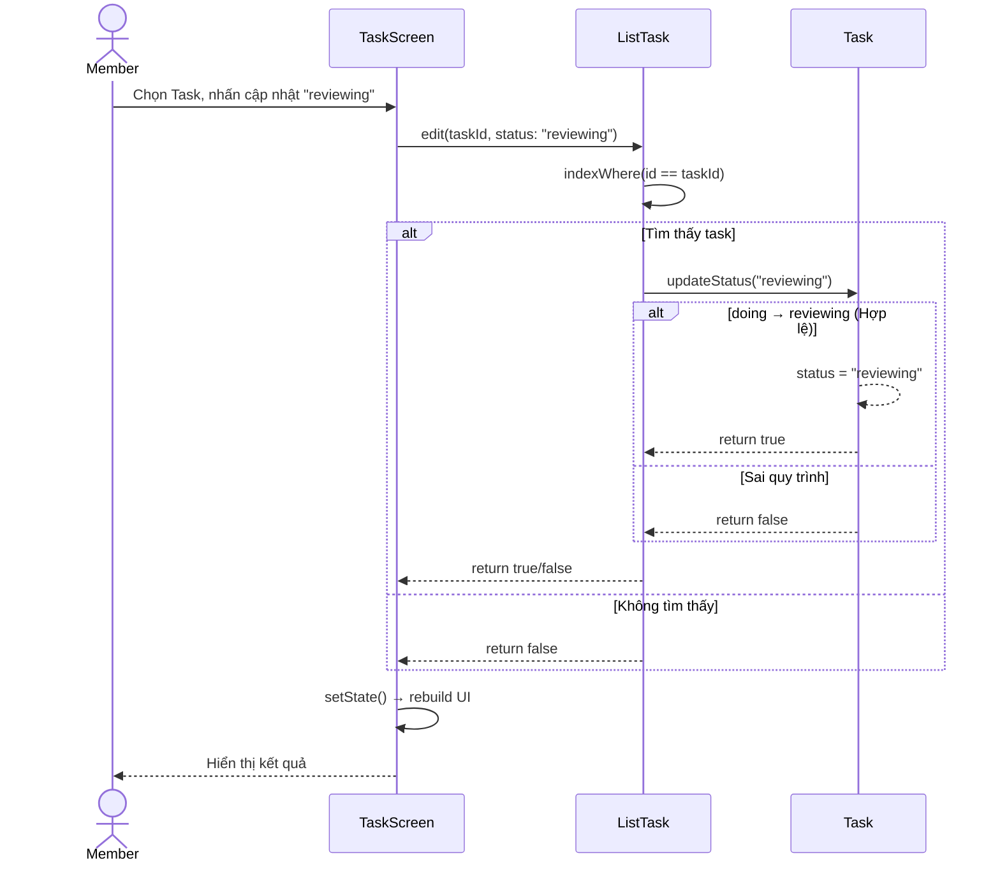

### 4.2 Luồng Repository Pattern

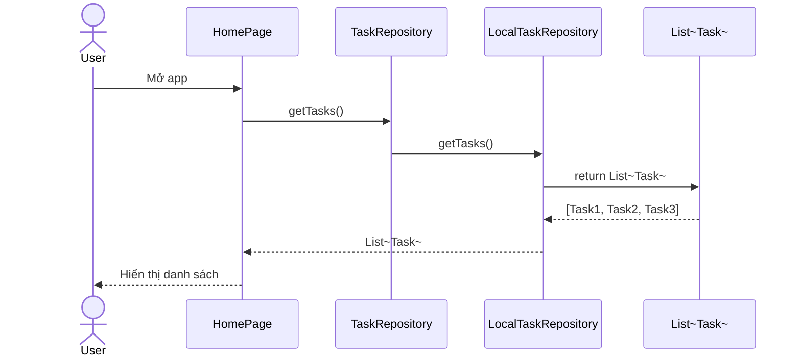

---

## 5. Sơ đồ Kiến trúc Hệ thống

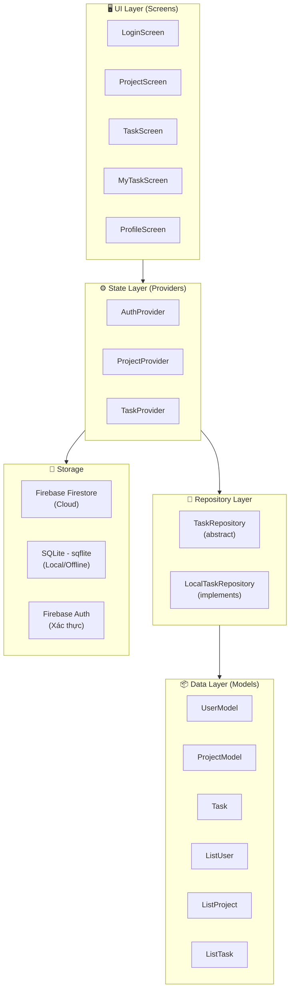

---

## 6. Sơ đồ Quan hệ Dữ liệu (ERD)

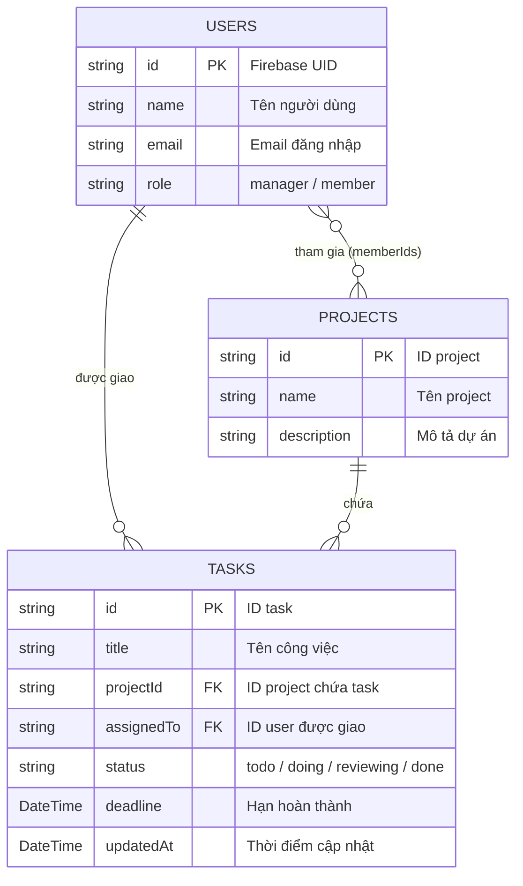

---

## 7. State Diagram – Trạng thái Task

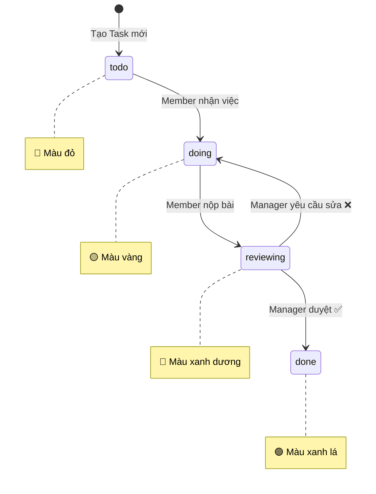

---

## 8. Sơ đồ Điều hướng Màn hình (Navigation Flow)

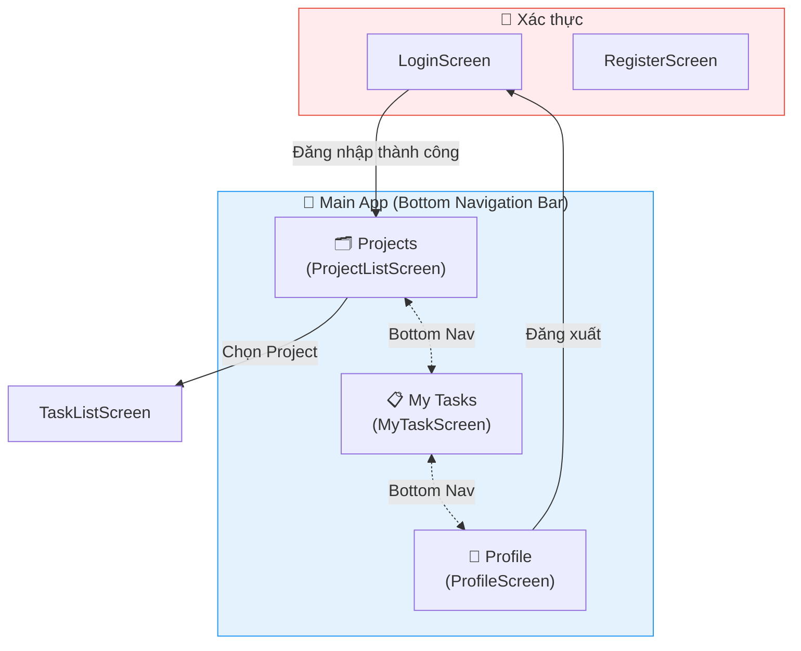

---

## 9. Sơ đồ Chiến lược Lưu trữ Kép (Dual Storage)

### 9.1 Luồng Đọc dữ liệu

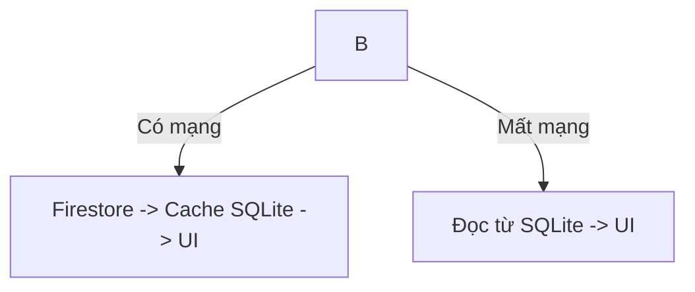

### 9.4 Luồng Xử lý Xung đột Đồng bộ (Sync Conflict Resolution)

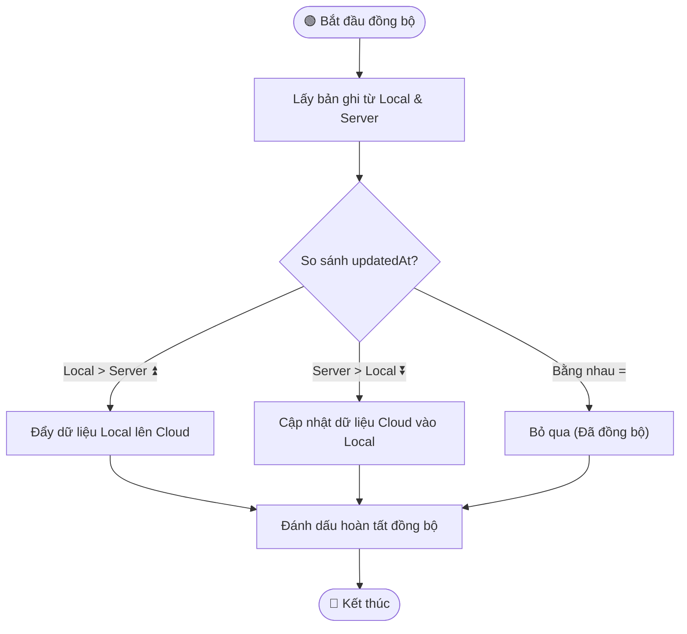

---

## 10. Sơ đồ Provider – Quản lý Trạng thái
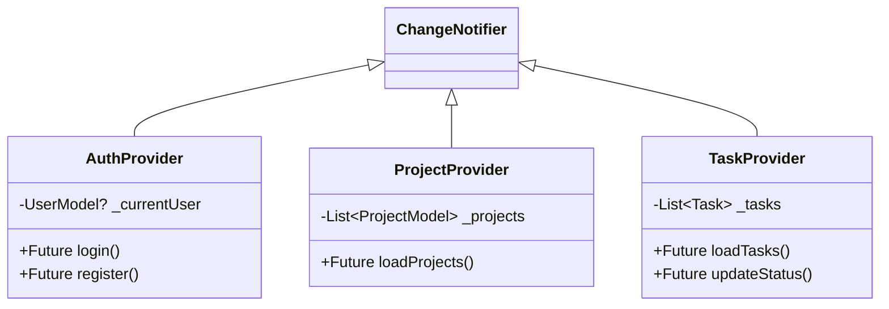
