# UML & Luồng Hoạt Động – Dự án TaskFlow (Bản Kỹ Thuật Chi Tiết)

> Cập nhật: 2026-04-26 – Đồng bộ hoàn toàn với mã nguồn nâng cao  
> CRUD thực tế nằm trong `repositories/`, Models thuần trong `models/`

---

## 1. Class Diagram (Sơ đồ lớp)

### 1.1 Data Models (`models/`)

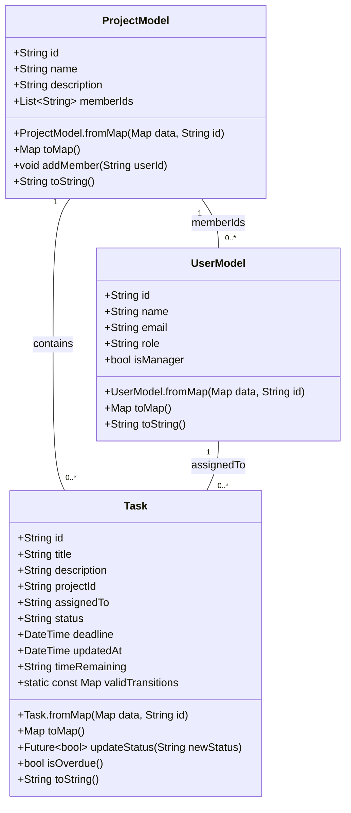

### 1.2 Generics Classes (`utils/`)

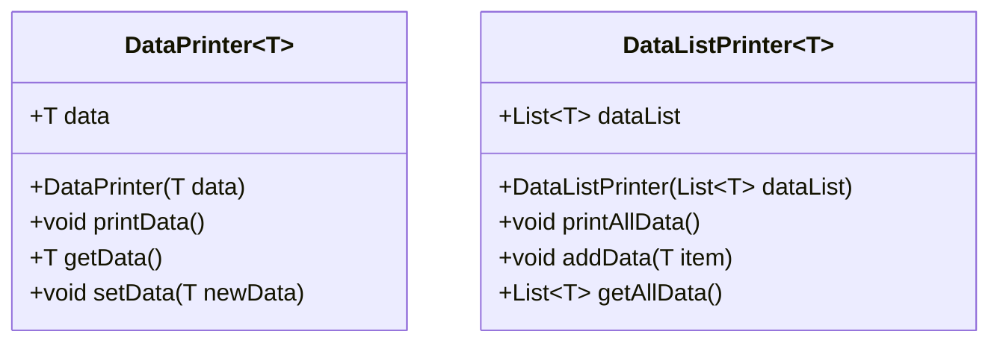

> **Ghi chú**: Các Generic Classes này được giữ lại phục vụ cho Debug Mode và kiểm thử kiểu dữ liệu nhanh trong quá trình phát triển.

### 1.3 Repository Pattern (`repositories/`)

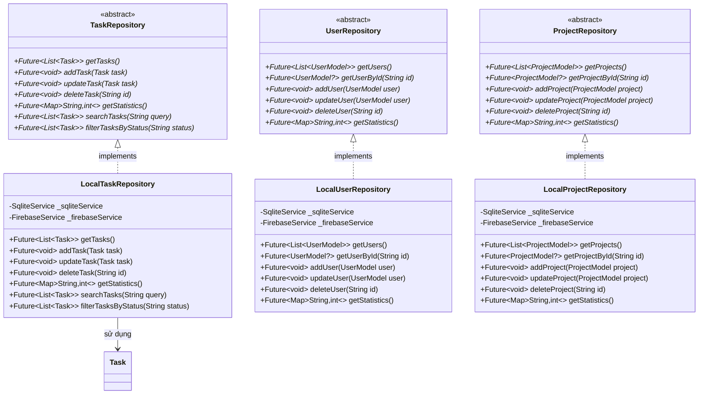

---

## 2. Use Case Diagram (Sơ đồ ca sử dụng)

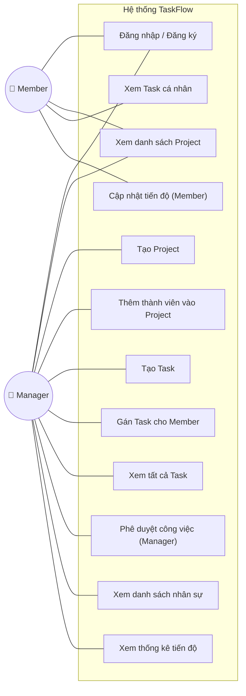

---

## 3. Activity Diagram (Sơ đồ hoạt động)

### 3.1 Luồng Đăng nhập & Phân quyền (Timeout & Offline Fallback)

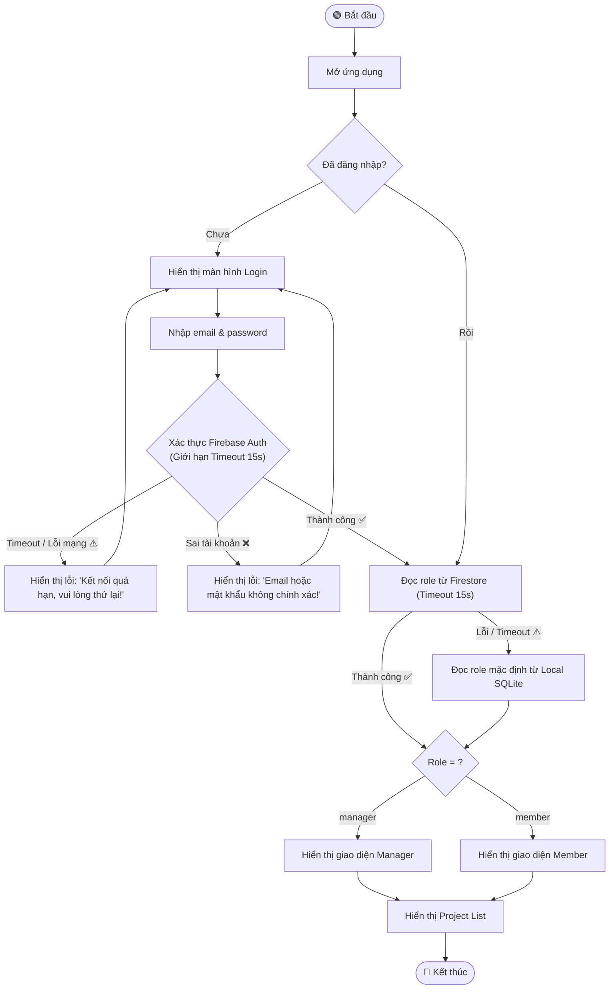

### 3.2 Luồng Tạo Task (Manager - Kiểm tra trùng lặp)

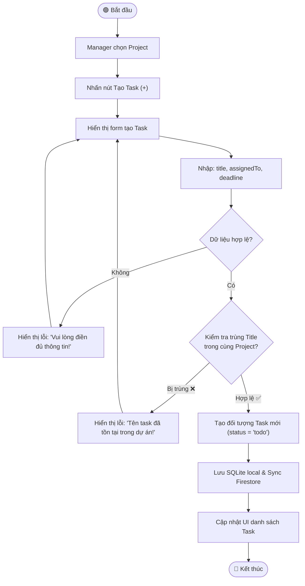

### 3.3 Luồng Cập nhật Tiến độ (Member nộp bài - WAL & Sync)

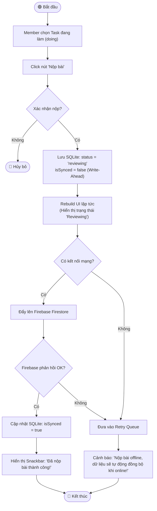

### 3.4 Luồng Chỉnh sửa Task (Manager Only - Optimistic UI)

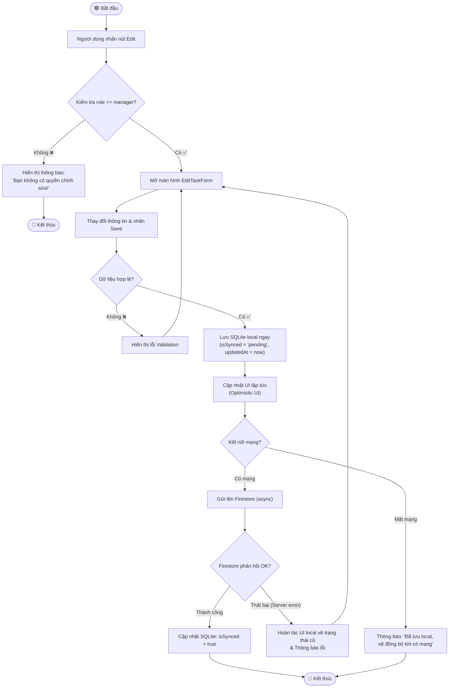

---

## 4. Sequence Diagram (Sơ đồ tuần tự)

### 4.1 Cập nhật trạng thái Task (Member nộp bài)

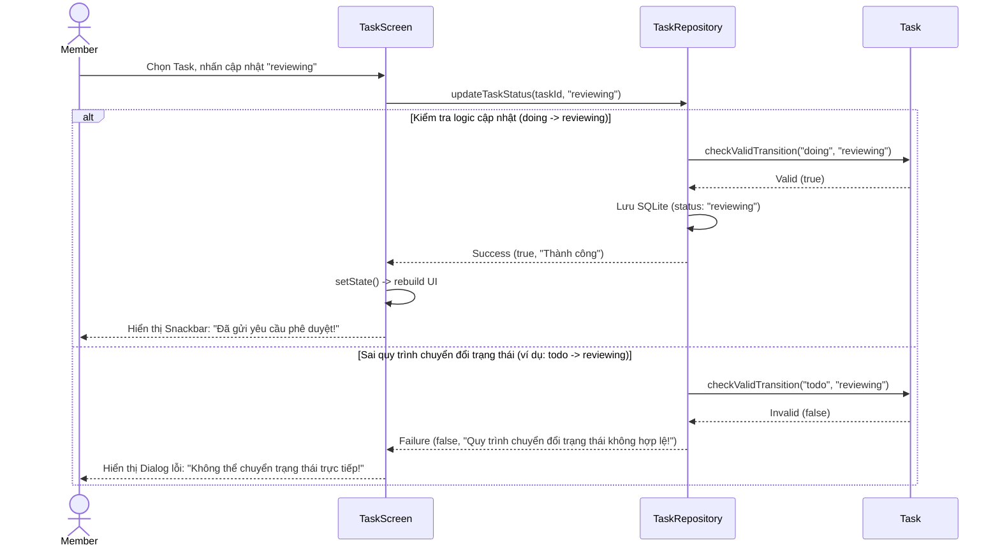

### 4.2 Luồng Repository Pattern (Offline Fallback & Error Handling)

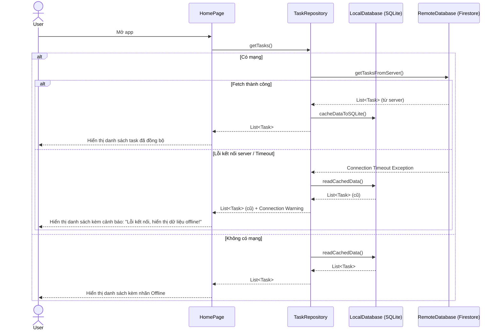

---

## 5. Sơ đồ Kiến trúc Hệ thống

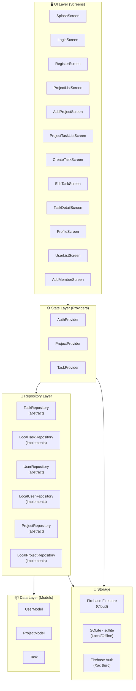

---

## 6. Sơ đồ Quan hệ Dữ liệu (ERD)

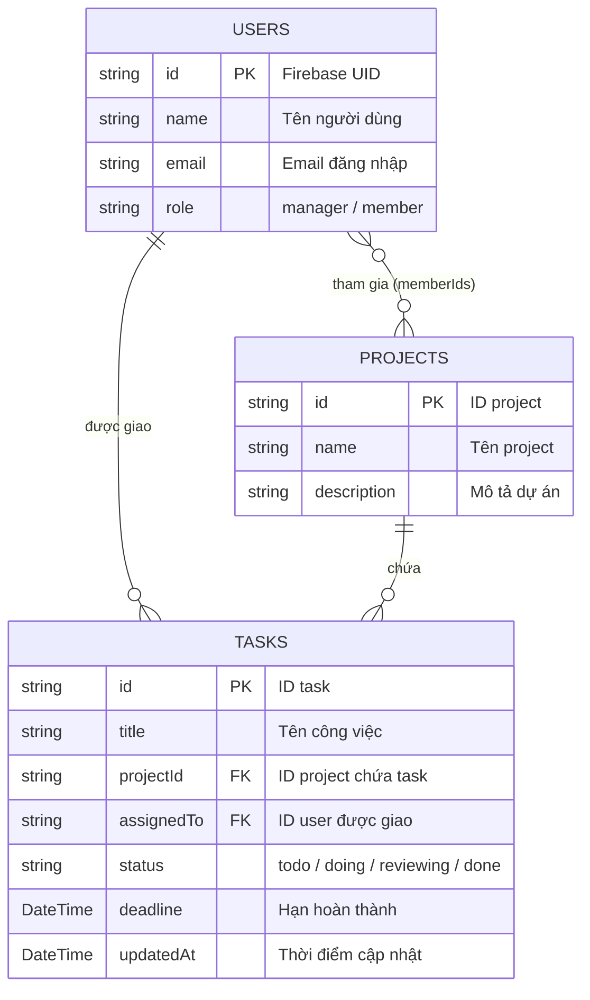

---

## 7. State Diagram – Trạng thái Task

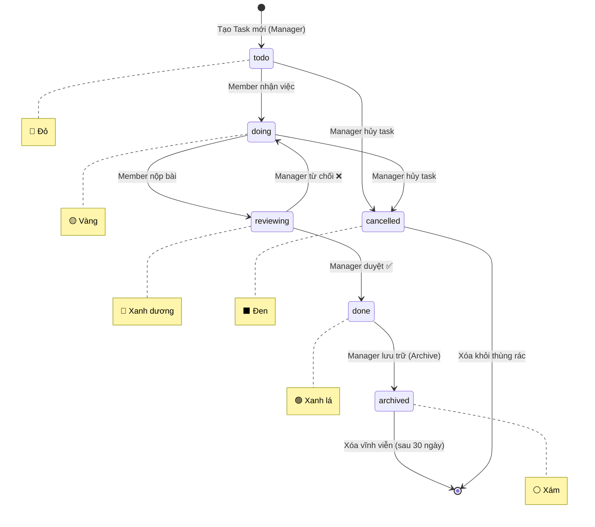

---

## 8. Sơ đồ Điều hướng Màn hình (Navigation Flow)

```mermaid
flowchart TD
    SPLASH(["🎬 SplashScreen"]) --> LOGIN["🔐 LoginScreen"]
    LOGIN --> REGISTER["📝 RegisterScreen"]
    REGISTER -->|Back| LOGIN
    
    LOGIN --> |"Đăng nhập thành công"| ROLE_DECISION{"Phân loại Role?"}
    
    ROLE_DECISION -->|Manager| MGR_DASHBOARD["📱 Manager Navigation Dashboard\n(Bottom Nav Bar)"]
    ROLE_DECISION -->|Member| MEM_DASHBOARD["📱 Member Navigation Dashboard\n(Bottom Nav Bar)"]
    
    %% Manager Navigation
    subgraph Manager Navigation (3 Tabs)
        MGR_DASHBOARD --> MGR_TAB1["🗂 ProjectListScreen\n(Manager Mode)"]
        MGR_DASHBOARD --> MGR_TAB2["📋 MyTaskScreen\n(Manager overview)"]
        MGR_DASHBOARD --> MGR_TAB3["👤 ProfileScreen"]
        
        MGR_TAB1 -->|"+" FAB| ADD_PROJECT["🆕 AddProjectScreen"]
        MGR_TAB1 -->|"Tap Project"| MGR_TASK_LIST["📋 ProjectTaskListScreen"]
        MGR_TASK_LIST -->|"+" FAB| CREATE_TASK["🆕 CreateTaskScreen"]
        MGR_TASK_LIST -->|"Tap Task"| TASK_DETAIL["🔍 TaskDetailScreen\n(Manager Mode)"]
        
        TASK_DETAIL -->|"Edit"| EDIT_TASK["✏️ EditTaskScreen"]
        MGR_TASK_LIST -->|"Manage Members"| ADD_MEMBER["👤 AddMemberScreen"]
        ADD_MEMBER -->|"List Users"| USER_LIST["👥 UserListScreen"]
    end
    
    %% Member Navigation
    subgraph Member Navigation (2 Tabs - No FAB)
        MEM_DASHBOARD --> MEM_TAB1["🗂 ProjectListScreen\n(Member View only)"]
        MEM_DASHBOARD --> MEM_TAB2["👤 ProfileScreen"]
        
        MEM_TAB1 -->|"Tap Project"| MEM_TASK_LIST["📋 ProjectTaskListScreen"]
        MEM_TASK_LIST -->|"Tap Task"| MEM_TASK_DETAIL["🔍 TaskDetailScreen\n(Member View Mode)"]
        MEM_TASK_DETAIL -->|"Tap Status"| STATUS_DIALOG["💬 Update Status Dialog"]
    end
    
    %% Back Stack pops (Android Back Button / Navigator pop)
    EDIT_TASK -->|"Back / Save"| TASK_DETAIL
    TASK_DETAIL -->|"Back"| MGR_TASK_LIST
    CREATE_TASK -->|"Back / Save"| MGR_TASK_LIST
    ADD_MEMBER -->|"Back"| MGR_TASK_LIST
    USER_LIST -->|"Back"| ADD_MEMBER
    ADD_PROJECT -->|"Back / Save"| MGR_TAB1
    MGR_TASK_LIST -->|"Back"| MGR_TAB1
    
    MEM_TASK_DETAIL -->|"Back"| MEM_TASK_LIST
    MEM_TASK_LIST -->|"Back"| MEM_TAB1
    
    MGR_TAB3 -->|"Đăng xuất"| LOGIN
    MEM_TAB2 -->|"Đăng xuất"| LOGIN
    
    style SPLASH fill:#9E9E9E,color:#fff
    style LOGIN fill:#E74C3C,color:#fff
    style ROLE_DECISION fill:#9C27B0,color:#fff
    style MGR_DASHBOARD fill:#2196F3,color:#fff
    style MEM_DASHBOARD fill:#4CAF50,color:#fff
```

---

## 9. Sơ đồ Chiến lược Lưu trữ Kép (Dual Storage)

### 9.1 Luồng Đọc Dữ liệu (Read Data Flow) - Cache Invalidation

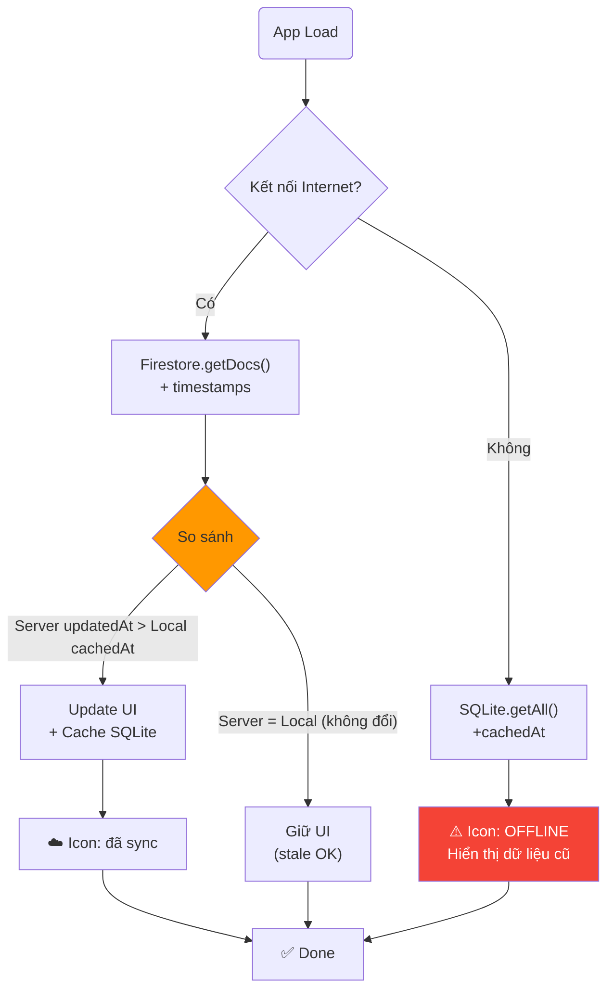

### 9.2 Luồng Ghi Dữ liệu (Write Data Flow) - Write-Ahead Logging & Optimistic UI

```mermaid
flowchart TD
    START["User Input & Save"] --> LOCAL["SQLite.write(\nisSynced = 'pending', localCreatedAt = now)"]
    LOCAL --> SUCCESS_LOCAL{Local\nWrite OK?}
    
    SUCCESS_LOCAL -- "FAIL ❌" --> ERROR_SHOW["❌ Lỗi ngay"]
    ERROR_SHOW --> END_ERR["🔴 End"]
    
    SUCCESS_LOCAL -- "OK ✅" --> UI["✅ UI update ngay\n(Optimistic UI)"]
    UI --> TRY_SYNC{Try sync\n(background)}
    
    TRY_SYNC -- "Có network" --> FIRESTORE["Firestore.create()"]
    FIRESTORE --> CHECK_SERVER{Server\nOK?}
    
    CHECK_SERVER -- "FAIL ❌" --> QUEUE["📋 Giữ trong\nretry queue"]
    QUEUE --> RETRY_TIMER["⏰ Retry with\nexponential backoff"]
    
    CHECK_SERVER -- "OK ✅" --> MARK_SYNC["✅ isSynced = true\nupdatedAt = serverTimestamp()"]
    MARK_SYNC --> FINAL["✅ Done"]
    
    TRY_SYNC -- "Không network" --> QUEUE
    
    style LOCAL fill:#4CAF50,color:#fff
    style QUEUE fill:#FF9800,color:#fff
```

### 9.3 Luồng Đồng bộ Ngầm (Background Sync)

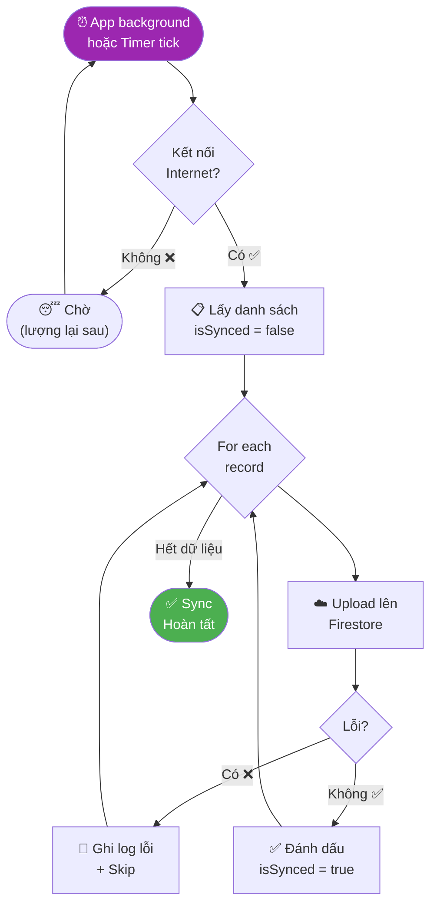

### 9.4 Luồng Xử lý Xung đột Đồng bộ (Sync Conflict Resolution) - Triple Conflict Merge

```mermaid
flowchart TD
    START["Sync batch"] --> FETCH["Fetch both\nLocal & Server"]
    FETCH --> FOR_EACH{For each record}
    
    FOR_EACH --> COMPARE{Compare scenarios}
    
    CASE_1[Local edit + Server not exist] --> PUSH["☁️ Push Local"]
    
    CASE_2[Server edit + Local not exist] --> PULL["📥 Pull Server"]
    
    CASE_3[Local updatedAt > Server] --> PUSH
    
    CASE_4[Server updatedAt > Local] --> PULL
    
    CASE_5{Server & Local\nDIFFERENT?\n(Same time)} --> CONFLICT[⚠️ TRIPLE\nConflict]
    CONFLICT --> USER_CHOOSE["🤔 Dialog:\nKeep Local / Keep Server"]
    
    USER_CHOOSE --> PUSH
    USER_CHOOSE --> PULL
    
    PUSH --> MARK["✅ Mark synced"]
    PULL --> MARK
    
    MARK --> MORE{More?}
    MORE -- "Yes" --> FOR_EACH
    MORE -- "No" --> END["✅ Done"]
    
    style CONFLICT fill:#F44336,color:#fff
```

---

## 10. Sơ đồ Provider – Quản lý Trạng thái
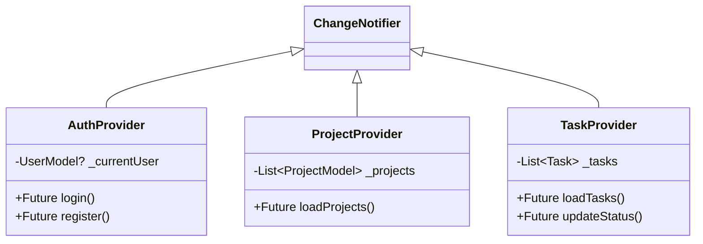
